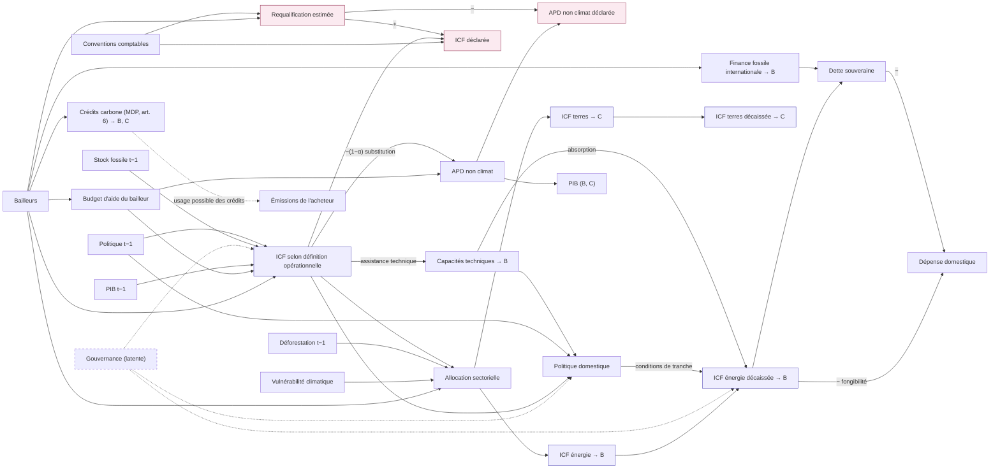
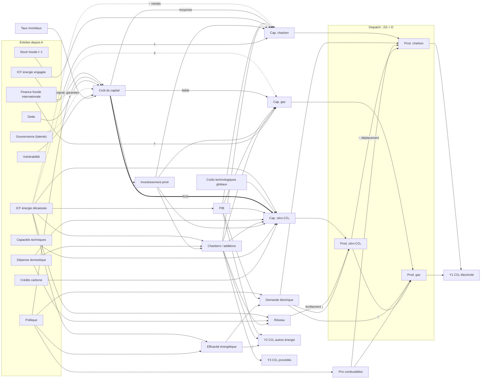
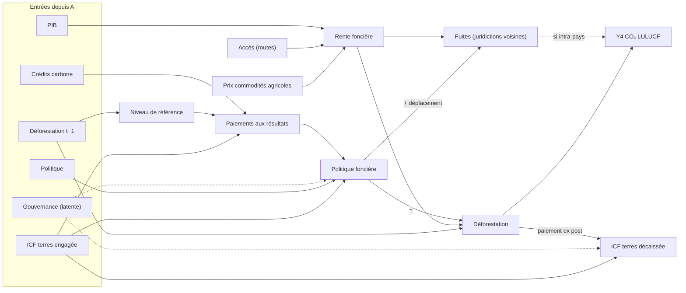
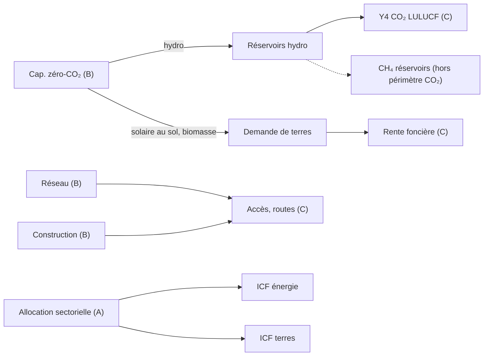

# Carte causale : finance climat internationale et émissions de CO₂

*Document de travail v0.6 — 28 septembre 2026*

> **Statut.** Carte d'hypothèses issue d'un travail exploratoire, révisée après la [revue Astra du 28 septembre 2026](carte-causale-icf-co2-review-astra-2026-09-28.md). Les principales assertions factuelles, valeurs et références ont fait l'objet d'un [audit de sources](carte-causale-icf-co2-verification-2026-09-28.md). Les chiffres de sensibilité sont des hypothèses illustratives, non des estimations d'effet. Les questions adressées à la littérature ne sont pas des résultats sur sa fréquence ou sa qualité.

---

## 1. Objet et périmètre

Ce document propose un ensemble d'hypothèses causales, représentées par un graphe orienté acyclique (DAG), sur les liens entre finance climat internationale (ICF) et émissions de CO₂ des pays receveurs. Le graphe ne prouve ni l'existence ni la force de ses arcs.

**Usage visé : une grille de questions pour la littérature économique.** Chaque contribution peut porter sur l'ontologie (catégories, variables), les données (disponibles ou utilisées), les preuves empiriques (descriptions, associations, estimations d'effet revendiquées), ou les modèles (mécanismes et contrefactuels). Ces dimensions ne sont pas exclusives. Quand une contribution prétend estimer un effet, on distingue son estimand revendiqué de celui que ses données et hypothèses peuvent soutenir. Un chemin du DAG est renseigné s'il est pertinent ; « aucun chemin applicable » reste une réponse valide.

La grille de codage figure en section 9.

**Périmètre retenu :**

- pays receveurs ;
- CO₂ ;
- deux secteurs : électricité, et utilisation des terres et forêts (LULUCF).

**Hors périmètre du DAG :** transport, bâtiment, industrie hors procédés, émissions non-CO₂ agricoles, et effets propres de l'adaptation. Leur littérature peut cependant être centrale pour la revue REL. L'adaptation n'est pas présumée être un contrôle négatif valide (section 7.4).

**Issues hors carte.** Une partie de la littérature étudie des effets de l'aide climat ou énergétique sur des issues non-CO₂ : capacité d'adaptation, précarité énergétique, sécurité énergétique, empreinte écologique. Ces études sont codées « hors carte » (section 11), et non écartées.

---

## 2. Architecture et conventions

### 2.1 Modules

| Module | Contenu | Unité d'analyse typique |
|---|---|---|
| **A. Amont** | Allocation, mesure, allocation sectorielle, politique, dette | pays-année |
| **B. Électricité** | Coût du capital, capacités, réseau, construction, dispatch, émissions énergie et procédés | pays-année, centrale, projet |
| **C. LULUCF** | Paiements aux résultats, politique foncière, déforestation, fuites | juridiction-année, pixel |
| **Ponts** | Arcs entre B et C | — |

### 2.2 Conventions graphiques et de notation

- **Arcs.** Un arc plein postule un effet causal direct ; il ne signale pas un effet établi par la littérature. Un arc pointillé désigne soit un arc issu d'une variable latente, soit un arc de signe ambigu (le signe est alors indiqué en étiquette).
- **Temps.** Chaque graphe est une coupe temporelle simplifiée. Les indices *t−1* marquent les variables pré-traitement. Les rétroactions (dette, croissance, construction, paiements aux résultats) exigent un graphe déplié dans le temps avant toute prescription d'ajustement.
- **Nœuds latents.** La Gouvernance, entendue comme capacité institutionnelle et momentum réformateur, n'est pas observée.

### 2.3 Issues

| Issue | Définition | Codes GIEC 2006 | Canal ICF principal | Signe attendu |
|---|---|---|---|---|
| **Y1** | CO₂ de combustion, production d'électricité | 1.A.1.a | Substitution, coût du capital, réseau | − |
| **Y2** | CO₂ de combustion hors production d'électricité | 1.A.1 hors 1.A.1.a et 1.A.2–1.A.5, selon disponibilité | Échelle, efficacité, construction | ± |
| **Y3** | CO₂ territorial des procédés industriels, sans combustion | 2.A, 2.C | Construction, production de matériaux | + transitoire |
| **Y4** | CO₂ territorial net LULUCF selon un inventaire défini | LULUCF | Déforestation évitée | ± |

Lorsque Y1 à Y4 sont mesurées sur un même périmètre territorial, une même période et des catégories mutuellement exclusives, leur somme est l'**agrégat cartographié**, pas nécessairement le CO₂ national total : plusieurs secteurs sont hors carte. Une série satellite de perte de couvert est un indicateur de Y4, non une composante interchangeable d'un inventaire. L'estimation conjointe peut tenir compte de chocs communs, mais la méthode ne remplace pas la vérification de ces frontières.

La frontière entre énergie et procédés dans les inventaires suit la chimie, pas le secteur économique. Pour le ciment, la décarbonatation est en 2.A.1 (Y3) et le combustible du four en 1.A.2.f (Y2). Le **canal** construction peut toucher les deux issues, mais ne les fusionne pas et ne compte aucune tonne deux fois. Les émissions incorporées importées relèvent d'une empreinte de consommation distincte des quatre issues territoriales. Voir les [lignes directrices GIEC pour le ciment](https://www.ipcc-nggip.iges.or.jp/public/2006gl/pdf/3_Volume3/V3_2_Ch2_Mineral_Industry.pdf).

---

## 3. Module A — Amont : allocation, mesure, politique



### 3.1 Points structurants

1. **La mesure peut être endogène.** Une requalification d'APD ou un comptage intégral des marqueurs de Rio peut dépendre des bailleurs qui allouent les fonds. Le schéma additif « ICF déclarée = ICF opérationnelle + requalification » n'est qu'un cas simplifié : classification, part climatique, valorisation, date d'engagement ou de décaissement et périmètre institutionnel varient séparément. Une classification NLP reproductible ne révèle pas un montant « réel » unique. Un instrument pour l'ICF déclarée doit être évalué aussi vis-à-vis de ces mécanismes de mesure.

2. **L'exposition financière est un construit, défini pour chaque mécanisme.**
   - Pour le **canal quantité** (capacités et réseau), rapporter le montant brut décaissé, sa part climatique estimée et son éventuelle substitution à d'autres financements ; « nouveau et additionnel » est une question empirique distincte.
   - Pour le **canal prix** (coût du capital), documenter les conditions du financement et le marché contrefactuel. L'équivalent-don comptable n'est pas automatiquement la subvention du projet ni la variation de son coût moyen pondéré du capital. Un prêt au taux affiché du marché peut modifier le risque, la maturité ou l'accès au financement.

3. **L'allocation sectorielle définit plusieurs interventions.** Une hausse de l'enveloppe énergie à budget total constant est une réallocation ; une hausse de l'énergie à terres constantes est une expansion. L'effet estimé dépend du contraste choisi. Conditionner mécaniquement sur le budget contemporain, somme de composantes de traitement, n'est pas une prescription universelle.

4. **Le canal politique.** Il recouvre les prêts de politique publique, l'assistance technique et les CDN conditionnelles. L'hypothèse à tester est qu'une partie de l'effet passe par la politique et les investissements induits, au-delà des MW directement financés ; son importance relative n'est pas établie ici.

5. **Dette et fongibilité.** Un prêt souverain décaissé crée une obligation de remboursement ; son effet net sur le risque souverain, l'espace budgétaire et le coût du capital dépend des termes et de l'usage des fonds (module B). L'ICF peut aussi se substituer à la dépense domestique. L'effet total pertinent pour les bailleurs est net de ces substitutions.

6. **Le contrefactuel côté bailleur.** Il se formalise via l'aide totale : voir 3.2.

### 3.2 « Nouveau et additionnel » contre requalification : deux phénomènes distincts

**Définitions dans un périmètre restreint à l'APD.** Soit A = F + O, où F est la composante climat de l'aide selon une définition opérationnelle et O l'autre APD. Dans le **seul cas de requalification à total déclaré inchangé**, F* = F + M et O* = O − M. Cette identité pédagogique ne couvre ni différences de valorisation et de calendrier, ni finance privée mobilisée, autres apports publics ou crédits à l'exportation. On ne peut pas déduire F de F* par recodage de textes sans validation externe et incertitude sur la part climatique.

**Réponse budgétaire causale sous une intervention précisée.** Pour une augmentation exogène de F dans ce périmètre, on peut définir :

$$\alpha = \frac{dA}{dF} = 1 + \frac{dO}{dF}$$

Sous les hypothèses de cette décomposition, α = 1 signifie qu'O ne baisse pas ; α = 0 qu'O baisse d'autant. L'arc ICF → APD non climat représente cette réponse éventuelle, pas une valeur universelle de α. Le critère comptable ou politique « nouveau et additionnel » compare des montants à une **référence normative** ; il ne mesure pas à lui seul cette dérivée causale.

| | Requalification | Non-additionnalité |
|---|---|---|
| Nature | Comptable (classement des projets) | Budgétaire (réallocation réelle) |
| Représentation | Nœud Requalification | Arc ICF → APD non climat |
| Flux réels modifiés | Non | Oui (composition de l'aide) |
| Effet sur les receveurs | Aucun, mais l'inférence est biaisée | Perte d'APD non climat → PIB, services sociaux, et indirectement émissions |
| Évaluation | Recodage validé sur projets et rapprochement des flux | Contraste budgétaire explicite, séparé de la référence normative |

**Équivalence observationnelle dans le cas simplifié.** Une hausse de F* avec A* stable est compatible avec une requalification pure ou une substitution réelle. Les distinguer demande au moins :

1. une définition de F et un recodage validé des projets pour borner M, la part climatique et les erreurs de calendrier ou de valorisation ;
2. une variation crédiblement exogène de F et des données comparables sur O pour estimer sa réponse. Des séries recodées seules ne suffisent pas.

C'est pourquoi le débat « greenwashing » et le débat « additionnalité » se confondent souvent dans la littérature : avec les seules données déclarées, ils ne sont pas identifiables séparément.

**« Nouveau » : par rapport à quoi ?** La référence n'est pas un nœud mais un choix de contraste pour O. Les options discutées dans la littérature sont notamment (Stadelmann, Roberts et Michaelowa 2011) :

- l'objectif de 0,7 % du RNB ;
- le niveau d'APD d'une année de référence, par exemple avant Copenhague ;
- la tendance de l'APD ;
- les seuls flux au-delà de l'APD.

Chaque option produit une **mesure comptable d'additionnalité** différente, sans modifier par elle-même le paramètre causal α. Le choix de référence est normatif ; la carte permet de l'expliciter.

**Périmètre.** Le nœud Conventions représente les règles de comptage : [APD en équivalent-don pour l'indicateur agrégé de référence à partir des données 2018](https://www.oecd.org/en/topics/sub-issues/oda-eligibility-and-conditions/official-development-assistance--definition-and-coverage.html) dans le cadre du CAD ; et, dans le [suivi OCDE de l'objectif des 100 milliards de dollars](https://www.oecd.org/en/publications/climate-finance-provided-and-mobilised-by-developed-countries-in-2016-2020_286dae5d-en/full-report.html), finance publique bilatérale et multilatérale attribuée, crédits à l'exportation liés au climat et finance privée mobilisée. Ces agrégats n'ont pas le même périmètre. Un changement de convention modifie les montants déclarés sans modifier les flux réels. C'est un objet propre pour l'histoire de la quantification.

**Conséquences pour l'identification.**

- **Interventions distinctes.** L'effet d'une expansion de F avec O qui réagit, celui d'une expansion à O fixé, et celui d'une réallocation à A fixé répondent à trois questions différentes. Leur contraste dépend des effets d'O et d'interactions possibles, non d'une simple soustraction toujours interprétable.
- **Instruments côté bailleur.** Un choc de budget d'aide peut déplacer F et O et ouvrir un chemin vers les issues par O. Un choc climatique plus spécifique (engagement Fast Start, reconstitution d'un fonds) n'est pas automatiquement valide : il faut examiner premier stade, exclusion, autres politiques du bailleur et réponse d'O.

### 3.3 Engagements et décaissements : deux variables causales

Engagement et décaissement ne sont pas deux mesures d'une même variable. Ils ont des parents et des enfants différents dans le graphe.

**L'engagement est la décision du bailleur.** C'est à ce stade que se font l'allocation sectorielle et le marquage climat, donc la requalification. Ses canaux propres :

- **Politique** : conditionnalité ex ante, CDN conditionnelles, annonces de type JETP.
- **Coût du capital** : la décision d'investissement se prend au bouclage financier, sur la base des termes engagés. Une garantie est un engagement qui ne se décaisse que si elle est appelée : son effet sur le coût du capital passe entièrement par l'engagement.

**Le décaissement est le flux réel.** Ses canaux propres :

- **quantité** : il finance le capex ;
- **dette** : elle naît au décaissement, pas à l'engagement ;
- **fongibilité**.

**Le décaissement est endogène**, pour trois raisons :

1. il dépend de la capacité d'absorption (Gouvernance) et du respect des conditions de tranche (Politique) ;
2. en financement de projet, il suit l'avancement du chantier. C'est une simultanéité avec les capacités, visible seulement dans le graphe déplié dans le temps ;
3. pour les paiements aux résultats, le versement à t dépend souvent de la performance mesurée à t ou plus tôt (arc Déforestation → ICF terres décaissée). Une régression de l'issue contemporaine sur ce versement inverse alors la temporalité. Des versements antérieurs peuvent toutefois modifier les comportements et les issues futures.

**Analogie ITT / TOT limitée.** L'engagement est une décision, non une assignation aléatoire ; le décaissement ressemble à une exposition reçue. L'engagement n'est pas d'office un instrument du décaissement, car les annonces et garanties peuvent agir directement sur la politique ou le coût du capital.

**Recommandations.**

| Estimand | Mesure du traitement |
|---|---|
| Effet total, variable de décision des bailleurs | Engagements (logique ITT) |
| Canal quantité (capacités, réseau) | Décaissements, avec retards, et proxys de gouvernance |
| Module C, réponse contemporaine | Engagements ou conditions contractuelles ex ante ; éviter le décaissement dépendant de la performance contemporaine |
| Module C, effets futurs des paiements | Décaissements antérieurs possibles, avec dynamique et sélection explicitement modélisées |
| Capacité d'absorption | Taux de décaissement comme issue à part entière |

**Mesure.** Le CRS renseigne les deux, à des dates différentes. Les bases de déclaration à la CCNUCC sont hétérogènes : certaines parties déclarent des engagements, d'autres des décaissements. C'est une dimension du nœud Conventions.

### 3.4 Canaux ajoutés après confrontation à la littérature (v0.4)

1. **Capacités techniques.** L'assistance technique peut agir par un canal de connaissance, distinct du capex : conception des politiques, capacité d'absorption des décaissements, développement de projets. La composition de l'aide (coopération technique, aide aux politiques énergétiques, aide aux renouvelables) et le revenu du receveur sont des dimensions à coder pour vérifier d'éventuelles différences de résultats.
2. **Sélection sur la politique (Politique t−1 → ICF).** Les financements peuvent suivre les cadres réglementaires favorables. Une mesure de la politique à t risque de mêler sélection antérieure et réponse au financement ; le calendrier et les causes communes doivent être précisés.
3. **Finance fossile internationale.** Financements chinois à l'étranger, crédits à l'exportation, prêts des BMD avant leurs politiques d'exclusion du charbon. C'est un canal concurrent possible sur les capacités fossiles et un confondeur potentiel si les mêmes déterminants influencent les deux flux. La fréquence de cette coïncidence et le rôle des bailleurs sont à vérifier empiriquement.
4. **Marchés carbone (MDP, article 6).** Les crédits transfèrent un droit ou une revendication comptable à l'acheteur ; ils n'impliquent pas mécaniquement une tonne d'émissions effectivement supplémentaire. L'effet mondial dépend du scénario contrefactuel, de l'additionnalité, des fuites, de la permanence et des règles d'usage des crédits. Les ajustements correspondants modifient l'attribution comptable des résultats, pas directement les émissions physiques.

---

## 4. Module B — Électricité



### 4.1 Relations formelles

**Identité en aval**, sans incertitude causale :

$$Y_1 = e_c\,G_c + e_g\,G_g$$

Les facteurs $e_c$ et $e_g$ sont des facteurs territoriaux de CO₂ à définir pour les centrales étudiées. Comme repère distinct, le [tableau A.III.2 du GIEC AR5 WGIII](https://www.ipcc.ch/site/assets/uploads/2018/02/ipcc_wg3_ar5_annex-iii.pdf) donne pour les émissions **directes en CO₂e** des médianes de 0,76 t/MWh pour le charbon pulvérisé et de 0,37 t/MWh pour le gaz à cycle combiné (fourchettes 0,67–0,87 et 0,35–0,49). Ces valeurs par technologie ne remplacent pas un facteur de CO₂ propre au parc et à la période étudiés.

**Dispatch**, sous contrainte physique :

$$G_{c,t} + G_{g,t} + G_{z,t} = D_t, \qquad G_{z,t} \le 8760\,CF^{pot}_{z,t} K_{z,t} - \text{écrêtement}_t(R)$$

L'équation s'entend en MWh annuels, avec K en MW, un facteur de charge potentiel et un écrêtement en MWh/an ; pour une autre période, remplacer 8760 par sa durée en heures. Réseau et capacité zéro-CO₂ sont complémentaires : sans réseau suffisant, la capacité ajoutée peut être écrêtée. L'effet d'un MWh zéro-CO₂ dépend de la technologie marginale déplacée, charbon ou gaz, donc notamment des prix des combustibles.

**Flux de construction puis stocks de capital**, avec dates explicites :

$$K_{j,t} = K_{j,t-1} + I_{j,t} - \text{Ret}_{j,t}, \qquad j \in \{c, g, z\}$$

L'ICF peut agir sur les décisions d'investissement $I$ et les retraits $Ret$ ; les chantiers et leurs émissions précèdent la mise en service du stock $K$. Les délais dépendent de la technologie et du pays. Dans le DAG simplifié, « Chantiers / additions » est placé avant les capacités installées ; un graphe déplié séparerait décision, chantier et mise en service.

**Coût du capital**, mécanisme de sensibilité différenciée :

$$\text{LCOE} = \frac{CRF(r,L)\cdot \text{capex} + \text{O\&M}_{\text{fixe}}}{8760 \cdot CF} + \text{coût combustible}, \qquad CRF(r,L) = \frac{r}{1-(1+r)^{-L}}$$

Pour L = 25 ans, passer de r = 10 % à 5 % fait passer le CRF de 0,110 à 0,071, soit −36 % sur la composante capital.

| Cas hypothétique | Part supposée du capital dans le LCOE initial | Effet mécanique de r : 10 % → 5 % sur le LCOE |
|---|---|---|
| Forte intensité en capital | 85 % | −30 % |
| Intensité intermédiaire | 45 % | −16 % |
| Faible intensité en capital | 22,5 % | −8 % |

Les parts de capital du tableau sont des **hypothèses de calcul**, et non des valeurs observées par technologie. Chaque effet est la part supposée multipliée par la baisse du CRF (35,6 %, arrondie). La sensibilité plus forte des projets à coûts initiaux élevés est cohérente avec l'[analyse de l'AIE](https://www.iea.org/articles/the-cost-of-capital-in-clean-energy-transitions). Son effet sur les investissements et les émissions dépend encore des projets qui auraient été financés autrement, de la demande, du réseau, de la concurrence et du financement de substitution. L'additionnalité projet par projet reste donc pertinente pour l'effet causal.

L'ICF pourrait agir sur le coût du capital par trois sous-canaux à vérifier :

- **direct** : tranche concessionnelle, qui abaisse le WACC en moyenne pondérée ;
- **dérisquage** : garanties et first-loss, qui réduisent la prime de risque sur la tranche privée ;
- **démonstration** : réduction de la prime de risque technologie-pays pour les projets suivants. Cette externalité entre projets viole SUTVA au niveau projet.

**Construction et courbe en J, calcul stylisé.** Notons $S$ le stock installé actif en kW, $I$ les additions annuelles en kW/an, $c$ les émissions incorporées par kW construit, $d$ les émissions évitées par kW actif et par an, et $g$ le taux de croissance du stock en an⁻¹. En l'absence de retraits et sous $I=gS$, avec facteurs et substitution constants :

$$\Delta E = c\,I - d\,S = c\,g\,S - d\,S < 0 \iff g < \frac{d}{c} = \frac{1}{\text{temps de retour carbone}}$$

Cet exemple compare des flux annuels sur une frontière d'émissions donnée ; il ne fournit pas l'effet territorial d'un programme sans localiser la fabrication et la substitution. Avec retraits, $I=gS+Ret$, et le seuil change. Le méthane des réservoirs relève d'un autre gaz et d'un autre calcul.

Un temps de retour chiffré exige, pour chaque projet, un inventaire de construction localisé, la production effectivement injectée et le facteur d'émission marginal déplacé. Le [tableau A.III.2 du GIEC AR5 WGIII](https://www.ipcc.ch/site/assets/uploads/2018/02/ipcc_wg3_ar5_annex-iii.pdf) rapporte des émissions de cycle de vie en CO₂e par MWh ; ses valeurs ne se transposent pas directement en émissions territoriales de construction par kW ni en CO₂ évité sur le réseau receveur.

En comptabilité territoriale, les émissions incorporées importées (modules, turbines, acier, ciment) ne figurent pas dans Y1–Y4 du pays receveur. La fabrication locale peut contribuer à Y2 (combustion, dont combustible du four) et Y3 (procédés). Pour Y3, le GIEC distingue notamment une méthode fondée sur la production domestique de ciment et une autre sur la production de clinker, avec ajustements appropriés ; la consommation apparente de ciment n'est pas une mesure directe des émissions territoriales de procédés. Une analyse d'empreinte incorporée, incluant les importations, serait un estimand séparé.

### 4.2 Canaux et signes

| Canal | Chemin | Signe |
|---|---|---|
| Substitution | ICF → Cap. zéro → Prod. zéro → déplacement fossile | − |
| Prix du capital | ICF → Coût du capital → Cap. zéro | − |
| Intégration | ICF → Réseau → écrêtement ↓ → Prod. zéro | − |
| Gaz | ICF → Cap. gaz → Prod. gaz | − s'il remplace du charbon ; + s'il s'ajoute, avec risque de verrou |
| Retraits | ICF → Cap. charbon ↓ | −, faible hors JETP |
| Politique | ICF → Politique → Prix combustibles, Demande, Coût du capital | Dépend de la réforme, de son application et des réponses |
| Échelle | ICF → PIB → Demande → Prod. fossile, et PIB → Y2 | + |
| Construction | Finance → Chantiers → capacités et réseau ; chantiers → Y2, Y3 | + transitoire sur les émissions domestiques de chantier et de matériaux |
| Dette | ICF (prêts) → Dette → Coût du capital | ± selon termes, risque souverain et substitution |
| Efficacité | ICF décaissée, Politique → Efficacité énergétique → Demande, Y2 | − |
| Mobilisation privée | ICF → Coût du capital → Investissement privé → Capacités | − si orientée vers le zéro-CO₂ |
| Capacités techniques | ICF → Capacités techniques → Cap. zéro, Politique, absorption | − |
| Finance fossile concurrente | Finance fossile internationale → Cap. charbon, gaz | + (canal hors ICF, mais confondeur) |
| Crédits carbone | Crédits → Cap. zéro chez le receveur ; usage ou revendication chez l'acheteur | Effet global dépendant du contrefactuel et des règles d'usage, sans compensation physique automatique |

L'effet net sur les émissions absolues est de signe a priori indéterminé. L'intensité carbone (tCO₂/MWh) peut diminuer dans des scénarios de substitution, mais le signe dépend du dispatch, de l'écrêtement et du mix marginal.

---

## 5. Module C — LULUCF



### 5.1 Différences structurelles avec le module B

| | Électricité (B) | LULUCF (C) |
|---|---|---|
| Mécanisme | Substitution dans le dispatch | Déforestation évitée par rapport à une ligne de base |
| Nature de l'effet | Stock de capital, durable | Flux évité, réversible (permanence) |
| Fuites | De marché | Spatiales |
| Rôle du coût du capital | Central | Faible |
| Mesure de Y | Identité production × facteur | Satellite × densité carbone, ou inventaire |

### 5.2 Points structurants

1. **Sélection et retour à la moyenne.** Certains programmes peuvent cibler des juridictions à forte déforestation passée ; d'autres couvrent des juridictions à fort couvert forestier et faible déforestation, comme le [cas étudié par Roopsind et al.](https://doi.org/10.1073/pnas.1904027116). Dans le premier cas, une réversion vers la moyenne peut être attribuée à tort au programme. Examiner la déforestation antérieure, les pré-tendances et la règle de sélection avant de choisir les variables d'ajustement.
2. **Niveau de référence.** Les [résultats REDD+ rapportés à la CCNUCC](https://redd.unfccc.int/fact-sheets/redd-mrv-and-results-based-payments.html) sont mesurés en tCO₂e/an contre un niveau de référence forestier. Ce CO₂e ne doit pas être confondu avec Y4, défini en CO₂. Une référence trop élevée peut produire des « réductions » comptables sans changement équivalent de comportement ; c'est un risque étudié dans les critiques de surcréditation.
3. **Fuites.** L'effet local mesuré surestime l'effet net si la déforestation se déplace. Il faut des issues mesurées sur les juridictions voisines, ou des designs à zones tampons.
4. **Permanence.** Un flux évité à t peut être réalisé à t + k. L'horizon d'évaluation fait partie de l'estimand.
5. **Temporalité des paiements.** Les paiements aux résultats sont versés ex post sur performance mesurée. L'incitation est anticipée, ce qui justifie l'arc RBP → Politique foncière, alors que les versements eux-mêmes sont une conséquence de la déforestation observée.

---

## 6. Ponts entre modules



| Pont | Mécanisme | Conséquence pour l'analyse |
|---|---|---|
| Hydroélectricité → Réservoirs | Ennoiement de forêt ; méthane des réservoirs tropicaux | Une ICF « électricité » peut toucher Y4 et émettre du CH₄ hors périmètre CO₂ ; toute comparaison de cycle de vie demande une métrique CO₂e et un horizon explicites. |
| Réseau et construction → Accès | Lignes haute tension et routes de chantier ouvrent des fronts pionniers | Effet de l'ICF énergie sur la déforestation |
| Solaire au sol, biomasse → Demande de terres | Concurrence foncière | Lien direct entre production électrique et demande de terres |
| Allocation sectorielle | Enveloppe et usages concurrents | Définir si le contraste est une réallocation à budget fixe ou une expansion avec les autres usages maintenus |

---

## 7. Identification

### 7.1 Confusion latente dans le graphe proposé

Dans le graphe **tel que postulé ici**, Gouvernance → ICF, Gouvernance → Politique et ICF → Politique laissent un chemin de confusion non observé vers les issues. Le lien ICF–Politique combine un effet direct supposé et une cause commune latente. Aucun simple ajustement sur les variables observées de ce graphe ne ferme ce chemin. Il ne s'ensuit pas qu'aucun design ou donnée supplémentaire ne puisse identifier un effet : une variation exogène crédible, des proxys justifiés ou des hypothèses structurelles changeraient le problème. La qualification formelle par l'algorithme ID reste à vérifier sur la version temporelle et les estimands précisément définis.

La même structure réapparaît dans le module B (Gouvernance → Coût du capital) et dans le module C (Gouvernance → Politique foncière).

**Conséquences pratiques :**

- pour un **effet total**, éviter de bloquer sans justification les chemins par les médiateurs ; une analyse de médiation ou la g-formule peut les modéliser puis intégrer sur leur distribution ;
- les proxys de gouvernance (WGI, CPIA) peuvent informer une analyse de sensibilité, mais leur ajustement ne garantit ni une réduction du biais ni l'échangeabilité ;
- évaluer la crédibilité de chaque source de variation, plus des analyses de sensibilité ; aucun nom de méthode ne garantit l'identification.

### 7.2 Le PIB, confondeur et médiateur

Les bailleurs peuvent allouer selon le revenu préexistant (PIB t−1 → ICF) et l'ICF passée peut affecter le PIB ultérieur, qui influe à son tour sur la finance et les émissions. Cette rétroaction exige des indices temporels explicites. Selon la question :

- ajuster sur le PIB **post-traitement** dans une régression d'effet total peut bloquer un canal d'échelle et introduire d'autres biais selon ses causes communes ; un biais de collider n'est pas automatique ;
- omettre le PIB **pré-traitement** peut laisser une confusion liée à l'allocation ;
- le traitement passé peut modifier un futur confondeur, ce qui rend les régressions standards difficiles à interpréter.

Les g-méthodes (modèles structurels marginaux avec pondération, g-formule) peuvent traiter ce retour **si** l'échangeabilité séquentielle conditionnelle, la positivité et la cohérence sont plausibles, avec mesures et modèles adéquats. Elles ne résolvent pas la confusion par Gouvernance latente. Voir [Hernán et Robins, *Causal Inference: What If*](https://www.hsph.harvard.edu/miguel-hernan/wp-content/uploads/sites/1268/2024/01/hernanrobins_WhatIf_2jan24.pdf) (version et citation bibliographique à fixer avant diffusion).

### 7.3 Stratégies candidates selon la question

Un effet total ne se décompose pas automatiquement en effets d'arcs estimés séparément. Une recomposition exigerait des définitions compatibles, des hypothèses de transportabilité et un modèle des interactions, notamment Réseau × Capacité zéro-CO₂. Le tableau réunit des **options à évaluer**, sans classement universel de crédibilité. Une identité physique ou comptable n'identifie pas l'effet de l'ICF qui l'alimente.

| Question | Approche candidate et contraste | Hypothèses à éprouver | Données possibles |
|---|---|---|---|
| Capacités, dispatch et Y1 | Modèle physique et identité émissions = production × facteur | Écrêtement, mix marginal, contrats ; cela ne donne pas le contrefactuel sans ICF | Ember, AIE |
| ICF énergie et capacités zéro-CO₂ | Discontinuité à un seuil IDA ou à une règle d'allocation, si elle existe dans les données | Premier stade pour **l'ICF visée**, absence de manipulation, autres aides et politiques qui changent au seuil, effet local | CRS recodé et validé, GEM, IRENA |
| ICF et coût du capital | Comparaison de termes financiers et modèle de financement contrefactuel | Risque, séniorité, devise, maturité, garanties et effet de la tranche concessionnelle sur les autres tranches ; la comparaison intra-projet est descriptive seule | Contrats de prêts, BMD |
| Coût du capital et capacités | Choc de taux × exposition initiale à l'intensité capitalistique | Choc de taux indépendant des demandes, politiques et coûts par technologie, hors canal WACC | Taux, paramètres de LCOE, capacités |
| ICF terres et déforestation | Contrôle synthétique ou comparaison spatiale sur une intervention définie | Pré-tendances, sélection, fuites, référence, horizon de permanence | GFW, Hansen, inventaires |
| Chantiers et Y2–Y3 | Comptabilité territoriale du combustible et des procédés de fabrication locale | Production domestique de ciment/clinker, commerce, facteurs d'émission ; ne mesure pas l'effet causal de l'ICF | Inventaires, USGS, Comtrade |
| ICF et agrégat CO₂ cartographié | Contrôle synthétique ou shift-share d'offre, si le choc cible l'ICF | Autres canaux du bailleur, O, commerce, IDE, gouvernance variable ; l'exclusion peut échouer | CRS validé, EDGAR |
| ICF et PIB | Design de la littérature aide-croissance transposé explicitement à l'ICF | Pertinence pour l'ICF, autres traitements au seuil et robustesse aux spécifications | WDI, flux d'aide |

Un effet global homogène des coûts technologiques peut être absorbé par des effets fixes temporels dans un panel pays. Une exposition hétérogène peut rester informative sous hypothèses fortes ; attribuer l'apprentissage mondial à l'ICF demande en général un modèle ou une autre source de variation.

### 7.4 Tests de falsification

Les tests ci-dessous sont des **diagnostics candidats**, pas des zéros universels imposés par le DAG :

- **Leads.** Une association entre finance future et émissions présentes peut révéler anticipation, sélection ou réaction du bailleur aux émissions ; préciser le calendrier avant d'en faire un placebo.
- **Exposition contrôle négatif.** La finance d'adaptation n'est utilisable que pour une issue et un horizon où l'absence de tout effet causal, direct **ou médié**, est défendable, et où elle renseigne les mêmes sources pertinentes de confusion. Elle peut changer demande, résilience électrique ou émissions de chantier.
- **Placebos croisés entre modules.** Les enveloppes énergie et terres partagent budgets et politiques ; les ponts physiques ajoutent d'autres voies. Une restriction à un sous-échantillon ne suffit pas seule à garantir l'absence d'effet.
- **Pré-tendances** dans le module C, utiles contre certaines sélections et retours à la moyenne, sans preuve générale d'identification.

### 7.5 Sensibilité

- Bornes de Cinelli et Hazlett : quelle part de la variance résiduelle de l'ICF et de Y la gouvernance devrait-elle expliquer pour annuler l'effet estimé ?
- Bornes de Manski pour les estimands mal identifiés.
- Pré-enregistrement de la spécification : définition de l'exposition, taux de dépréciation, retards, contrôles et horizon. Son utilité est une hypothèse méthodologique à documenter, pas un classement chiffré des garde-fous.

### 7.6 Confondeurs ajoutés en v0.4

- **Politique t−1.** Elle peut être un confondeur pré-traitement à considérer selon l'intervention et l'estimand ; son ajustement n'est pas automatique. Elle est elle-même en partie causée par Gouvernance, qui reste latente.
- **Finance fossile internationale.** Des bases de projets et de crédits à l'exportation peuvent en fournir des indicateurs incomplets. Son omission peut biaiser l'estimation si elle est cause commune de l'ICF et de l'issue ; le **signe** du biais dépend des corrélations et n'est pas fixé a priori. L'ajustement dépend aussi du calendrier et de l'intervention étudiée.
- **Crédits carbone.** Les réductions vendues ne doivent pas être comptées deux fois, chez le receveur et dans l'effet de l'ICF « classique ». Si les issues sont mesurées après ajustements correspondants, la définition de Y change.

---

## 8. Mesure

### 8.1 Traitement (ICF)

| Choix | Recommandation | Justification |
|---|---|---|
| Source | CRS déclaré et descriptions recodées par NLP, avec échantillon validé manuellement | Le recodage donne une classification opérationnelle et son incertitude, pas un flux « réel » observé |
| Engagements ou décaissements | Les deux, selon intervention, temporalité et canal | Engagements pour les annonces ; décaissements pour la quantité, avec sélection ; en C, distinguer paiement contemporain endogène et paiement antérieur |
| Valeur | Montant brut, part climatique, équivalent-don et termes contractuels, séparément | La valeur faciale, la convention comptable et la subvention économique ne sont pas interchangeables |
| Dynamique | Retards et, pour le capital financé, stock cumulé déprécié $\mathcal{S}_{it} = \sum_k (1-\delta)^k F_{i,t-k}$ | Le stock n'est pas la bonne exposition pour toutes les garanties, politiques ou assistances techniques ; justifier le calendrier par canal |

### 8.2 Issues et nœuds intermédiaires

| Nœud | Sources | Qualité | Remarque |
|---|---|---|---|
| PIB | WDI | Bonne | — |
| Capacités | IRENA, trackers GEM, WEPP (S&P) | Bonne | Le niveau centrale permet les designs locaux |
| Production | Ember, AIE | Bonne | — |
| Réseau | Km de lignes (rare) ; proxys : pertes T&D, décaissements CRS transport-distribution | Faible | Nœud causalement central, maillon faible des données |
| Y1, Y2 | EDGAR, CEDS, inventaires | Moyenne | Souvent reconstruits comme production × facteur |
| Y3 | EDGAR, inventaires, séries de production de ciment et de clinker | Moyenne | Les méthodes GIEC varient selon les données disponibles ; tenir compte du clinker et du périmètre territorial |
| Y4 | Inventaires LULUCF, modèles bookkeeping, GFW | Variable | [Grassi et al. (2018)](https://www.nature.com/articles/s41558-018-0283-x) documentent un écart **agrégé mondial** d'environ 4 GtCO₂/an entre modèles et inventaires nationaux pour les émissions nettes anthropiques liées aux terres ; environ 3,2 GtCO₂/an sont expliqués par des différences conceptuelles, notamment sur les terres gérées. Ce n'est pas une incertitude applicable à chaque pays. |
| CH₄ réservoirs | Bases dédiées | Faible | Hors des quatre issues CO₂ ; le [raffinement GIEC 2019, chapitre 7](https://www.ipcc-nggip.iges.or.jp/public/2019rf/pdf/4_Volume4/19R_V4_Ch07_Wetlands.pdf) fournit des méthodes d'inventaire pour les terres inondées. |

**Principe général.** Quand un indicateur d'émissions est calculé à partir d'une activité et d'un facteur, expliciter l'activité, le facteur, leurs incertitudes et l'inventaire visé. Estimer un effet sur l'activité puis appliquer cette relation n'identifie l'effet sur les émissions que si le facteur et les autres voies pertinentes sont correctement traités ; l'indicateur calculé n'est pas une mesure indépendante.

---

## 9. Grille de codage de la littérature

### 9.1 Gabarit par contribution

La bibliométrie REL situe la contribution dans un courant ; cette fiche décrit
**ce qu'elle fait**. Les quatre dimensions de la science sont cumulables. Un
article peut mesurer une association sans identifier un effet causal ; un
modèle peut explorer un contrefactuel sans l'estimer sur données observées.
Les noms de nœuds, s'ils sont utiles, sont ceux de l'annexe A. Les champs
`estimand_revendique` et `estimand_soutenu` sont volontairement distincts.

```yaml
reference: "Auteur·s (année)"
identifiant_corpus: ""
courant_bibliometrique: "à mesurer"
contributions: [donnees, preuves] # ontologie | donnees | preuves | modeles
question: "Que cherche à savoir cette contribution ?"
niveau: pays-annee        # projet | centrale | juridiction | pixel
modules: [A, B]           # [] si hors carte ; modules non exclusifs
relation_etudiee: "ICF_E_dec et Cap_zero"
chemins_DAG_pertinents: [] # [] ou chemins proposés, jamais 'arcs estimés' par défaut
hors_carte: false
traitement:
  mesure: decaissements   # engagements | equivalent_don | recode_CRS | declare_Rio
  canal: quantite         # prix | politique
contraste: "non défini"  # expansion | réallocation | O fixé | autre
issue_observee: Cap_zero   # Y1 | Y2 | Y3 | Y4 | intensite | autre
type_resultat: association # description | association | effet_identifie | simulation
estimand_revendique: "effet de l'ICF décaissée sur la capacité"
estimand_soutenu: "association conditionnelle, si absence de variation exogène"
design: panel_FE          # RDD | IV | SC | DiD | MSM | ACV | modele | autre
hypotheses_identification: []
confondeurs_traites: [PIB_lag, Stock_fossile_lag]
confondeurs_ouverts: [Gouv]
mediateurs_conditionnes: [] # évaluer au regard de l'estimand, pas faute automatique
tests_falsification: []
sensibilite: false
signe: "à extraire"
magnitude: "à extraire, avec unités et intervalle"
horizon: "t+5"
commentaire: "Faire correspondre traitement, issue et question au texte lu."
```

Le champ `mediateurs_conditionnes` déclenche une lecture de l'estimand : une
régression d'effet total qui ajuste sur un médiateur post-traitement peut
bloquer une partie de cet effet ; une analyse de médiation ou une g-formule
peut traiter le même nœud avec un autre objectif. Le codage relève la
justification de l'auteur, l'hypothèse nécessaire et le jugement du lecteur.

### 9.2 Familles provisoires et questions à tester

Ces familles viennent d'une exploration non systématique et ne préjugent ni des
communautés bibliométriques mesurées pour REL, ni de la fréquence des défauts
méthodologiques dans le champ. Chaque « lacune » ci-dessous est une **question
à coder**, pas un résultat établi sur la littérature.

| Famille provisoire | Chemin ou objet proposé | Méthodes à relever | Question de lecture, non constat de lacune |
|---|---|---|---|
| Efficacité de l'aide, aide-croissance | ICF → PIB | Instruments, panel, seuils | Le canal d'échelle est-il relié aux émissions ? |
| Allocation de l'aide climat | Bailleurs, PIB t−1, Gouvernance, Vulnérabilité → ICF, Allocation | Régressions de déterminants | Les déterminants d'allocation servent-ils à traiter la sélection ? |
| Mesure et comptabilité de la finance climat | Définitions, déclarations, recodages et incertitudes | Audit de codage, NLP | Les écarts de mesure sont-ils propagés dans les estimations d'effet ? |
| Additionnalité (« nouveau et additionnel ») | Référence normative et réponse budgétaire d'O | Séries d'APD, choix de référence | Les deux objets sont-ils distingués de la requalification ? |
| Coût du capital, dérisquage, finance mixte | ICF → Coût du capital → Capacités | Ratios de mobilisation, études de cas | Quel contrefactuel financier est documenté ? |
| Diffusion des ENR, courbes d'apprentissage | Coûts technologiques globaux → Cap. zéro | Séries temporelles, modèles | Quels modèles attribuent l'apprentissage à l'ICF, et sous quelles hypothèses ? |
| Économie politique du charbon | Politique, Stock fossile, Cap. charbon | Études de cas comparatives | Qu'apportent les cas et les quantifications disponibles ? |
| Réforme des subventions fossiles | Politique → Prix combustibles | Panel, modèles | La relation à l'ICF est-elle étudiée ? |
| REDD+ et paiements aux résultats | Module C | Contrôle synthétique, appariement spatial | Comment les fuites, la permanence et la référence sont-elles traitées ? |
| Dette et climat | Dette, Vulnérabilité → Coût du capital | Panel souverain | Les effets des prêts ICF sur la dette et le capital sont-ils reliés ? |
| ACV, émissions incorporées | Construction → empreinte de cycle de vie, distincte de Y3 | ACV | Quelle frontière territoriale ou de consommation est utilisée ? |
| JETP (cas) | A et B, avec forte composante Politique | Études de cas | Que permet de comprendre le DAG JETP dédié ? |
| Panels en forme réduite ICF → CO₂ | Association ou effet total revendiqué | Effets fixes, régressions quantiles, hétérogénéité | Quels estimands sont revendiqués et soutenus ? Des médiateurs post-traitement sont-ils conditionnés ? |
| Aide énergétique → capacités renouvelables | ICF décaissée, Capacités techniques → Cap. zéro | Panel, projets cumulés, composition de l'aide | Comment la sélection des projets et des pays est-elle traitée ? |
| Aide → intensité énergétique | ICF → Efficacité → Demande | Panel avec instruments | L'intensité et les émissions absolues sont-elles distinguées ? |
| Finance climat → ambition des CDN | ICF → Politique | Panel | Quelle mesure d'ambition, quels résultats et quelle identification ? |
| Déterminants des flux vers les renouvelables | Politique t−1 → ICF | Régressions de déterminants | Les résultats éclairent-ils la sélection des études d'effet ? |
| Finance énergétique chinoise et crédits à l'exportation | Finance fossile internationale → Cap. fossiles | Bases de projets | Le lien avec la sélection des bénéficiaires ICF est-il documenté ? |
| Additionnalité du MDP, article 6 | Crédits carbone → projet ; usage des crédits chez l'acheteur | Audits de projets, comparaisons | Effet physique, droit transféré et attribution comptable sont-ils séparés ? |

---

## 10. Limites et angles morts restants

1. **Contrefactuel côté bailleur.** Le paramètre de substitution budgétaire sous intervention reste à estimer ; le choix de la référence comptable du « nouveau » reste normatif.
2. **Canal global.** Une variation commune des coûts technologiques est difficile à attribuer à l'ICF en panel pays avec effets temporels. Une exposition hétérogène ou un modèle structurel peut informer ce canal, sous hypothèses à expliciter ; aucun ordre de grandeur relatif n'est établi ici.
3. **Dynamique.** Les retours dette–coût du capital, construction–PIB et vulnérabilité–coût de la dette ne sont visibles que dans un graphe déplié dans le temps. Une version dynamique explicite reste à produire.
4. **Secteurs non couverts.** Transport, bâtiment, industrie et émissions non-CO₂ agricoles.
5. **Hors CO₂.** Le méthane des réservoirs est hors des quatre issues CO₂ de cette carte ; une analyse CO₂e peut modifier l'évaluation de certains projets hydroélectriques, sous frontière et données explicites.
6. **Adaptation.** Hors périmètre du DAG ; elle peut avoir des effets propres sur l'électricité, les chantiers et les émissions, et n'est pas un contrôle négatif général.
7. **Couverture non validée.** Les ajouts de la v0.4 viennent d'un sondage non systématique de la littérature. Les versions 0.5 et 0.6 corrigent le raisonnement interne, les références et les chiffres, pas cette lacune empirique ; la validation relève du protocole de la section 11.

---

## 11. Protocole de validation de la couverture

**Objectif.** Éprouver deux questions dans un ensemble de publications défini :

1. quels objets, données, associations, estimands et modèles se placent sur un chemin du DAG, et lesquels restent hors de cette hypothèse de mécanismes ? Une contribution hors carte peut révéler une limite du DAG, sans devoir être traduite en arc ;
2. quels chemins ne sont pas étudiés **dans l'échantillon codé** ? Une absence dans cet échantillon n'établit pas une absence dans toute la littérature.

### 11.1 Constitution du corpus

- **Base principale REL** : révision du corpus et fenêtre 1990–2024 fixées avant les résultats ; conserver ses langues et ses sources documentées. La recherche ci-dessous est un **audit ciblé complémentaire**, pas une nouvelle frontière de la revue.
- **Sources complémentaires à dater** : OpenAlex, Semantic Scholar, RePEc/IDEAS, HAL et littérature institutionnelle (OCDE, Banque mondiale, ODI, CPI, Oxfam, BMD), après vérification de la couverture du corpus REL.
- **Requêtes par bloc de la carte**, auxquelles ajouter des requêtes indépendantes sur les définitions, les jeux de données, les méthodes bibliométriques, l'adaptation et les modèles intégrés pour pouvoir trouver des travaux hors DAG :

| Bloc | Requête indicative |
|---|---|
| Effet total | ("climate finance" OR "climate aid" OR "mitigation aid") AND (emissions OR CO2 OR "carbon intensity") |
| Énergie | ("energy aid" OR "renewable energy aid") AND (capacity OR generation OR "energy intensity") |
| Coût du capital | ("blended finance" OR "de-risking" OR guarantee) AND ("cost of capital" OR "renewable investment") AND developing |
| Allocation | ("climate finance" OR "climate aid") AND (allocation OR determinants) |
| Mesure | ("Rio markers" OR "climate finance accounting" OR additionality) |
| LULUCF | ("REDD+" OR "results-based payments" OR "Amazon Fund") AND deforestation |
| Marchés carbone | (CDM OR "Article 6") AND (additionality OR "emission reductions") |
| Finance fossile | ("overseas energy finance" OR "export credit") AND coal |
| Dette | ("climate vulnerability" OR "climate finance" loans) AND ("sovereign debt" OR "cost of debt") |

- **Inclusion pour le codage REL** : conserver les études pertinentes sur l'ontologie, les données, les preuves empiriques et les modèles, qu'elles quantifient ou non un arc. Documenter langue, type de document, période, disponibilité du plein texte et raison de toute exclusion. Une analyse restreinte aux études d'effets CO₂ peut être rapportée séparément, avec son propre dénominateur.
- **Traçabilité** : enregistrer sources, requêtes, dates, doublons, tri et exclusions dans un diagramme de flux PRISMA fondé sur les comptes de la révision REL ; distinguer corpus bibliométrique et sous-échantillon lu en plein texte.

### 11.2 Codage

- Gabarit YAML de la section 9.1, avec les noms de nœuds de l'annexe A **seulement si applicables** ; conserver les fiches hors carte.
- Si un second codeur est disponible, double coder un échantillon défini à l'avance et mesurer l'accord sur les catégories de contribution, types de résultats et estimands ; arbitrer les divergences. Ne pas annoncer un kappa avant ce travail.

### 11.3 Sorties

- Une matrice courants bibliométriques × ontologie/données/preuves/modèles, avec dénominateurs.
- Une matrice chemins du DAG × études **qui invoquent réellement ces mécanismes**, distincte des associations et effets totaux.
- La liste des chemins non couverts dans l'échantillon et la liste des études hors DAG, avec les raisons de ce positionnement.
- Des tableaux séparés pour effectifs, résultats contradictoires, hypothèses d'identification et incertitudes ; un seul code couleur de « meilleur design » masquerait ces dimensions.

### 11.4 Critère d'arrêt

Une stabilité des codes au fil de lots de lecture peut aider à gérer l'exploration qualitative, avec seuil annoncé à l'avance. Elle ne prouve ni l'exhaustivité des recherches ni l'absence d'une famille de travaux. L'arrêt de la recherche systématique dépend de ses sources, dates, requêtes et critères d'inclusion documentés ; l'arrêt de la lecture approfondie dépend de la stratégie d'échantillonnage exposée.

### 11.5 Outillage

Scripts éventuels à développer dans le dépôt : rapprochement des œuvres avec la révision REL, validation des fiches YAML sans imposer un nœud DAG, agrégation des matrices et traçabilité des comptes PRISMA. Les besoins d'API supplémentaires seront définis après l'audit de couverture du corpus existant.

---

## Annexe A — Spécification dagitty consolidée

Syntaxe destinée à dagitty (R ou navigateur) et à des outils Python (`pgmpy`, `y0`) après conversion. Cette version contient **56 nœuds et 126 arcs**, et a été vérifiée acyclique. Ce contrôle ne valide aucune hypothèse causale.

```
dag {
  ICF [exposure]
  CO2_elec [outcome]
  CO2_energie_autre [outcome]
  CO2_procedes [outcome]
  CO2_LULUCF [outcome]
  Emissions_acheteur [outcome]
  Gouv [latent]

  Bailleurs -> ICF
  Bailleurs -> Requalif
  Bailleurs -> Alloc
  Bailleurs -> Budget_aide
  Budget_aide -> ICF
  Budget_aide -> APD_autre
  ICF -> APD_autre
  Conventions -> Requalif
  Conventions -> ICF_decl
  APD_autre -> APD_autre_decl
  Requalif -> APD_autre_decl
  APD_autre -> PIB
  PIB_lag -> ICF
  PIB_lag -> PIB
  Gouv -> ICF
  Gouv -> Politique
  Gouv -> WACC
  Gouv -> Pol_fonciere
  Stock_fossile_lag -> ICF
  Stock_fossile_lag -> Cap_charbon
  Vuln -> Alloc
  Vuln -> WACC
  Defor_lag -> Alloc
  Defor_lag -> Niveau_ref
  Defor_lag -> Deforestation
  ICF -> ICF_decl
  Requalif -> ICF_decl
  ICF -> Alloc
  Alloc -> ICF_E
  Alloc -> ICF_L
  ICF -> Politique
  Dette -> Depense_dom
  Dette -> WACC

  ICF_E -> WACC
  ICF_E -> ICF_E_dec
  Gouv -> ICF_E_dec
  Politique -> ICF_E_dec
  ICF_E_dec -> Cap_zero
  ICF_E_dec -> Reseau
  ICF_E_dec -> Construction
  ICF_E_dec -> Cap_gaz
  ICF_E_dec -> Cap_charbon
  ICF_E_dec -> PIB
  ICF_E_dec -> Dette
  ICF_E_dec -> Depense_dom
  ICF_L -> ICF_L_dec
  Gouv -> ICF_L_dec
  Deforestation -> ICF_L_dec
  Politique -> Prix_comb
  Politique -> WACC
  Politique -> Demande
  Taux_mondiaux -> WACC
  Couts_techno -> Cap_zero
  WACC -> Cap_zero
  WACC -> Cap_charbon
  WACC -> Cap_gaz
  PIB -> Demande
  PIB -> Cap_charbon
  PIB -> Cap_gaz
  PIB -> Cap_zero
  PIB -> CO2_energie_autre
  Depense_dom -> Cap_zero
  Depense_dom -> Reseau
  Depense_dom -> Construction
  Invest_prive -> Construction
  Construction -> Cap_charbon
  Construction -> Cap_gaz
  Construction -> Cap_zero
  Construction -> Reseau
  Construction -> CO2_energie_autre
  Construction -> CO2_procedes
  Cap_charbon -> Prod_charbon
  Cap_gaz -> Prod_gaz
  Cap_zero -> Prod_zero
  Reseau -> Prod_zero
  Demande -> Prod_charbon
  Demande -> Prod_gaz
  Demande -> Prod_zero
  Prix_comb -> Prod_charbon
  Prix_comb -> Prod_gaz
  Prod_zero -> Prod_charbon
  Prod_zero -> Prod_gaz
  Prod_charbon -> CO2_elec
  Prod_gaz -> CO2_elec

  ICF_L -> RBP
  ICF_L -> Pol_fonciere
  Politique -> Pol_fonciere
  Niveau_ref -> RBP
  RBP -> Pol_fonciere
  Prix_commodites -> Rente
  Acces -> Rente
  PIB -> Rente
  Rente -> Deforestation
  Pol_fonciere -> Deforestation
  Pol_fonciere -> Fuites
  Rente -> Fuites
  Deforestation -> CO2_LULUCF
  Fuites -> CO2_LULUCF

  Cap_zero -> Reservoirs
  Reservoirs -> CO2_LULUCF
  Reseau -> Acces
  Construction -> Acces
  Cap_zero -> Demande_terres
  Demande_terres -> Rente

  Politique_lag -> ICF
  Politique_lag -> Politique
  ICF -> Cap_tech
  Cap_tech -> Politique
  Cap_tech -> Cap_zero
  Cap_tech -> ICF_E_dec
  Bailleurs -> Fin_fossile_int
  Fin_fossile_int -> Cap_charbon
  Fin_fossile_int -> Cap_gaz
  Fin_fossile_int -> Dette
  Bailleurs -> Credits_carbone
  Credits_carbone -> Cap_zero
  Credits_carbone -> RBP
  Credits_carbone -> Emissions_acheteur
  ICF_E_dec -> Efficacite
  Politique -> Efficacite
  Efficacite -> Demande
  Efficacite -> CO2_energie_autre
  WACC -> Invest_prive
  Invest_prive -> Cap_zero
  Invest_prive -> Cap_gaz
  Invest_prive -> Cap_charbon
}
```

---

## Références et sources primaires consultées

- Abadie, A., Diamond, A., Hainmueller, J. (2010). [Synthetic control methods for comparative case studies: Estimating the effect of California's tobacco control program](https://www.mit.edu/~jhainm/Paper/ccs.pdf). *Journal of the American Statistical Association*, 105(490), 493–505.
- Borusyak, K., Hull, P., Jaravel, X. (2022). [Quasi-experimental shift-share research designs](https://doi.org/10.1093/restud/rdab030). *Review of Economic Studies*, 89(1), 181–213.
- Cames, M. et al. (2016). [*How additional is the Clean Development Mechanism? Analysis of the application of current tools and proposed alternatives*](https://climate.ec.europa.eu/system/files/2017-04/clean_dev_mechanism_en.pdf). Rapport pour la Commission européenne.
- Cinelli, C., Hazlett, C. (2020). [Making sense of sensitivity: Extending omitted variable bias](https://doi.org/10.1111/rssb.12348). *Journal of the Royal Statistical Society, Series B*, 82, 39–67.
- Clemens, M., Radelet, S., Bhavnani, R., Bazzi, S. (2012). [Counting chickens when they hatch: Timing and the effects of aid on growth](https://doi.org/10.1111/j.1468-0297.2011.02482.x). *Economic Journal*, 122, 590–617.
- Dreher, A., Langlotz, S. (2020). [Aid and growth: New evidence using an excludable instrument](https://doi.org/10.1111/caje.12455). *Canadian Journal of Economics*, 53, 1162–1198.
- Galiani, S., Knack, S., Xu, L. C., Zou, B. (2017). [The effect of aid on growth: Evidence from a quasi-experiment](https://doi.org/10.1007/s10887-016-9137-4). *Journal of Economic Growth*, 22, 1–33.
- Goldsmith-Pinkham, P., Sorkin, I., Swift, H. (2020). [Bartik instruments: What, when, why, and how](https://doi.org/10.1257/aer.20181047). *American Economic Review*, 110(8), 2586–2624.
- Grassi, G. et al. (2018). [Reconciling global-model estimates and country reporting of anthropogenic forest CO₂ sinks](https://doi.org/10.1038/s41558-018-0283-x). *Nature Climate Change*, 8, 914–920.
- AIE (2025). [*Cost of Capital Observatory*](https://www.iea.org/reports/cost-of-capital-observatory).
- GIEC (2006). [*Guidelines for National Greenhouse Gas Inventories*, vol. 3, chap. 2](https://www.ipcc-nggip.iges.or.jp/public/2006gl/pdf/3_Volume3/V3_2_Ch2_Mineral_Industry.pdf) ; GIEC (2019), [*Refinement*, vol. 4, chap. 7](https://www.ipcc-nggip.iges.or.jp/public/2019rf/pdf/4_Volume4/19R_V4_Ch07_Wetlands.pdf).
- GIEC (2014). [AR5, WGIII, annexe III, tableau A.III.2](https://www.ipcc.ch/site/assets/uploads/2018/02/ipcc_wg3_ar5_annex-iii.pdf) : émissions directes et sur cycle de vie des technologies.
- Jakob, M., Steckel, J. C. (dir.) (2022). [*The Political Economy of Coal: Obstacles to Clean Energy Transitions*](https://www.routledge.com/The-Political-Economy-of-Coal-Obstacles-to-Clean-Energy-Transitions/Jakob-Steckel/p/book/9780367491048). Routledge.
- Kim, J. E. (2018). [Technological capacity building through energy aid: Empirical evidence from renewable energy sector](https://doi.org/10.1016/j.enpol.2018.07.003). *Energy Policy*, 122, 449–458.
- Kling, G., Lo, Y., Murinde, V., Volz, U. (2018). [*Climate vulnerability and the cost of debt*](https://soas-repository.worktribe.com/output/381470/climate-vulnerability-and-the-cost-of-debt). Document de travail.
- Kretschmer, B., Hübler, M., Nunnenkamp, P. (2013). [Does foreign aid reduce energy and carbon intensities of developing economies?](https://doi.org/10.1002/jid.1788) *Journal of International Development*, 25, 67–91.
- Robins, J. M., Hernán, M. A., Brumback, B. (2000). [Marginal structural models and causal inference in epidemiology](https://pubmed.ncbi.nlm.nih.gov/10955408/). *Epidemiology*, 11(5), 550–560.
- Roopsind, A., Sohngen, B., Brandt, J. (2019). [Evidence that a national REDD+ program reduces tree cover loss and carbon emissions in a high forest cover, low deforestation country](https://doi.org/10.1073/pnas.1904027116). *PNAS*.
- Shpitser, I., Pearl, J. (2006). [Identification of joint interventional distributions in recursive semi-Markovian causal models](https://aaai.org/Papers/AAAI/2006/AAAI06-191.pdf). *AAAI*.
- Zoungrana, T. D. et al. (2024). [Effect of climate finance on environmental quality: A global analysis](https://doi.org/10.1016/j.rie.2024.100989). *Research in Economics*, 78(4), 100989.
- Stadelmann, M., Roberts, J. T., Michaelowa, A. (2011). [New and additional to what? Assessing options for baselines to assess climate finance pledges](https://doi.org/10.1080/17565529.2011.599550). *Climate and Development*, 3(3), 175–192.
- Toetzke, M., Stünzi, A., Egli, F. (2022). [Consistent and replicable estimation of bilateral climate finance](https://doi.org/10.1038/s41558-022-01482-7). *Nature Climate Change*, 12, 897–900.
- West, T. A. P. et al. (2023). [Action needed to make carbon offsets from forest conservation work for climate change mitigation](https://doi.org/10.1126/science.ade3535). *Science*, 381, 873–877.
