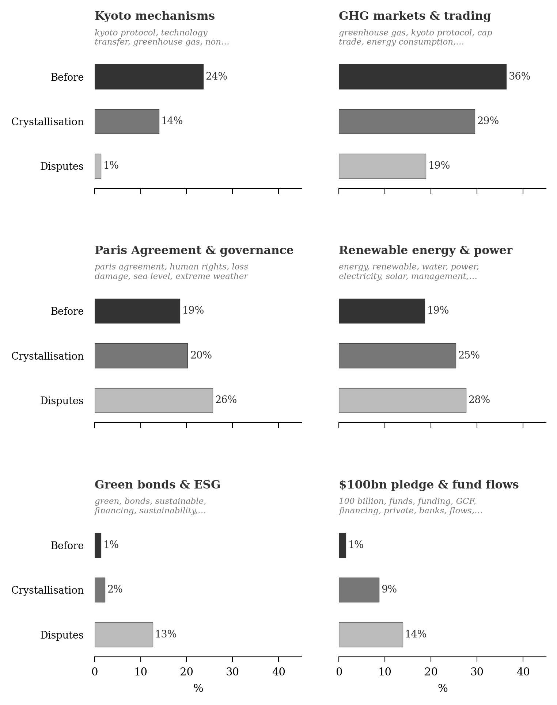

**Résumé.** Depuis le début des années 1990, la finance climat est passée d'une expression floue des politiques internationales à un objet économique central, quantifié, comparé et audité dans les négociations climatiques, au sein de l'OCDE et des banques multilatérales de développement. Les engagements collectifs successifs -- de l'objectif des 100 milliards de dollars par an adopté à Copenhague en 2009 au nouvel objectif quantifié de 300 milliards à l'horizon 2035 fixé à Bakou en 2024 -- ont fait de la finance climat un point nodal de la gouvernance climatique internationale. Pourtant, malgré trois décennies d'efforts statistiques, les controverses persistent quant à ce qui doit être comptabilisé comme finance climat, à la manière de l'évaluer et à l'attribution des responsabilités entre acteurs.

Nous proposons une analyse historique de la construction de la finance climat comme objet économique entre 1990 et 2025. Elle s'éloigne d'une lecture qui ferait de la finance climat une simple extension technique de l'économie de l'environnement ou de l'économie du climat fondée sur la modélisation intégrée. Si les travaux fondateurs sur les externalités et les contraintes environnementales collectives [@ayres_kneese1969], puis les modèles centrés sur la croissance, les dommages, le risque et le temps [@nordhaus1992; @manne_richels1992; @stern2007; @weitzman2007], ont structuré une partie de l'expertise climatique, la question du partage international de l'effort financier s'est développée en grande partie en dehors de ces cadres.

La finance climat a émergé principalement à travers l'entrelacement des négociations internationales, des pratiques de la finance du développement et des outils comptables mobilisés pour rendre opératoires des engagements politiques. À l'OCDE, et en particulier au sein du Comité d'aide au développement, des économistes comme Jan Corfee-Morlot ont joué un rôle central dans la mise en place d'infrastructures statistiques -- marqueurs de Rio, méthodes d'évaluation en équivalent-don, cadres de suivi et de déclaration -- qui ont permis de rendre la finance climat visible et mesurable dans les cadres existants de l'aide publique au développement [@corfee-morlot2009; @corfee-morlot2012].

Ces catégories comptables sont rapidement devenues des lieux de controverse au sein de la discipline économique. D'un côté, des approches fondées sur la correction des défaillances de marché ont mis l'accent sur l'efficacité, l'effet de levier et la mobilisation du capital privé, justifiant le recours à la finance mixte et aux instruments de réduction du risque. De l'autre, des économistes inscrits dans une perspective d'économie politique ont contesté tant les conventions de mesure que leurs implications normatives. Axel et Katharina Michaelowa ont mis en évidence les incitations à la surévaluation inhérentes aux marqueurs de Rio [@michaelowa2007], tandis que Romain Weikmans et J. Timmons Roberts ont interprété les controverses récurrentes comme l'expression de conflits distributifs non résolus entre Nord et Sud [@roberts_weikmans2017; @weikmans_roberts2019].

À travers quatre controverses récurrentes -- la valorisation des prêts concessionnels, la crédibilité des marqueurs de Rio, l'attribution de la finance privée mobilisée et la frontière entre aide au développement et obligations climatiques -- nous montrons que les économistes ont agi non seulement comme experts techniques, mais comme acteurs à la frontière science-société, redéfinissant en permanence ce que la finance climat est et devrait être. La finance climat apparaît ainsi comme un cas privilégié pour analyser les limites politiques de la quantification économique en gouvernance internationale.

**Mots-clés :** finance climat, quantification, catégories comptables, organisations internationales

**Codes JEL :** B20, Q54, F35, Q56

\newpage

## Introduction : un chiffre précis, un objet instable {#sec-intro}

En novembre 2024, à Bakou, les négociateurs climatiques ont adopté un nouvel objectif collectif : les pays développés devraient mobiliser 300 milliards de dollars par an d'ici 2035 pour l'action climatique dans les pays en développement. Le chiffre est net. L'objet qu'il désigne l'est beaucoup moins. Aucune caisse ne contient ces 300 milliards. Aucun registre unique ne les enregistre. Aucune méthode de comptage ne s'impose sans contestation. Le nombre est produit, comme l'objectif des 100 milliards de dollars par an annoncé à Copenhague en 2009, par l'application de conventions comptables discutées à des flux financiers hétérogènes : dons, prêts concessionnels, prêts non concessionnels, garanties, prises de participation, cofinancements privés, contributions multilatérales.

C'est ce paradoxe qui fait de la finance climat un objet intéressant pour l'histoire de la pensée économique. La finance climat est aujourd'hui traitée comme une grandeur économique évidente : elle est suivie, comparée, auditée, commentée dans des rapports de l'OCDE, de la CCNUCC, des banques multilatérales de développement et des ONG. Pourtant, son périmètre reste disputé. Faut-il compter un prêt à sa valeur faciale ou seulement à son équivalent-don ? Une garantie publique peut-elle faire entrer l'investissement privé qu'elle accompagne dans le total de la finance climat ? Un projet de développement ordinaire devient-il climatique parce qu'il reçoit un marqueur comme tel par l'institution qui le finance ? Ces questions sont clés pour déterminer si un pays tient ses engagements internationaux, pour séparer l'aide au développement de la dette extérieure, et pour mesurer à quel point l'effort de solidarité internationale pour le climat est nouveau et additionnel. Comme on va le montrer, ces questions se posent encore : la finance climat n'est pas une grandeur économique évidente du tout.

La thèse défendue ici est simple : les économistes n'ont pas découvert la finance climat comme on découvrirait une réalité déjà là. Les flux financiers existent bien : budgets publics, prêts, garanties, prises de participation et investissements privés. Ce qui est construit, c'est leur agrégation comme grandeur gouvernable. Les économistes ont contribué à cette construction en élaborant les catégories comptables, les seuils de concessionnalité, les marqueurs d'objectif et les méthodes d'attribution qui permettent de rendre comparables des flux autrement hétérogènes. Ce travail n'a pas été accompli seulement dans les revues académiques. Il s'est joué dans les organisations internationales, les comités statistiques, les rapports d'experts, les banques de développement et les procédures de déclaration. L'économie en jeu ici est une économie des conventions de mesure, plus que celle du modèle d'équilibre ou du calcul coût-bénéfice.

La formule du titre -- « économistes sous contrainte » -- est à prendre au pied de la lettre. La contrainte est d'abord diplomatique : les montants sont fixés avant que l'objet soit stabilisé. Elle est aussi statistique, car l'appareil de l'aide publique au développement préexiste et impose ses catégories. Elle est enfin politique : les mêmes instruments doivent concilier deux exigences mal compatibles, l'efficacité de la mobilisation et la redevabilité des transferts. Les économistes n'agissent ni en souverains ni en simples exécutants ; ils travaillent dans cet espace contraint, où toute convention de mesure est aussi un compromis.

La littérature sur l'histoire de l'économie du climat a surtout étudié la modélisation : l'optimisation intertemporelle, le choix du taux d'actualisation, la valeur du carbone, les modèles intégrés d'évaluation [@pottier2016; @aykut_dahan2015]. Ces travaux sont essentiels pour comprendre comment le changement climatique a été constitué comme problème économique. Ils disent moins comment les flux financiers climatiques ont été constitués comme objet mesurable. Le déplacement est important. Passer de la question « quel doit être le prix du carbone ? » à la question « ce dollar compte-t-il comme finance climat ? » revient à changer de régime intellectuel : du modèle à la comptabilité et de l'optimisation à la commensuration [@espeland_stevens1998; @merry2016], c'est-à-dire de la recommandation normative à la vérification d'engagements politiques.

Ce texte périodise la pensée économique sur la finance climat en trois époques. Durant la première, jusqu'au milieu des années 2000, plusieurs traditions existent séparément : économie de l'environnement, économie du développement, économie du partage international de l'effort. Aucune ne produit seule la finance climat. La seconde période, 2007--2014, est une époque de cristallisation : Bali et Copenhague créent la demande de mesure, l'OCDE/CAD et les banques multilatérales fournissent les infrastructures de comptage. La troisième époque, depuis 2015, est celle des controverses autour de l'objet existant. Nous partirons d'une opération concrète -- un financement de la Banque mondiale en Turquie -- pour montrer comment ces controverses deviennent opératoires. La conclusion revient sur le résultat principal : la finance climat est devenue gouvernable non pas malgré l'ambiguïté de ses catégories, mais grâce à elle.

## Méthode

La périodisation proposée découle de notre lecture des textes, de l'observation participante aux débats, notamment sur la modélisation intégrée et au GIEC, et de l'analyse des négociations climatiques. Afin de la tester, nous ajoutons une analyse computationnelle d'un corpus multilingue sur la finance climat (Figure 1). L'enjeu n'est pas de remplacer l'interprétation par le calcul, mais de la soumettre à une tentative de falsification. L'emploi d'une méthode quantitative nous a semblé utile pour illustrer le propos, à la frontière entre histoire de la pensée économique et études science/société.

Cette manière de faire de l'histoire intellectuelle peut surprendre. La discipline lit d'ordinaire de près un petit nombre de textes canoniques. Or la finance climat n'a pas de canon. Du moins, s'il existe un canon dans le domaine, notre moissonnage des syllabus de cours de finance climat trouvables sur internet ne l'a pas fait remonter. En effet la finance climat s'est formée récemment, dans des milliers de rapports d'experts, de décisions institutionnelles et d'articles dispersés, en plusieurs langues -- une littérature trop vaste et trop éclatée pour qu'un seul lecteur la tienne tout entière. Nous établissons un corpus empirique à visée exhaustive, dans lequel les publications institutionnelles prennent une place importante. Cela correspond à la nature de l'objet étudié : la finance climat n'est pas définie par une théorie unique publiée dans un petit nombre de productions académiques anglo-saxonnes.

{#fig-bars width=85%}

L'argument historique couvre la période 1990--2025. Le corpus bibliographique systématique s'arrête toutefois à 2024, dernière année complète disponible au moment de l'analyse ; l'année 2025 est mobilisée par le cas Türkiye comme test contemporain des catégories stabilisées.

L'analyse computationnelle d'environ  travaux est discutée en annexe. Les résultats fournissent des indices convergents : les ruptures lexicales, les communautés de co-citation et la recomposition thématique du corpus sont cohérentes avec une périodisation en trois moments : avant la finance climat (1990--2006), cristallisation (2007--2014), champ établi et controversé (2015--2024). Ainsi, la Figure 2 montre la vitesse de renouvellement des thèmes traités dans la littérature. L'indice est exprimé en unités relatives, et calculé sans connaissance a priori de la périodisation. Les résultats accréditent notre lecture en deux ruptures. Les changements lexicographiques tabulés en annexe montrent bien, entre les périodes, le recul des termes associés au Mécanisme de développement propre et au vocabulaire de Kyoto, et la progression des termes associés à la finance mobilisée, aux fonds, aux flux, à l'aide et, plus tard, à la finance verte.

{#fig-breaks width=85%}

## Avant la finance climat : trois traditions disjointes (1990--2006) {#sec-before}

La Convention-cadre des Nations unies sur les changements climatiques, adoptée en 1992, ne parle pas encore de « finance climat ». Son article 4.3 formule une obligation beaucoup plus précise : les pays développés doivent fournir des ressources financières nouvelles et additionnelles pour couvrir les coûts convenus, en particulier les « coûts incrémentaux complets » des mesures mises en œuvre par les pays en développement [@unfccc1992]. La logique est transactionnelle : il s'agit de rembourser des coûts définis et acceptés, non de comptabiliser un agrégat mondial de flux financiers. L'histoire ultérieure peut se lire comme l'abandon progressif de cette précision initiale au profit d'une catégorie plus large, plus maniable et plus ambiguë : la finance climat.

Cette section montre pourquoi aucun des trois langages disponibles avant 2007 -- prix du carbone, aide au développement, partage de l'effort -- ne suffisait à produire une comptabilité de la finance climat. Avant la COP de Copenhague, trois traditions intellectuelles abordent chacune une partie du problème.

La première est l'économie de l'environnement. Depuis Pigou, puis avec les travaux sur les externalités et les contraintes matérielles [@ayres_kneese1969], elle traite la pollution comme divergence entre coûts privés et coûts sociaux. Dans le cas du climat, cette tradition produit une question dominante : quel prix donner aux émissions ? Les modèles intégrés développés par Nordhaus, Manne et Richels, puis discutés par Stern et Weitzman, calculent des trajectoires optimales d'abattement, des dommages futurs, des taux d'actualisation et des prix implicites du carbone [@nordhaus1992; @manne_richels1992; @stern2007; @weitzman2007]. Ils structurent puissamment l'économie du changement climatique. Mais ils ne construisent pas une catégorie de finance climat. Les flux Nord-Sud qui peuvent apparaître dans ces modèles sont des variables d'optimisation ou de bien-être, non des instruments institutionnels devant être suivis et vérifiés.

La deuxième tradition est l'économie du développement et, plus précisément, la statistique de l'aide. Le Comité d'aide au développement de l'OCDE suit depuis les années 1960 l'aide publique au développement : dons, prêts, canaux bilatéraux et multilatéraux, secteurs, objectifs. Ces catégories n'ont rien de naturel, mais l'effort de transparence est utile dans un monde où les questions d'aide, de commerce, d'influence et d'intégrité publique s'entremêlent. Elles sont le résultat de décennies de négociations statistiques, stabilisées dans des directives et rendues progressivement objectives par l'usage [@desrosieres1998; @porter1995]. Les notions de concessionnalité, de valeur faciale et d'équivalent-don appartiennent d'abord à cet univers. Les marqueurs de Rio, introduits en 1998 pour identifier les projets liés aux conventions issues du Sommet de Rio, fournissent ensuite un pont décisif : ils permettent d'apposer une étiquette climatique à des activités d'aide existantes. La finance climat héritera ainsi d'une infrastructure statistique conçue pour l'aide au développement, avec ses forces, ses biais et ses incitations à la déclaration.

La troisième tradition est celle du partage international de l'effort. Les négociations climatiques des années 1990 sont traversées par les principes de responsabilité commune mais différenciée, d'équité, d'émissions historiques et de capacités respectives. Dans la modélisation économique, ces questions croisent la littérature sur les pondérations de bien-être et la répartition des coûts [@negishi1960]. Dans les négociations, elles prennent une forme juridique et politique : qui doit payer ? Or cette tradition reste largement déconnectée de la question opérationnelle : comment compter ce qui a effectivement été payé ? Le Protocole de Kyoto et le Mécanisme de développement propre rapprochent bien flux financiers et objectifs climatiques, mais à travers des crédits carbone et des mécanismes de marché, non à travers une comptabilité de la finance climat en dollars [@michaelowa2019].

Nous avons testé cette dispersion dans le corpus, en examinant les références utilisées par les écrits antérieurs à 2007. Il apparaît que les modélisateurs de l'économie des politiques climatiques, les spécialistes de l'aide et les chercheurs en gouvernance internationale partagent peu de références centrales. Cette fragmentation correspond à l'état intellectuel du problème. Avant 2007, les pièces existent, mais l'objet n'est pas assemblé. L'économie de l'environnement produit le raisonnement de l'efficacité et du prix du carbone. L'économie du développement fournit les catégories et les registres de l'aide. Les débats sur le partage de l'effort fournissent la grammaire de la responsabilité. Or la finance climat n'apparaît que lorsque ces trois ensembles sont contraints de fonctionner ensemble par un engagement politique chiffré.

| Tradition | Question centrale | Auteurs et institutions | Apport à la finance climat | Limite avant 2007 |
|---|---|---|---|---|
| Économie de l'environnement | Quel prix pour le carbone ? | Ayres, Kneese ; Nordhaus ; Manne et Richels ; Stern ; Weitzman | Externalités, coût-bénéfice, prix implicite du carbone, efficacité de l'abattement | Pas de comptabilité des flux Nord-Sud |
| Économie du développement | Comment classer et compter l'aide ? | OCDE/CAD ; directives statistiques ; marqueurs de Rio ; Michaelowa | APD, concessionnalité, équivalent-don, canaux bilatéraux et multilatéraux | Catégories conçues pour l'aide, non pour les obligations climatiques |
| Partage international de l'effort | Qui doit payer ? | CCNUCC ; Kyoto ; Negishi ; débats sur équité et responsabilités différenciées | Principe de transfert, coûts incrémentaux, responsabilités Nord-Sud | Faible traduction en instruments de suivi financier |

: Trois traditions avant la finance climat {#tbl-traditions}

## Cristallisation : Copenhague et la fabrique comptable (2007--2014) {#sec-crystallization}

Le moment de cristallisation a procédé d'une contrainte politique, non d'une découverte théorique. Le Plan d'action de Bali, en 2007, demande que les engagements financiers soient mesurables, notifiables et vérifiables [@unfccc2007bali]. Deux ans plus tard, à Copenhague, les pays développés s'engagent à mobiliser 100 milliards de dollars par an d'ici 2020. Le chiffre n'est pas déduit d'un modèle économique ni d'une estimation des besoins. Il résulte d'une négociation. Or, une fois annoncé, il crée une obligation de mesure. Pour savoir si 100 milliards ont été mobilisés, il faut dire ce qui compte.

C'est en ce sens limité que l'engagement de Copenhague est performatif [@callon1998]. Il ne crée pas les flux financiers eux-mêmes : des prêts, des dons, des garanties et des investissements existaient déjà. Il oblige en revanche les institutions à construire l'agrégat qu'il promet de mesurer. La performativité ne passe pas ici par un modèle de marché, comme dans les analyses de MacKenzie sur les formules financières [@mackenzie2006]. Elle passe par des formulaires, des directives statistiques, des bases de données, des coefficients et des conventions d'attribution. La finance climat devient une grandeur gouvernable parce qu'elle devient comptable.

L'OCDE/CAD joue alors un rôle décisif. Le choix pratique consiste à greffer le climat sur l'appareil existant de l'aide publique au développement. Les marqueurs de Rio permettent aux bailleurs de déclarer si une activité vise le climat comme objectif principal, comme objectif significatif, ou pas du tout. Cette solution est efficace : elle évite de créer un système de déclaration entièrement nouveau. Mais elle déplace dans la finance climat les conventions et les biais de l'APD. Les donneurs déclarent eux-mêmes les marqueurs. Les projets à objectif « significatif » peuvent être comptés avec des coefficients variables. Les prêts peuvent être enregistrés à leur valeur faciale ou à leur équivalent-don. Un dispositif conçu comme outil de suivi devient ainsi l'armature d'une comptabilité internationale politiquement chargée.

Les économistes d'organisations internationales occupent dans cette période une position spécifique. Ils ne sont ni de simples techniciens ni les auteurs souverains d'une architecture. Ils répondent à une demande issue des négociations, des États et des ONG : rendre les engagements vérifiables avec les instruments statistiques disponibles. Mais en rendant les flux comparables, ils définissent aussi ce qui devient visible. Les travaux de Jan Corfee-Morlot et de ses collègues à l'OCDE, ceux de la Climate Policy Initiative, ainsi que les rapports des banques multilatérales ne font pas qu'observer la finance climat ; ils en fixent les catégories opératoires [@corfee-morlot2009; @corfee-morlot2012; @buchner2011; @buchner2013]. C'est un cas typique d'économisation : un domaine devient économique parce qu'il est équipé de dispositifs de calcul [@caliskan_callon2009; @caliskan_callon2010].

Deux vocabulaires se stabilisent alors, et avec eux deux pôles durables du champ. Le premier est un pôle d'efficacité. Il parle d'effet de levier, de finance mixte, de dérisquage, de mobilisation du capital privé et de correction des défaillances de marché. Dans cette perspective, la finance publique climatique doit être catalytique : elle sert à modifier le profil de risque-rendement des projets pour attirer des capitaux privés. Le second est un pôle de redevabilité. Il parle d'additionnalité, de double comptage, d'équivalent-don, de justice climatique, de qualité de l'aide. Dans cette perspective, la finance climat est d'abord un engagement des pays développés envers les pays en développement, et le problème principal est la tendance des donneurs à requalifier des flux existants.

| Pôle | Question dominante | Concepts privilégiés | Institutions et lieux typiques | Risque politique |
|---|---|---|---|---|
| Efficacité | Comment augmenter les volumes d'investissement ? | Levier, finance mixte, dérisquage, mobilisation privée, obligations vertes | Banques multilatérales, OCDE, finance durable, économie de l'énergie | Diluer l'obligation climatique dans l'ingénierie financière |
| Redevabilité | Comment vérifier la réalité du transfert ? | Additionnalité, équivalent-don, double comptage, marqueurs de Rio, justice climatique | ONG, CCNUCC, économie politique, rapports critiques | Réduire la finance climat à un contentieux distributif insoluble |

: Deux pôles constitutifs du champ {#tbl-poles}

Ces deux pôles ne sont pas extérieurs l'un à l'autre. Ils utilisent les mêmes catégories, mais les interprètent différemment. Pour le pôle d'efficacité, un prêt de développement peut être une ressource utile s'il débloque un investissement bas carbone. Pour le pôle de redevabilité, le même prêt peut être une dette supplémentaire qui ne devrait être comptée qu'à hauteur de son élément de don. Pour le premier, l'ambiguïté des catégories facilite l'action ; pour le second, elle rend possible l'inflation des chiffres. La controverse n'est donc pas un accident de la finance climat. Elle en est une condition de fonctionnement.

## Compter, c'est gouverner : controverses dans un champ établi (2015--2025) {#sec-controverses}

L'Accord de Paris donne à la finance climat un statut juridique central. L'article 9 dispose que les pays développés doivent fournir des ressources financières pour aider les pays en développement à la fois pour l'atténuation et l'adaptation, et que cette mobilisation doit progresser par rapport aux efforts antérieurs [@unfccc2015paris]. Le contraste avec 1992 est frappant. Là où la Convention parlait de coûts incrémentaux convenus, Paris parle simplement de ressources financières et de mobilisation. Le terme est plus large, mais moins précis. La catégorie est suffisamment installée pour être utilisée comme si elle allait de soi, mais elle demeure assez indéterminée pour continuer à soutenir des interprétations divergentes.

### Une opération, plusieurs manières de compter : le cas Türkiye / Banque mondiale {#sec-transaction}

Une opération suffit à faire apparaître la mécanique de ces controverses. En 2025, la Banque mondiale approuve un financement pour le projet turc *Transforming Power Transmission System* (TPTS, P508354), destiné à moderniser le réseau électrique et à permettre l'intégration directe de 1,7 gigawatt d'énergies renouvelables.^[World Bank, « World Bank and Clean Technology Fund Support Türkiye's Renewable Energy Goals with Power Transmission Project », communiqué du 4 août 2025, projet *Transforming Power Transmission System* (P508354). Montants confirmés par le communiqué et par le document d'information de projet (World Bank, PID PIDIA01318, 28 avril 2025) : prêt IBRD de 625 M€, soit 707,9 M$ équivalent ; prêt CTF de 32,8 M€, soit 38 M$ ; don CTF de 2 M$.] L'opération combine trois instruments : un prêt IBRD de 625 millions d'euros à environ 3 %, un prêt concessionnel du Clean Technology Fund de 32,8 millions d'euros, soit environ 38 millions de dollars, avec une commission de service de 0,25 %, et un don de 2 millions de dollars.^[L'estimation du coût complet du prêt IBRD combine l'Euribor à trois mois, autour de 2,1 % à la mi-2025, et la marge standard de la Banque. Les conditions de taux et de maturité du prêt CTF ne sont pas détaillées dans le document d'information de projet public et relèvent du barème concessionnel standard des Climate Investment Funds ; l'hypothèse retenue ici -- taux de l'ordre de 0,25 %, maturité de quinze à vingt ans pour un pays à revenu intermédiaire -- est indicative. Le taux souverain turc cité reflète les conditions de marché de la mi-2025, la note du pays ayant été relevée en 2024-2025 tout en restant en dessous de la catégorie investissement.] Au même moment, la Turquie, notée en dessous de la catégorie investissement, emprunte sur les marchés en dollars à environ 7,2--7,75 %.

Une précision évite un contresens. Les banques multilatérales et les bailleurs bilatéraux ne mobilisent pas exactement le même système de codage : les premières raisonnent en co-bénéfices climat selon une méthodologie commune des banques multilatérales, les seconds utilisent les marqueurs de Rio de l'OCDE/CAD. Le point commun n'est pas l'identité des outils, mais le fait que la qualification climatique repose sur une convention déclarative d'objectif.

| Instrument | Montant | Prix du capital | Manière de compter possible | Controverse révélée |
|---|---:|---:|---|---|
| Prêt IBRD | 625 M€ | Environ 3 % | Montant quasi intégral comme financement climatique de mitigation | Concessionnalité issue du bilan AAA de la Banque, non d'une subvention budgétaire |
| Prêt CTF | 32,8 M€ / 38 M$ | 0,25 % | Valeur faciale, ou équivalent-don de l'ordre de la moitié du montant | Écart entre argent prêté et transfert réel |
| Don CTF | 2 M$ | Sans remboursement | Montant intégral | Cas simple, mais marginal dans le total |
| Projet réseau | Ensemble de l'opération | Infrastructure générale | Marqueur climat « principal » ou co-bénéfice de mitigation | Additionnalité et spécificité climatique discutables |

: Une opération, plusieurs conventions de comptage {#tbl-turkiye}

La première controverse concerne la concessionnalité. Dire qu'un prêt est concessionnel signifie que ses conditions sont plus favorables que celles du marché. Mais il existe deux façons de l'enregistrer. À sa valeur faciale, le prêt CTF compte pour 38 millions de dollars. À son équivalent-don, il ne compte qu'à hauteur de la subvention implicite contenue dans le prêt, de l'ordre de la moitié du montant selon les conditions et le taux d'actualisation retenus. La différence n'est pas technique au sens faible : elle décide si l'on parle d'un volume de financement ou d'un transfert net.

Le prêt IBRD est encore plus révélateur. Il ne contient pas nécessairement de subvention budgétaire d'un donneur. Sa faveur vient de la capacité de la Banque mondiale à emprunter à bas coût grâce à son bilan et à sa notation. Si l'on compare le taux IBRD au taux auquel la Turquie emprunterait seule, l'avantage est réel -- même si la comparaison, entre un prêt en euros et un coût de marché libellé en dollars, reste indicative. Mais doit-il être compté comme une contribution climatique des pays développés ? Selon le taux d'actualisation, la maturité retenue et la règle appliquée, le même prêt peut franchir ou non le seuil conventionnel de concessionnalité. Ce qui change n'est pas le flux financier ; c'est la convention de mesure.

La deuxième controverse concerne la qualification climatique. Une modernisation du réseau peut permettre l'intégration d'énergies renouvelables. Elle peut donc être déclarée comme financement d'atténuation, soit comme co-bénéfice climat dans la méthodologie des banques multilatérales, soit comme objectif climatique dans le vocabulaire des marqueurs de Rio. Mais un réseau transporte aussi l'électricité produite par d'autres sources ; les électrons n'ont pas de couleur. La qualification climatique attribue une finalité à une infrastructure qui sert le système électrique dans son ensemble. Elle ne résout pas la question de la spécificité climatique. Elle la clôt par convention.

La troisième controverse concerne l'additionnalité. La Banque mondiale finance des réseaux électriques depuis longtemps. Il est donc possible que le projet aurait existé, au moins en partie, sans la catégorie finance climat. Le comptabiliser comme finance climat peut enregistrer une ressource additionnelle ; il peut aussi requalifier une activité de développement déjà probable. Là encore, la convention ne se borne pas à décrire la réalité : elle la découpe.

Ce cas justifie de traiter la finance climat moins comme une catégorie de monnaie que comme une procédure de comptage. Chaque étape -- prix du capital, équivalent-don, marqueur climatique, attribution de l'objectif -- est gouvernée par une convention. Les controverses d'après Paris ne naissent donc pas de l'absence de catégories. Elles naissent du fait que les catégories existent, mais qu'elles restent assez ouvertes pour soutenir plusieurs lectures incompatibles.

### Quatre controverses récurrentes

La première controverse porte sur la valeur des prêts concessionnels. Les donneurs ont longtemps intérêt à compter les prêts à leur valeur faciale : un prêt de 100 millions augmente immédiatement le total annoncé de 100 millions. Les pays récipiendaires et les ONG insistent au contraire sur l'équivalent-don, car seul celui-ci mesure la part réellement transférée. La réforme de la mesure de l'APD en équivalent-don, adoptée par le CAD et mise en œuvre à partir de 2018, montre que la question est centrale [@bachus_becault2017]. Les rapports critiques d'Oxfam appliquent précisément ce type de correction pour produire des estimations beaucoup plus faibles que les chiffres officiels [@carty_lecomte2018; @zagema2023]. Cet écart ne tient pas à une erreur de calcul : il traduit deux définitions différentes de l'effort.

La deuxième controverse concerne la crédibilité des marqueurs de Rio. Les marqueurs reposent largement sur l'auto-déclaration des bailleurs. Or ceux-ci ont une incitation directe à qualifier comme climatiques des projets qui l'auraient été partiellement, marginalement, ou pas du tout. Les travaux d'Axel et Katharina Michaelowa ont montré très tôt les risques de surdéclaration et d'incohérence entre donneurs [@michaelowa2007]. Le problème n'est pas seulement que certains projets seraient mal codés : le dispositif transforme un outil de suivi en indicateur de conformité politique. Dès lors, le marqueur ne constate plus seulement une intention ; il crée un intérêt à déclarer cette intention.

La troisième controverse porte sur l'attribution de la finance privée mobilisée. Si une garantie publique accompagne un investissement privé dans un parc éolien, quelle part de l'investissement privé peut être attribuée à la garantie ? Toute la difficulté vient du raisonnement contrefactuel : que se serait-il passé sans intervention publique ? Les méthodologies développées par l'OCDE cherchent à standardiser cette attribution [@caruso_ellis2013; @jachnik2015], mais elles ne peuvent supprimer le jugement. Compter largement la finance privée mobilisée permet d'augmenter les totaux et de présenter la finance publique comme catalytique. Compter strictement réduit les montants, mais protège mieux la notion de contribution vérifiable [@stadelmann2013; @atteridge_dzebo2015].

La quatrième controverse concerne la frontière entre aide au développement et obligation climatique. Le principe de ressources « nouvelles et additionnelles » est présent depuis la Convention et réaffirmé politiquement à Copenhague. Mais il n'a jamais reçu de définition opérationnelle consensuelle. Additionnel par rapport à quoi ? À l'APD existante ? À la cible de 0,7 % du RNB ? À un scénario contrefactuel de dépense publique ? Plusieurs options sont possibles, mais aucune ne s'impose, parce qu'elles redistribuent différemment l'effort apparent [@stadelmann2011]. Roberts et Weikmans ont raison de lire ces controverses comme des conflits distributifs : elles portent sur les chiffres, mais les chiffres portent sur la responsabilité [@roberts_weikmans2017].

Ces quatre controverses se prolongent dans le passage de l'objectif des 100 milliards au nouvel objectif collectif quantifié. Lorsque l'OCDE annonce que le seuil des 100 milliards a été dépassé en 2022, la conclusion dépend des conventions retenues : marqueurs, valeur faciale, instruments inclus, attribution de la finance privée.^[OCDE (2024), *Climate Finance Provided and Mobilised by Developed Countries in 2013-2022*, Éditions OCDE, Paris : le total déclaré pour 2022 atteint 115,9 milliards de dollars.] À Bakou, le nouvel objectif de 300 milliards d'ici 2035 reconduit la même architecture, en l'élargissant.^[Décision de la CMA à la COP29 (Bakou, novembre 2024) sur le nouvel objectif collectif quantifié de financement climatique, fixant 300 milliards de dollars par an d'ici 2035.] Les débats sur la contribution éventuelle de certains pays émergents, sur la prise en compte des flux Sud-Sud, sur les pertes et préjudices ou sur la part de subventions ne sont pas des questions périphériques. Ils rouvrent la frontière de l'objet.

Le champ postérieur à Paris est donc « établi » dans un sens particulier. Les catégories existent. Les institutions publient des séries. Les rapports se répondent. Les chiffres circulent. Mais ce qui se stabilise est un langage commun de dispute, plus qu'un accord sur la substance. Les mêmes catégories -- équivalent-don, marqueur, mobilisation, additionnalité -- permettent aux acteurs de coopérer assez pour produire des chiffres et de diverger assez pour continuer à les contester.

L'analyse computationnelle pointe dans la même direction. Après 2015, les thèmes se diversifient : finance verte, obligations vertes, ESG, risques climatiques, pertes et préjudices, transition juste. Mais il n'apparaît pas de rupture comparable à celle de 2007--2009 dans les catégories de mesure. L'Accord de Paris modifie l'architecture institutionnelle et renforce les obligations de transparence ; il ne remplace pas les conventions comptables héritées de la période de cristallisation. La polarisation efficacité/redevabilité devient plus nette, sans faire éclater le champ.

## Conclusion : l'ambiguïté comme ressource de gouvernement {#sec-conclusion}

L'histoire retracée ici conduit à renverser une intuition courante. On pourrait penser que la finance climat reste controversée parce que ses catégories sont insuffisamment définies. C'est vrai en partie, mais insuffisant. La finance climat est devenue gouvernable précisément parce que ses catégories sont assez définies pour permettre la déclaration et la comparaison, et assez ambiguës pour agréger des intérêts contradictoires.

Le point de départ de 1992 était relativement précis : les pays développés devaient couvrir des coûts incrémentaux convenus. Ce cadre avait une cohérence économique et juridique. Mais il était étroit, coûteux à appliquer et politiquement contraignant. La trajectoire ultérieure -- mécanismes de Kyoto, fonds spécialisés, engagement de Copenhague, article 9 de Paris, objectif de Bakou -- élargit progressivement l'objet. Elle remplace la logique du remboursement de coûts définis par celle de la mobilisation d'un agrégat financier. Ce déplacement permet de compter davantage de choses : prêts, garanties, financements multilatéraux, cofinancements privés, instruments de dérisquage. Il offre un niveau de flou diplomatique permettant de maintenir ensemble deux interprétations concurrentes : pour les donneurs, un effort de mobilisation ; pour les récipiendaires et les ONG, une obligation de transfert et de redevabilité.

Les économistes, aussi bien praticiens qu'académiques, occupent dans cette histoire une position contrainte. Ils ne fixent pas les objectifs politiques. Ils ne décident pas seuls des compromis diplomatiques. Mais ils fournissent les dispositifs qui rendent ces compromis opératoires. En construisant les marqueurs, les méthodes d'équivalent-don, les règles d'attribution de la finance privée et les cadres de suivi et de déclaration, ils redéfinissent les frontières de l'objet. Ils font un travail de frontière [@gieryn1983] : entre aide et climat, entre prêt et transfert, entre mobilisation et obligation, entre efficacité financière et justice distributive.

La finance climat apparaît ainsi comme un observatoire privilégié des limites politiques de la quantification économique. La quantification ne pacifie pas le conflit ; elle le rend administrable. Elle transforme une dispute sur la responsabilité historique, l'équité et le développement en dispute sur des catégories comptables. Ce déplacement est productif : sans lui, les engagements collectifs seraient invérifiables ; avec lui, ils deviennent vérifiables seulement au prix de controverses récurrentes sur ce qui est vérifié.

Cette conclusion ouvre plusieurs chantiers. Le premier est archivistique : une histoire plus fine des comités de l'OCDE, de la CCNUCC et des banques multilatérales permettrait de comprendre comment certaines conventions ont été retenues plutôt que d'autres. Le deuxième est géographique : l'histoire de la finance climat vue depuis les pays récipiendaires, et pas seulement depuis les institutions de déclaration dominées par les donneurs, reste largement à écrire. Le troisième est juridique : le passage des coûts incrémentaux de l'article 4.3 à l'objectif collectif quantifié de Bakou mérite une histoire institutionnelle propre. Enfin, la question du financement des « pertes et préjudices » teste de façon décisive la viabilité des accords sur la finance climat. Si cette catégorie est absorbée par les conventions existantes, l'ambiguïté stratégique de la finance climat sera reconduite. Si elle impose d'autres instruments de mesure, elle pourrait rouvrir ce que Copenhague avait refermé : la question de ce qui est dû, à qui, et pourquoi.

\newpage

## Annexe. Note méthodologique sur l'analyse computationnelle {.unnumbered}

### A.1 Introduction {.unnumbered}

L'analyse computationnelle ne produit pas l'interprétation. La périodisation, les traditions intellectuelles et les controverses ont été établies à partir du dossier historique : textes de la CCNUCC, rapports de l'OCDE et des banques multilatérales, littérature d'économie politique, trajectoires d'acteurs et controverses de déclaration. Le corpus sert seulement à vérifier si des signaux indépendants -- vocabulaire, citations, voisinages de sens -- vont dans le même sens que cette lecture.

Trois questions lui sont posées. La première : le langage du champ bascule-t-il à la fin des années 2000, comme le voudrait l'idée d'une cristallisation ? La deuxième : avant 2007, les trois traditions citent-elles déjà les mêmes références, ou restent-elles séparées ? La troisième : après Paris, la tension entre efficacité et redevabilité se lit-elle dans les thèmes et dans les revues ? Les trois sections qui suivent répondent à ces questions dans l'ordre.

### A.2 Le corpus {.unnumbered}

Le corpus rassemble environ  travaux publiés entre 1990 et 2024, réunis depuis six sources : OpenAlex, ISTEX, littérature grise institutionnelle, rapports de la Banque mondiale, canons pédagogiques et références complémentaires collectées à la main. Les doublons sont retirés d'abord par identifiant DOI, puis par rapprochement des titres et des années. L'inclusion de la littérature grise est un choix de fond : les catégories étudiées ici ont été fabriquées dans des rapports d'experts et des décisions institutionnelles autant que dans des revues académiques.

Le corpus reste imparfait. Il ne contient que les métadonnées. Il demeure dominé par l'anglais, malgré des requêtes multilingues. Il reflète mieux les institutions qui publient et indexent leurs travaux que les négociations informelles, et il sous-représente sans doute les savoirs produits dans les administrations des pays récipiendaires. Ses résultats sont donc des indices structurels, non une cartographie exhaustive.

Pour comparer les travaux par leur sens, et non par leurs seuls mots exacts, chaque titre, résumé et liste de mots-clés est traduit en un point dans un « espace de sens » : deux textes traitant de sujets proches y sont voisins, même s'ils n'emploient pas les mêmes mots, par exemple parce qu'ils sont dans des langues différentes. Il devient possible de traiter le corpus sur une base géométrique, comme un vaste nuage de points.

On a classé ces points en six groupes, sans indiquer de réponse attendue. Chaque groupe peut être ensuite repéré par les mots qui le caractérisent. Le nombre de six est arbitraire. La finance climat forme un continuum, non un ensemble d'écoles bien séparées. Cependant, les groupes font bien apparaître les différents thèmes des négociations climatiques. Et l'évolution, d'une période à l'autre, de la part des publications par groupe correspond à l'histoire de ces négociations.

{#fig-composition width=85%}

### A.3 Premier point : les ruptures dans le temps {.unnumbered}

La périodisation -- 1990--2006, 2007--2014, 2015--2024 -- repose d'abord sur l'histoire institutionnelle : avant Bali et Copenhague, la catégorie n'est pas stabilisée ; entre 2007 et 2014, les dispositifs de comptage se cristallisent ; après Paris, les controverses se déploient dans un cadre établi. Pour l'éprouver sans lui souffler la réponse, on cherche les années de rupture en ignorant délibérément le calendrier des COP. Le principe est simple : mesurer, année après année, à quel point le vocabulaire et les thèmes de la littérature se déplacent d'une fenêtre de quelques années à la suivante. Quand cette mesure fait un saut, c'est qu'une année concentre un changement de langage.

Sur la figure 2, les sauts les plus nets tombent autour de 2007, avec un second, plus faible, vers 2013. L'Accord de Paris, lui, ne produit pas de rupture comparable : il diversifie les thèmes sans refonder les catégories de mesure. C'est exactement ce que prédit la thèse, puisque après 2015 les disputes se déploient dans des catégories déjà cristallisées.

### A.4 Deuxième point : les filiations de citation {.unnumbered}

La deuxième question porte sur les références partagées. On prend les travaux les plus cités avant 2007, on relie deux références chaque fois qu'un même texte du corpus les cite ensemble, puis on laisse ces liens dessiner des regroupements, sans en fixer le nombre à l'avance. Le résultat important n'est pas le détail des groupes, mais la fragmentation du réseau : la modélisation climatique, la statistique de l'aide et la gouvernance internationale forment des lignées faiblement reliées. Avant la cristallisation, les trois traditions ne se lisent guère les unes les autres.

### A.5 Troisième point : la polarisation efficacité / redevabilité {.unnumbered}

La troisième question demande si la polarisation d'après Paris se voit dans les textes eux-mêmes. Pour cela, dans le même espace qui a servi à classer les publications en six groupes, on peut les projeter selon un axe efficacité/redevabilité. Il est alors possible de valider l'axe par rapport à l'écologie des revues, dont on connaît la ligne éditoriale. Les travaux proches du pôle efficacité apparaissent davantage dans les revues de finance, d'énergie et de risque climatique. Les travaux proches du pôle redevabilité se concentrent plus souvent dans les revues de gouvernance environnementale, de politique climatique et d'économie politique.



**Reproductibilité, données et code.** Les opérations résumées ci-dessus reposent sur des méthodes statistiques standard : les représentations vectorielles (« embeddings ») sont produites par le modèle multilingue `BAAI/bge-m3`. Le regroupement des textes par leur sens utilise l'algorithme k-means à six groupes sur les embeddings. La détection des ruptures combine la divergence de Jensen--Shannon et la distance cosinus, sur les répartitions thématiques. Les communautés de co-citations sont examinées par la méthode de Louvain. Les scripts et la chaîne de reproduction complète sont archivés sur Zenodo (DOI : [10.5281/zenodo.19097045](https://doi.org/10.5281/zenodo.19097045)) et développés en science ouverte à l'adresse <https://github.com/MinhHaDuong/climate-finance-het>.

## Bibliographie {.unnumbered}

::: {#refs}
:::
