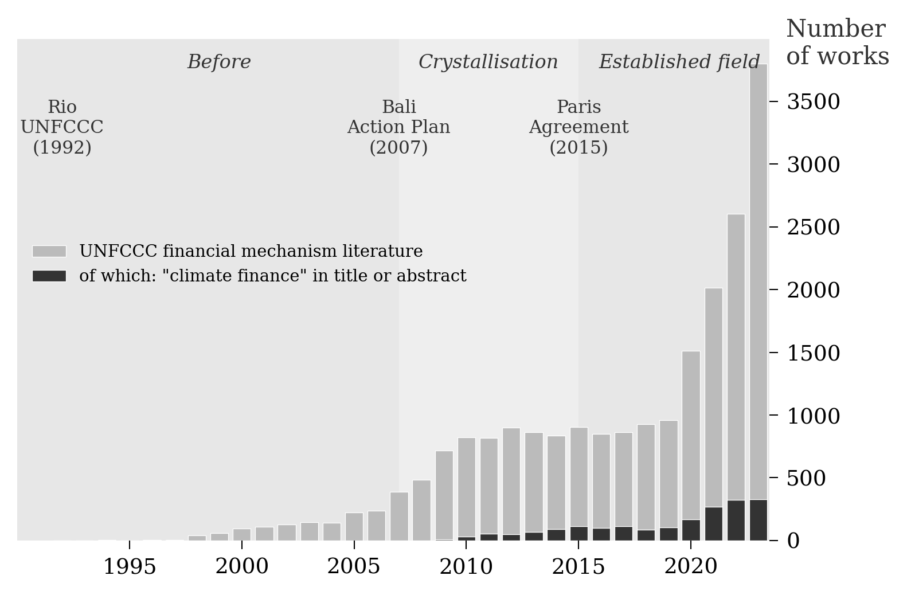
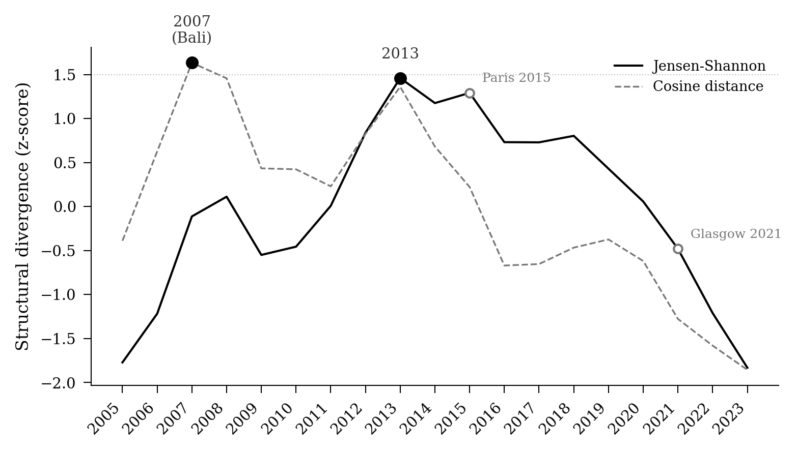

<!-- Phase 2→3 contract: this manuscript consumes
     - figures/fig_bars_v1.png          (@fig-bars)
     - figures/fig_breaks.png           (@fig-breaks)
     - figures/fig_composition.png      (@fig-composition)
     - tables/tab_venues.md             (@tbl-venues)
     Any change to these outputs requires rebuilding the manuscript.

     English translation of the frozen French source content/manuscript-Gide.qmd
     (tag gide-submitted-2026-06-29), machine-performed and style-anchored on the
     author's pre-AI English prose (docs/style-anchor-v205.md, ticket 0173). -->

**Abstract.** This article traces how climate finance was made into an economic aggregate: a magnitude counted, compared and audited in the climate negotiations, at the OECD and in the multilateral development banks, in the lineage of the histories of gross domestic product and the monetary aggregates. Its birth met three conditions. A political number came first: the $100 billion a year fixed at Copenhagen in 2009, like the $300 billion by 2035 set at Baku in 2024, was set before anyone had settled what would count towards it. A statistical infrastructure was already standing: the development-aid accounts of the OECD, with their markers and grant-equivalent conventions. And economists, working under constraint, built the devices that turned a political number and an inherited apparatus into a countable whole. The categories remain contested -- over what counts as climate finance, how to value it, and how to attribute responsibilities -- and that contestation is the condition of the aggregate's success rather than a failure of its construction.

This reading departs from one that would make climate finance a mere technical extension of environmental economics, or of a climate economics grounded in integrated modelling. The founding work on externalities and collective environmental constraints [@ayres_kneese1969], then the models centred on growth, damages, risk and time [@nordhaus1992; @manne_richels1992; @stern2007; @weitzman2007], structured part of climate expertise; the question of sharing the international financial effort, however, developed largely outside these frames.

Climate finance emerged mainly through the entanglement of international negotiations, development finance practices, and the accounting tools mobilized to make political commitments operational. At the OECD, and within the Development Assistance Committee in particular, economists such as Jan Corfee-Morlot built the statistical infrastructures -- Rio markers, grant-equivalent valuation methods, monitoring and reporting frameworks -- that made climate finance visible and measurable within the existing frames of official development assistance [@corfee-morlot2009; @corfee-morlot2012].

These accounting categories soon became sites of controversy within the economics profession. On one side, approaches grounded in the correction of market failures emphasized efficiency, leverage and the mobilization of private capital, justifying blended finance and de-risking instruments. On the other, economists working from a political-economy perspective contested both the measurement conventions and their normative implications. Axel and Katharina Michaelowa exposed the incentives to over-report inherent in the Rio markers [@michaelowa2007], while Romain Weikmans and J. Timmons Roberts read the recurring controversies as the expression of unresolved distributive conflicts between North and South [@roberts_weikmans2017; @weikmans_roberts2019].

Through four recurring controversies -- the valuation of concessional loans, the credibility of the Rio markers, the attribution of mobilized private finance, and the boundary between development aid and climate obligations -- I show that economists acted as technical experts and, beyond that, as actors at the science-society boundary, permanently redefining what climate finance is and ought to be. Climate finance is therefore a good case for studying the political limits of economic quantification in international governance.

**Keywords:** climate finance, quantification, accounting categories, international organizations

**JEL codes:** B20, Q54, F35, Q56

\newpage

## Introduction: a sharp goal for a fuzzy value {#sec-intro}

In November 2024, in Baku, climate negotiators adopted a new collective goal: developed countries should mobilize $300 billion per year by 2035 for climate action in developing countries. The number is sharp. The object it designates is much less so. No fund holds these 300 billion. No single ledger records them. No counting method commands assent. The number is produced, like the $100 billion per year announced at Copenhagen in 2009, by applying disputed accounting conventions to heterogeneous financial flows: grants, concessional loans, non-concessional loans, guarantees, equity stakes, private co-financing, multilateral contributions.

This paradox raises a question that counting alone cannot settle. Bibliometric mappings of the climate finance literature exist, built on corpora of 315 to about 3,300 documents [@care_weber2023; @shang_jin2023; @maria_etal2023]; the smallest of them finds the field under-published in the top finance journals, a "ghettoization" [@care_weber2023]. Such mappings establish that the literature grew and where it clusters. They cannot establish how the object being counted was assembled into an economic quantity, and for that question the history of economic thought is the necessary complement; it is the approach I take here. Climate finance is treated today as a self-evident economic quantity: it is tracked, compared, audited and commented upon in reports from the OECD, the UNFCCC, the multilateral development banks and NGOs. Yet its perimeter remains disputed. Should a loan be counted at face value, or only at its grant equivalent? Can a public guarantee bring the private investment it accompanies into the climate finance total? Does an ordinary development project become climatic because the institution that finances it marks it as such? These questions are key to determining whether countries honour their international commitments, to separating development aid from external debt, and to gauging how new and additional the international effort of climate solidarity really is.

History of macroeconomic accounting has long been interested in the invention of aggregates. It has shown, for example, that the Gross Domestic Product idea did not precede the accounts that defined it; it was assembled through negotiated conventions, its perimeter drawn and redrawn, and its political uses stabilized the number [@lepenies2016; @desrosieres1998]. This article follows another aggregate: climate finance, a birth recent enough that its archives are open and its architects alive. The case has a distinctive trait: the aggregate was used by diplomats before being fully defined by economists. Climate finance is neither a pure accounting illusion nor a natural variable waiting to be measured. It is an operative category, stabilized by conventions, institutions and reporting practices, yet permanently exposed to controversy.

Economists did not discover climate finance the way one discovers a natural reality. The financial flows themselves exist: public budgets, loans, guarantees, equity stakes and private investment. What is constructed is their aggregation into a governable quantity. The move has a precedent: Mitchell has shown that "the economy" itself became an object only in the mid-twentieth century, once national accounting gave it a shape [@mitchell1998]. Climate finance is a later and smaller instance of the same work. Economists contributed to this construction by devising the accounting categories, the concessionality thresholds, the purpose markers and the attribution methods that make otherwise heterogeneous flows comparable. This work was mostly carried out of academic journals. It played out in international organizations, statistical committees, expert reports, development banks and reporting procedures. The economics at stake here is an economics of measurement conventions, more than one of equilibrium models or cost-benefit calculation.

Economists worked here under constraint, in a literal sense. The constraint is diplomatic first: the amounts are fixed before the object is stabilized. It is also statistical, because the apparatus of official development assistance pre-exists and imposes its categories. It is political, finally: the same instruments must reconcile two poorly compatible requirements, the efficiency of mobilization and the accountability of transfers. Economists act neither as sovereigns nor as mere executants; they work in this constrained space, where every measurement convention is also a compromise.

The literature on the history of climate economics has mostly studied modelling: intertemporal optimization, the choice of the discount rate, the value of carbon, integrated assessment models [@pottier2016; @aykut_dahan2015]. These works are essential for understanding how climate change was constituted as an economic problem. They say less about how climate-related financial flows were constituted as a measurable object. The shift matters. Moving from the question "what should the price of carbon be?" to the question "does this dollar count as climate finance?" changes intellectual regime. The task of economists is no longer to compute an optimal trajectory but to make heterogeneous flows commensurable [@espeland_stevens1998; @merry2016]: to define an aggregate solid enough to verify political commitments, yet supple enough to remain negotiable.

Two operations run through this history. Commensuration puts heterogeneous flows on a common metric. A grant-equivalent percentage, a marker coefficient, a dollar total: each makes unlike things comparable [@espeland_stevens1998]. Economization goes one step further. The quantity so produced becomes an economic object in its own right: given a perimeter and a target, made to grow, and governed by the reasoning of leverage and mobilization [@caliskan_callon2009]. The same device often performs both, the second move riding on the first. That passage, traced period by period, is the thread running through the rest of this article.

This text orders economic thought on climate finance into three eras. During the first, up to the mid-2000s, several traditions exist separately: environmental economics, development economics, the economics of international effort-sharing. None of them produces climate finance on its own. The second period, 2007--2014, is one of crystallization: Bali and Copenhagen create the demand for measurement, the OECD/DAC and the multilateral banks supply the counting infrastructures. The third era, since 2015, is that of controversies around the existing object. A concrete operation -- a World Bank financing in Türkiye -- serves to show how these controversies become operative. The conclusion returns to the main result: climate finance became governable through the ambiguity of its categories, not despite it.

## Method

Economic aggregates are not theoretical concepts but borderline objects: climate finance is the product of a practical economics of measurement, not a philosophical ideal of political economy. This is why the present text proposes a history of economic thought outside of its canonical sites. It follows the operative categories through which economists in international organizations, development banks and expert networks made a diplomatic commitment calculable, more than the models, the theoretical articles and the academic controversies. The research lies at the border between the history of economic thought and science-and-society studies.

The proposed periodization follows from my reading of the texts, from participant observation of the debates, notably on integrated modelling, at the IPCC, and from the analysis of the climate negotiations -- the annual COPs (Conference of Parties to the Climate Convention). A computational analysis of a multilingual corpus on climate finance (@fig-bars) illustrates the discussion. The point is to submit the subjective interpretation to independent testing, not a formal falsification attempt; computation does not replace interpretation here.

This way of doing intellectual history may surprise. The discipline usually reads a small number of canonical texts closely. Yet climate finance has no canon. At least, if a canon exists in the field, my harvest of the climate finance course syllabi findable on the internet did not bring it up. Climate finance took shape recently, in thousands of expert reports, institutional decisions and scattered articles, in several languages -- a literature too vast and too fragmented for a single reader to hold entire. I build an empirical corpus that aims at exhaustiveness, in which institutional publications take an important place. This matches the nature of the object under study: climate finance is not defined by a single theory published in a small set of Anglo-American academic outputs.

{#fig-bars width=85%}

The historical argument covers the period 1990--2025. The systematic bibliographic corpus stops at 2024, the last complete year available at the time of the analysis; the year 2025 enters through the Türkiye case, as a contemporary test of the stabilized categories.

The computational analysis of about  works is discussed in the appendix. The results provide convergent clues: the lexical breaks and the thematic recomposition of the corpus are consistent with a periodization in three acts: I. Before climate finance (1990--2006), II. Crystallization (2007--2014), and III. An established and contested field (2015--2024). @fig-breaks, which plots the speed at which the themes treated in the literature renew themselves, computed with no prior knowledge of the periodization, indeed produces a bimodal curve: the fastest change were around 2007 and 2014.

{#fig-breaks width=85%}

## Before climate finance: three disjoint traditions (1990--2006) {#sec-before}

The United Nations Framework Convention on Climate Change (UNFCCC), adopted in 1992 in Rio, does not yet speak of "climate finance", but establishes its legal foundation, specifies the obligations of developed countries, and proposes a mechanism. The fundamental legal principle is Common But Differentiated Responsibilities (CBDR), articulated in Article 3.1: Parties should protect the climate system "on the basis of equity and in accordance with their common but differentiated responsibilities and respective capabilities," with developed countries expected to "take the lead." Article 4.3 states a more precise obligation: the developed countries listed in Annex II shall provide new and additional financial resources to cover the agreed costs, in particular the "agreed full incremental costs", of the measures implemented by developing countries [@unfccc1992]. Article 11 attaches a mechanism to the promise, entrusted on an interim basis to the Global Environment Facility, which negotiates and reimburses these costs project by project (Article 21.3). The logic is transactional: defined and accepted costs are to be reimbursed; no worldwide aggregate of financial flows is to be compiled. Annex II governments could read the clause as a ceiling on their liability, met one increment at a time; developing countries read it as a floor set too low. The later history can be read as the gradual extension of Article 4.3 initial precision in favour of a broader, handier and more ambiguous category: climate finance, still under the CBDR.

This section shows why none of the three languages available before 2007 -- carbon price, development aid, effort-sharing -- sufficed to produce an accounting of climate finance. Before the Copenhagen COP, three intellectual traditions each address one part of the problem.

The first is environmental economics. From Pigou onward, then with the work on externalities and material constraints [@ayres_kneese1969], it treats pollution as a divergence between private and social costs. In the climate case, this tradition produces one dominant question: what price should emissions carry? The debate between Pigouvian taxation and Coasean bargaining generates a rich literature on instrument design, culminating in the cap-and-trade systems of the 1990 US Clean Air Act and, later, the EU Emissions Trading System. The integrated energy/economy/climate change models developed by Nordhaus, Manne and Richels, then discussed by Stern and Weitzman, compute optimal abatement paths, future damages, discount rates and implicit carbon prices [@nordhaus1992; @manne_richels1992; @stern2007; @weitzman2007]. They structured the economics of climate change as an intertemporal efficiency, rather than international redistribution, issue. Since the North-South flows are not seen as institutional instruments to be tracked and verified, they appear in these models as optimization result variables, not as objectives or in constraints. The intellectual center of the Energy Modeling Forum, the International Institute for Applied Systems Analysis (IIASA in Laxenburg), was founded in 1972 to promote East-West dialogue, not North-South cooperation.

Applied to the international negotiations, the same optimization mindset fueled the "when and where flexibility" doctrine: mitigation should occur wherever marginal abatement costs are presumed lowest, that is in the future and in developing countries. This reasoning produced the Kyoto Protocol's Clean Development Mechanism (CDM), discussed below. Framed as efficiency gains from trade rather than as transfers owed, that line of research did not build a category of climate finance. Even the Stern Review's famous figure of 1% of GDP was an estimate of aggregate cost rather than a financial flow from North to South.

The second tradition is development economics and, more precisely, aid statistics. Official development assistance exists to finance the development and welfare of poor countries, and its accounts measure the donors' effort towards one end: the eradication of poverty. The OECD's Development Assistance Committee (OECD/DAC) has tracked official development assistance since the 1960s: grants, loans, bilateral and multilateral channels, sectors, purposes. The system embodies specific conventions. A loan is concessional when its terms are more favourable than the market offers; the grant element quantifies that concessionality, and a loan qualifies as aid only above a grant element of 25%; flows are recorded at face value rather than at the subsidy they contain, which can inflate the apparent transfer. These conventions are examined at work in a single transaction in @sec-transaction. The system also encodes a geography of responsibility: aid flows from North to South, measured by donor effort rather than recipient need, judged against the target of 0.7% of gross national income (GNI) adopted by the UN General Assembly in 1970. There is nothing natural or even stable about these categories, but the effort of transparency is useful in a world where questions of aid, trade, influence and public integrity intertwine [@michalopoulos2017]. They are the outcome of decades of statistical negotiation, stabilized in directives and made progressively objective through use [@desrosieres1998; @porter1995]. That objectivity has an edge. Mitchell's history of development in Egypt shows how an aid apparatus frames a political question, who owes what to whom, as a technical one [@mitchell2002].

The Rio markers, introduced in 1998 to identify projects linked to the conventions issued from the Rio Summit, are already an instrument of commensuration: they place unlike activities on a common scale of concessionality and purpose, alongside the grant element. What is missing before Copenhagen is the economization move: no target yet exists for that scale to serve. The measurement machinery precedes by a decade the object it will come to build.

The third tradition is that of international governance. The climate negotiations of the 1990s are steeped in the principles of common but differentiated responsibility, equity, historical emissions and respective capabilities. In economic modelling, these questions cross the literature on welfare weights and cost allocation [@negishi1960]. However, in the negotiations, they take a legal and political form: who must pay based on which criteria? On this economists had less to say than sociologists and political scientists -- a divergence the corpus corroborates, discussed below. This tradition remained largely disconnected from the operational question: how to count what has actually been paid? The Kyoto Protocol and the Clean Development Mechanism tried to bring financial flows and climate objectives closer, but through carbon credits and market mechanisms, not through an accounting of climate finance in dollars [@michaelowa2019].

The Clean Development Mechanism (CDM) came closest to bridging the gap, and its failure taught the negotiations what climate finance would have to be instead. A developed country could meet part of its Kyoto target by financing emission-reducing projects in developing countries, each run through a fixed cycle of validation, registration and verification before Certified Emission Reductions (CERs) were issued. By 2015 more than 7,500 projects were registered in 105 countries, nominally associated with over $200 billion of investment -- but that capital was overwhelmingly private money chasing credit revenue, not public transfers from North to South: the CDM organized an offset market, not a donor obligation. Whether the projects would have happened anyway remained contested throughout [@michaelowa2019]. The CDM counted its transfers in tonnes and in CERs, and a CER is a unit of carbon accounting, not of financial accounting: no dollar aggregate of climate finance could be read off its registries. The mechanism's principal buyer was the European Union Emissions Trading System; demand faded from 2011 as the scheme tightened its limits on imported offsets and the Doha Amendment extending Kyoto into a second period stalled in ratification [@michaelowa2019]. CER prices fell below one euro after 2012, and the collapse demonstrated the fragility of market-based transfer mechanisms. It reinforced a demand that recipient countries and NGOs had pressed since Bali: a rigorous accounting of climate finance in budgetary terms, not in tonnes.

The CDM experience also demonstrated the problem with  "additionality" as a practical test: would the project have happened without the incentive? This is counterfactual, therefore not observable. Yet the idea endures: voluntary standards apply it outside any treaty [@michaelowa2019], and article 6.4 of the Paris Agreement recycled the same baseline-and-additionality method into a new crediting mechanism, with very little success to show ten years later. Repurposed again in climate finance debates, additionality came to ask whether finance was additional to existing aid, one of the key controversies discussed below @sec-controverses. 

The corpus is probably too thin to test empirically the connectedness of the three intellectual traditions in the first period. Fewer than 50 works per year survive from before 2007 (@fig-bars), and on so small an N none of the tests I attempted produces a statistic distinguishable from its null; they are reported in appendix A.5. Still, the corpus allows to identify which works anchors each tradition, and @tbl-traditions compares the core works identified through qualitative analysis with the empirically determined co-citation anchors. The international governance row reveals a gap between narrative and citation practice: the tradition is anchored in my narrative by @negishi1960, whose welfare weights informed the integrated assessment models, yet Negishi does not appear among the top-250 pre-2007 references -- climate finance scholars did not cite the welfare-weights framework directly. What the algorithm detects as the third pre-2007 community is instead anchored by @north1990, @dimaggio1983 and @finnemore1998, the institutionalist and constructivist literature that framed the UNFCCC as a site of norm diffusion rather than welfare optimization.

| Tradition and core question | Intellectual-history anchors | Co-citation anchors (pre-2007) | Contribution to climate finance |
|:------------|:------------|:------------|:------------------------------|
| **Environmental economics** — What price for carbon? | @nordhaus1992; @manne_richels1992; @stern2007; @weitzman2007 | @weitzman1974; @barrett1994; @carraro1993 | Cost--benefit logic, optimal abatement paths, shadow prices of carbon — but no concept of North--South financial *flows* |
| **Development economics** — How to count and channel aid? | @desrosieres1998; @michaelowa2007; OECD DAC directives; Rio markers (1998) | @michaelowa2003; @sutter2007 | ODA accounting infrastructure, concessionality thresholds, bilateral/multilateral classifications — the readymade measurement apparatus grafted onto climate finance after Copenhagen |
| **International governance** — Through what institutions, by what norms? | @negishi1960; UNFCCC Art. 4.3 (1992); Kyoto Protocol (1997) | @north1990; @dimaggio1983; @finnemore1998 | Differentiated responsibilities, norm diffusion, "new and additional" resources — governance framing displaced the welfare-theoretic calculus |

: Three intellectual traditions preceding climate finance (pre-2007). *Intellectual-history anchors* are the works foregrounded in the narrative of this section; *co-citation anchors* are the most-connected papers in the algorithmically detected community. {#tbl-traditions}

Before 2007, then, the pieces exist but the object is not assembled. Environmental economics produces the reasoning of efficiency and the carbon price. Development economics supplies the categories and registers of aid. The international governance debates supply the grammar of responsibility. The three had remarkably little contact, and climate finance required precisely their intersection: a political commitment, a statistical infrastructure and a market-failure logic, demanded at once. That moment was Copenhagen, and the assembly it triggered is the subject of the next section.

## Crystallization: Copenhagen and the making of the accounts (2007--2014) {#sec-crystallization}

### Birth of climate finance

The moment of crystallization proceeded from a political constraint, not from a theoretical discovery. In December 2007, the Bali Action Plan -- Decision 1/CP.13, the negotiating roadmap adopted to chart a strengthened post-2012 agreement -- went beyond the Convention's incremental-cost logic, recognizing that the Global Environment Facility, paying incremental costs project by project since 1992, was insufficient to fund adaptation. The Facility kept funding mitigation on the old basis for years afterwards; the framework was extended, not repealed. Where Article 4.3 had specified bilateral reimbursement of agreed costs, Bali called for something broader:

> Enhanced action on the provision of financial resources and investment to support action on mitigation and adaptation and technology cooperation [...] improved access to adequate, predictable and sustainable financial resources [...] including official and concessional funding for developing country Parties. [@unfccc2007bali, Decision 1/CP.13, para. 1(e)]

The Bali Action Plan required that these commitments be measurable, reportable and verifiable [op. cit., para. 1(b)(ii)]. It was the first explicit requirement that climate finance be *countable*. Climate finance as an economic aggregate was not born in Bali, but countries agreed to make it happen. They made countability a condition of political legitimacy, so that a commitment which could not be measured could no longer be treated as credible. The accounting infrastructure was built to satisfy that requirement over the following years, as this section describes. 

The decisive moment came at Copenhagen (COP15) in December 2009, when developed countries committed to mobilizing $100 billion per year by 2020. The figure was not derived from an economic model or from an estimate of needs; it emerged from last-minute diplomatic bargaining. The Accord itself bound no one: the Conference of the Parties could not agree to adopt it and merely took note of it [@unfccc2009copenhagen]. The pledge acquired the standing of a formal decision only a year later, at Cancún, when COP16 folded the $100 billion goal into its own decision text [@unfccc2010cancun]. Before Copenhagen, "climate finance" referred loosely to whatever financial flows accompanied climate policy: carbon market revenues, grants from the Global Environment Facility, bilateral aid tagged with environmental objectives. After Copenhagen, it became a specific quantity that had to be defined, measured, tracked and reported. The pledge specified neither which costs were covered nor what "climate finance" meant, only that $100 billion must be mobilized. Once announced, however, it created an obligation to measure. To know whether 100 billion have been mobilized, one must say what counts.

### A different kind of performativity

The Copenhagen commitment is performative [@callon1998] in a specific way. It does not create the financial flows themselves: loans, grants, guarantees and investments existed already. It does oblige institutions to construct the aggregate it promises to measure. Performativity works differently here from the version economic sociology made famous. @mackenzie2006 calls a model *Barnesian*, after the sociologist Barry Barnes, when its use reshapes markets until they behave more as the model describes: once traders priced options with the Black--Scholes formula, observed prices moved into line with it. The Copenhagen pledge changed no market through a shared model; it announced a political quantity that did not yet exist and obliged institutions to make it countable after the fact. Its force ran through forms, statistical directives, databases, coefficients and attribution conventions, not through traders internalizing a theory. I call this *institutional* performativity. The term keeps MacKenzie's insight, that economic ideas remake the reality they describe, while locating the mechanism in the machinery of measurement. Climate finance becomes a governable quantity because it becomes countable.

The distinction explains why the technical methodologies for counting climate finance came to be fought over as bitterly as the political target itself. If the methods merely recorded a pre-existing flow, their design would be a clerical matter. Because the choice of attribution rule, discount rate and marker coefficient determined what "$100 billion" referred to, and therefore which countries could claim compliance, the accounting rules became the place where the political conflict was actually conducted. The performativity claim thus predicts where to look for the disputes, and @sec-controverses finds them exactly there.

### The OECD becomes a reference

The OECD/DAC played a decisive role. The practical choice is to graft climate onto the existing apparatus of official development assistance. The Rio markers are a three-tier tag by which donors declare whether an activity targets climate as its principal objective, as a significant objective, or not at all. This solution is efficient: it avoids creating an entirely new reporting system. But it carries the conventions and biases of ODA over into climate finance, and it demands finer judgements than it calibrates. No agreed coefficient was ever established for projects marked "significant": donor agencies count anywhere from 0% to 100% of such a project's value as climate finance, so that Japan and the United Kingdom, reporting on similar projects, can reach different totals simply by reading the same category differently. Loans can be recorded at face value or at grant equivalent. A device designed as a monitoring tool thus becomes the frame of a politically charged international accounting.

The Rio markers illustrate the commensuration / economization passage. They began early on as an instrument of commensuration, a way of tracking which activities touched the Rio conventions. Grafted later onto the Copenhagen pledge, the same tag turned into an instrument of economization: it now fed the reckoning of compliance with a $100 billion target, so that a tracking coefficient came to govern an economic aggregate.

"Mobilized private finance" was the most consequential of the new categories built this way. It allowed donor countries to count private investment triggered by public interventions as part of their contributions, vastly expanding the measurable total, at the price of an attribution problem: deciding how much of a co-financed project any one public instrument can claim. The methodologies that settle such questions were built by committee. The OECD's Research Collaborative on Tracking Private Climate Finance (2013--2015), coordinated by Raphaël Jachnik and Roberta Caruso of the Environment Directorate, convened development banks and bilateral agencies to resolve a series of binary choices, each with distributional consequences [@caruso_ellis2013; @jachnik2015]. Volume-based attribution, which counts total project value, favoured the large co-financing arrangements of the multilateral banks; instrument-based attribution, which counts only the finance directly linked to a public instrument, favoured bilateral guarantees. Counting at commitment produced larger figures than counting at disbursement. The resulting methodology, adopted into DAC reporting guidelines, illustrates economization through bureaucratic procedure: the choices of a small expert group became binding statistical conventions that determined which countries could claim credit for mobilizing private capital.

A parallel infrastructure emerged within the UNFCCC process. The Standing Committee on Finance, established at COP16 in Cancún (2010), was tasked with producing biennial assessments of climate finance flows. The DAC system was built by and for donors: it counted what they had *provided*. The UNFCCC process also answered to recipient countries, which counted what they had *received*. The two figures rarely agreed. The first Biennial Assessment (2014) reported a global total of $340--650 billion per year across all countries and sources, mostly domestic and private -- not the figure at stake in the Copenhagen dispute. The flows it isolated as developed-country public support to developing countries it put at roughly $35--50 billion for 2011--2012; the OECD's own first estimate, published the following year, put comparable flows at $52 billion for 2013 and $62 billion for 2014 [@unfccc2014biennial; @oecd2015climatefinance]. Two measurement regimes, each answering to its own constituency, produced different numbers for what should have been the same underlying reality. The OECD's figures became the *de facto* reference for progress towards the $100 billion target, because the DAC delivered data that was more standardized and more timely. The development-economics categories embedded in the DAC system won the definitional contest the way incumbents usually do: the machinery was already running.

What is reported, to whom, and for what purpose was never governed by a single regime. The multilateral development banks kept their own joint methodology from 2011, project-level and activity-based rather than marker-based; the Green Climate Fund built its own investment framework and results measurement system; and the International Development Finance Club, some twenty-seven national and regional development banks largely from the Global South, publishes an annual Green Finance Mapping on categories that overlap the OECD/DAC framework without reproducing it. These commensurations coexist rather than converge, each producing different numbers from overlapping flows. Donor-side reporting answers to the providers of finance; the recipient-facing and South-led mappings answer to other audiences.

The Paris Agreement added procedural machinery around this landscape without redesigning it. The Enhanced Transparency Framework, whose modalities were adopted at Katowice in 2018 (decision 18/CMA.1), set common reporting formats that drew directly on the OECD/DAC apparatus: the same instrument classes (grants, concessional and non-concessional loans, equity, guarantees), the same bilateral and multilateral channels, the same sectoral codes, and the same mobilized-private-finance methodology described above [@jachnik2015]. Even the most contested choice -- reporting at face value or at grant equivalent -- was settled by allowing both, deferring the dispute rather than closing it. @pauw2022 reads the negotiations over the post-2025 goal as the price of that deferral: with no agreed accounting modalities, the target became a number without a stable referent, its meaning turning on which conventions each party applied. Paris extended the measurement apparatus; it did not redesign it.

### The role of economists

The UN Secretary-General's High-Level Advisory Group on Climate Change Financing (AGF), convened in 2010 to work out how the Copenhagen pledge could be met, was a deliberately hybrid body: co-chaired by the prime ministers of Ethiopia and Norway, Meles Zenawi and Jens Stoltenberg, it seated finance ministers, central bankers and economists alongside heads of state, and no climate scientists. Meeting the pledge was treated from the outset as a problem of public finance, and the categories the group produced were financial categories. Nicholas Stern, whose 2007 Review had established the economic case for early action, served as a member, bridging the macroeconomic question of how much the transition would cost and the institutional question of through what channels the money would flow [@stern2010]. The group's central analytical move was a tripartite framework distinguishing sources (where the money comes from), instruments (how it is channelled) and governance (who decides). One politically sensitive question, whether revenues from carbon pricing -- financial transaction taxes, levies on bunker fuels -- should count among the sources of climate finance, was left strategically ambiguous. The report concluded that the target was "challenging but feasible", a formulation that worked backwards from the political commitment to its achievability without asking whether the amount was adequate.

Stern was not the only channel. Jean-Charles Hourcade, an economist at CIRED who had long argued that climate policy and development finance were inseparable, contributed a different piece of the intellectual architecture: the argument that the low-carbon transition ran into a "financial paradox", abundant global savings coexisting with insufficient investment in climate-compatible infrastructure [@hourcade2015]. Where Stern emphasized the cost--benefit case for acting early, Hourcade emphasized the structural mismatch between the temporality of climate investment, long-term and infrastructure-heavy, and the short horizons of financial markets. This line of argument later fed the debates on blended finance and de-risking, framing public climate finance as the correction of a financial market failure rather than as aid.

A specialized vocabulary carried this framing further. After Copenhagen a new lexicon took hold: mobilized private finance, leverage ratios, blended finance, de-risking, crowding-in -- each term encoding assumptions about the relationship between public and private capital, and each borrowed from a specific research programme. Leverage, crowding-in and the mobilization of private capital are the terms of the finance-and-growth literature, which since the early 1990s had asked whether financial deepening causes economic development, and under what institutional conditions it does [@king_levine1993; @aghion_bolton1997]. Blended finance and de-risking are that programme's applied vocabulary, carried into the climate arena by the development-bank economists who had learned it there. The borrowing stopped at the words. In its home literature, mobilization is a hypothesis: whether public money crowds private investment in or out is an empirical question, and the answer turns on the depth of markets and the quality of institutions. Climate accounting took mobilization as given and built its conventions on top of it, so that mobilized private finance became a quantity to count rather than a claim to test. A policy field equipped itself with the language of an economic research programme while sealing its central category off from that programme's unsettled disputes, and the category could stabilize because it had been cut loose from the debates that would have kept it contested.

No single economist determined this architecture. What travelled through these bodies was a mode of reasoning. Unlike the diplomats, who negotiated the political commitments, or the climate scientists, who established the physical baselines, economists supplied the quantitative grammar -- commensuration, leverage, attribution -- through which the commitments could be operationalized. Most were policy professionals in international organizations rather than academic theorists, and they did not act alone: the demand for quantification came from the G77 and China negotiators and the civil-society organizations who insisted that pledges be verifiable, and the targets themselves were set by heads of state. Within these constraints, economist-trained officials built the measurement instruments, the markers, ratios and reporting frameworks, that gave the demands institutional form. Thus, economists in international organizations are, in this period, more than technicians and less than architects. They answer a demand issued from the negotiations, the states and the NGOs: make the commitments verifiable with the statistical instruments at hand. Make the flows comparable. But they also define what becomes visible. The work of Jan Corfee-Morlot and her colleagues at the OECD, that of the Climate Policy Initiative, and the reports of the multilateral banks do more than observe climate finance; they fix its operative categories [@corfee-morlot2009; @corfee-morlot2012; @buchner2011; @buchner2013]. This is economization at work: a domain becomes economic because it is equipped with calculation devices [@caliskan_callon2009; @caliskan_callon2010].

Climate finance is an object defined more  by operational economists in institutions rather than by academics. Other examples exist. The research programme on the scientization of central banking, Marcussen's term for the transformation of central banks since the 2000s, studies the economics produced inside an operating institution and the authority it confers [@marcussen2009; @claveau_dion2018; @goutsmedt_sergi2025]. Acosta and co-authors reconstruct six decades of it at the Bank of England [@acosta_etal2024]. The statistical committees of climate finance belong to that history. The OECD and UNFCCC bodies produced economic knowledge under an operational mandate, and their conventions carried political stakes in technical form. In doing so they decided what would be visible, and what would remain invisible, in the accounts of climate finance. Escobar traced the same power in the postwar development apparatus: its statistical categories organized what could be seen of the countries they measured, and governed through that visibility [@escobar1988].

The corpus corroborates this account of the period. Its vocabulary shifts sharply in 2007--2008, the years when the Bali Action Plan made financial commitments an object of mandatory measurement and the global financial crisis reframed public investment, and by 2013 the six thematic groups the clustering tracks are all in place (@fig-composition, appendix A.3): the Kyoto vocabulary of the first period contracts, the terms of mobilized finance and green finance expand. After 2013, what changes is the routinization of measurement practice rather than the categories: the DAC statistics incorporate climate markers as standard fields, the UNFCCC's biennial assessments become regular exercises, the Climate Policy Initiative's *Global Landscape of Climate Finance*, first published in 2012, appears annually [@buchner2013]. Climate finance has become what the sociology of quantification calls a statistical convention, a set of categories whose artificiality grows less visible with repeated use [@desrosieres1998].

The publication ecology of the most-cited works points the same way. Alongside the academic journals, the core of the corpus holds a substantial share of institutional publications: the OECD/IEA Climate Change Expert Group papers that provided the technical foundations for DAC reporting standards, the CPI's annual *Global Landscape*, the reports of the multilateral banks. Category-making power ran through these grey channels as much as through peer review, and it fed on a productive circularity: the documents that described the categories were produced by the institutions responsible for implementing them, which stabilized the categories and insulated them from external challenge [@gieryn1983]. Golka finds a comparable self-reinforcing dynamic in the adjacent domain of sustainable and impact investing, where authority over what counts as green or sustainable rests less with academic economists than with the financial institutions -- development banks, multilateral secretariats, practitioners -- that both define and deploy the categories [@golka2024]. The most influential works, finally, show thematic stability across 2005--2020: the categories through which the field analysed climate finance were set by the mid-2000s, and the vocabulary shift visible in the full corpus is driven by the influx of new, lower-cited scholarship, not by a reorientation of the influential works. The crystallization was a categorical event: the concepts were set once, and the disputes that followed have been conducted inside them.

## Counting is governing: controversies in an established field (2015--2025) {#sec-controverses}

The term "Climate finance" did not appear in COP final documents before 2011, the COP17 in Durban. In 2015, the Paris Agreement gives climate finance a central legal status. Article 9 provides that developed countries shall provide financial resources to assist developing countries with both mitigation and adaptation, and that this mobilization shall progress beyond previous efforts [@unfccc2015paris, art. 9.1, 9.3]. The contrast with 1992 is striking. Where the Convention spoke of agreed incremental costs, the whole Decision consecrates "climate finance" four times, three of them in Article 9 -- twice in the soft mobilization language of paragraph 3, once in paragraph 6 [@unfccc2015paris, art. 9.1, 9.3, 9.6]. The term is broader but less precise, and never in the binding obligation of paragraph 1. As a framework convention, the Paris Agreement is concise, but subsequently four COP (2016, 2018, 2021, 2022) mentionned "Climate Finance" over 100 times in the final text, evidence that the concept was well established post 2015.

This is when Climate finance gets its conceptual autonomy from a cousin concept: Green finance. The later descends from market instruments and disclosure, green bonds, taxonomies and ESG ratings, and it answers to investors and regulators; no counting obligation ties it to the Conference of the Parties. Climate finance descends from the development-aid accounts and the North–South obligation, and its numbers exist to verify a political commitment. The two lineages meet, since the mobilization conventions can pull privately issued green instruments into the aggregate, and Article 2.1(c) of the Paris Agreement asks that financial flows at large become consistent with the climate goals. The corpus registers the cousin's rise after 2015 (@fig-composition); the object of this article remains the aggregate.

Before discussing the controversies around climate finance, let us work out an example.

### Climate finance example: Türkiye / World Bank case {#sec-transaction}

In 2025, the World Bank -- through its non-concessional lending arm, the International Bank for Reconstruction and Development (IBRD) -- approved financing for the Turkish project *Transforming Power Transmission System* (TPTS, P508354), meant to modernize the power grid and allow the direct integration of 1.7 gigawatts of renewable energy^[World Bank, "World Bank and Clean Technology Fund Support Türkiye's Renewable Energy Goals with Power Transmission Project", press release of 4 August 2025, project *Transforming Power Transmission System* (P508354). Amounts confirmed by the press release and by the project information document (World Bank, PID PIDIA01318, 28 April 2025): IBRD loan of €625 million, or $707.9 million equivalent; CTF loan of €32.8 million, or $38 million; CTF grant of $2 million.] and to accommodate on the reinforced grid some fifteen gigawatts of additional wind and solar capacity.^[World Bank, *Transforming Power Transmission System Project* (P508354), project page, projects.worldbank.org. The two figures measure different things: the 1.7 gigawatts the communiqué highlights are directly integrated by the operation, whereas the fifteen gigawatts are the additional renewable capacity the reinforced network is sized to carry.] The operation combines three instruments, which is typical of large projects financing: an IBRD loan of 625 million euros at about 3%, a concessional loan from the Clean Technology Fund (CTF) of 32.8 million euros, about 38 million dollars, with a 0.25% service fee, and a grant of 2 million dollars.^[The estimate of the full cost of the IBRD loan combines the three-month Euribor, around 2.1% in mid-2025, and the Bank's standard margin. The rate and maturity conditions of the CTF loan are not detailed in the public project information document and fall under the standard concessional scale of the Climate Investment Funds; the assumption retained here -- a rate of about 0.25%, a maturity of fifteen to twenty years for a middle-income country -- is indicative.]

| Instrument | Amount | Price of capital | Possible way of counting | Controversy revealed |
|---|---:|---:|---|---|
| IBRD loan | €625M | About 3% | Near-full amount as mitigation climate finance | Concessionality issued from the Bank's AAA balance sheet, not from a budgetary subsidy |
| CTF loan | €32.8M / $38M | 0.25% | Face value, or a grant equivalent of 47--78% of the amount depending on the reference rate | Gap between money lent and real transfer |
| CTF grant | $2M | No repayment | Full amount | Simple case, but marginal in the total |
| Grid project | The whole operation | General infrastructure | "Principal" climate marker or mitigation co-benefit | Additionality and climate specificity debatable |

: One operation, several counting conventions {#tbl-turkiye}

The operation raises several questions:

Are the loans concessional? To say that a loan is concessional means that its terms are more favourable than the market's. At the operation's period Türkiye, rated below investment grade, borrows dollars on the markets at about 7.2--7.75%^[The Turkish sovereign rate quoted reflects market conditions in mid-2025, the country's rating having been upgraded in 2024-2025 while remaining below investment grade.]. The operation's rates are well below that.  However, depending on the discount rate, the maturity retained and the rule applied, the IBRD loan may cross the conventional 25% concessionality threshold or fall short of it.^[On standard IBRD Flexible-Loan terms -- a maturity near thirty years with a grace period, priced around 3% -- the grant element works out to about 31% discounted at the Committee's 6% rate and about 54% at the flat 10% rate behind the classic 25% threshold; discounted instead at a commercial rate close to the loan's own, it falls towards zero, well short of that threshold. These are present-value calculations on assumed terms, since the Bank does not publish the repayment schedule.] What changes is not the financial flow; it is the measurement convention.

The CTF loan is concessional, what is the value of the concession then? There are two ways to record it. At face value, the CTF loan counts for 38 million dollars. At grant equivalent, it counts only for the implicit subsidy contained in the loan. There is a need for a counterfactual reference, since market rates vary all the time, and the reference can only be conventional -- awkwardly so here, since the OECD/DAC's reference rate is designed for bilateral aid, not a multilateral blend inside a World Bank project. Two more concrete references bound the range instead. Against Türkiye's own market borrowing cost (7.2--7.75%), the grant element runs to about 78%, or 30 million dollars of subsidy. Against IBRD's own lending rate -- the terms Türkiye could likely have obtained simply by borrowing more from IBRD, absent the CTF tranche -- the grant element falls to about 47%, or 18 million dollars.^[On the Climate Investment Funds' standard concessional-loan terms -- a forty-year maturity, a ten-year grace period, principal repaid in equal instalments thereafter, priced at a 0.25% service charge -- the grant element works out to about 79% discounted at the top of Türkiye's market range (7.75%), about 71% at the OECD/DAC's conventional 6% reference rate, and about 47% discounted at IBRD's own 3% lending rate. These are present-value calculations on assumed terms; the public project documentation does not detail the CTF loan's exact repayment schedule.] The OECD's conventional 6% reference sits inside that range, at about 71%, or 27 million dollars.

The IBRD loan reveals more. Comparing the IBRD rate with the rate at which Türkiye would borrow alone, the advantage is real -- even if the comparison, between a loan in euros and a market cost denominated in dollars, remains indicative. But it does not necessarily contain any budgetary subsidy from a donor. Its favour comes from the World Bank's capacity to borrow at low cost thanks to its balance sheet and its rating -- itself underwritten by the callable capital developed-country shareholders pledge, not by direct disbursement. The Bank does not distribute this income as dividends: IBRD's earnings return to its own reserves and, since 1964, fund transfers to the International Development Association (IDA), the concessional window for the poorest countries. Sovereign borrowers also treat multilateral development banks as preferred creditors, repaying them ahead of other debt even in a crisis, which further lowers IBRD's realized lending risk. IBRD's reserves have in fact grown well past what its own capital-adequacy policy requires -- about 6% a year over the past decade, its Equity-to-Loans ratio still several points above the Board's own minimum even after that minimum was lowered in 2024.^[IBRD's usable equity rose from about $40 billion (FY2015) to about $74 billion (FY2025), roughly a 6% annual rate; its Equity-to-Loans ratio stood at 21.4% in December 2025, well above the 18% policy minimum set in October 2024. Clemence Landers, "Is the World Bank Spending Its Record Profits Optimally?", Center for Global Development, 22 January 2026, argues the retained profit -- which quadrupled over the decade -- would be better directed to IDA; this is a contested policy position, not a settled fact.] The shareholder states' "contribution" here is a standing capital guarantee that makes cheap lending possible, not a fiscal transfer that shows up as spending. Should that still count as a climate contribution?

Is this a climate project? One reminder to avert a misreading. The multilateral banks and the bilateral donors do not mobilize exactly the same coding system: the former reason in climate co-benefits under the multilateral banks' joint methodology, the latter use the OECD/DAC Rio markers. The common point is the declarative convention of purpose on which the climate qualification rests. A grid upgrade can allow the integration of renewables. It can therefore be declared as mitigation finance, either as a climate co-benefit in the multilateral banks' joint methodology or as a climate objective in the vocabulary of the Rio markers. The climate qualification assigns a purpose to an infrastructure that serves the power system as a whole. It does not resolve the question of climate specificity. It closes it by convention. But a grid also carries the electricity produced by other sources; electrons have no colour.

Is that operation new and additional finance? The World Bank has been financing power grids for a long time. The project may well have existed, at least in part, without the climate finance category. Counting it as climate finance may be relabeling a development activity that was already likely.

Does the operation mobilize private finance? The operation carries no private co-investment, this is fully public money, so the leverage claim can only be supported indirectly, by arguing that the project will develop the capacity to later access private green financing, or that transmission upgrades will allow private investment on the generation side. On that ground however, results of the Turkish YEKA renewable energy auctions show that the recurring investors are large domestic conglomerates, not international developers.

The example shows that the essence of climate finance is less a category of money than a counting procedure. Each step -- price of capital, grant equivalent, climate marker, attribution of purpose -- is governed by a convention. The controversies set out below are already visible in it: the value of a concessional loan, the credibility of the climate marker, the boundary of what counts as additional, and the private capital leverage effect.

### Recurring controversies

The climate finance literature identifies several dispute areas.

One controversy bears on the value of concessional loans. Donors have long had an interest in counting loans at face value: a loan of 100 million immediately raises the announced total by 100 million. Recipient countries and NGOs insist instead on the grant equivalent, because it alone measures the share actually transferred. The reform measuring ODA in grant equivalent, adopted by the DAC and implemented from 2018, shows that the question is central [@bachus_becault2017]. Oxfam's critical reports apply precisely this kind of correction to produce estimates far below the official figures [@carty_lecomte2018; @zagema2023]. This gap does not come from a calculation error: it translates two different definitions of effort.

Another controversy concerns the credibility of the Rio markers. The markers rest largely on donor self-declaration. Donors, though, have a direct incentive to qualify as climatic projects that would have been so partially, marginally, or not at all. The work of Axel and Katharina Michaelowa showed very early the risks of over-declaration and of inconsistency across donors [@michaelowa2007]. The problem goes beyond a few miscoded projects: the device turns a monitoring tool into an indicator of political compliance. From then on the marker no longer merely records an intention; it creates an interest in declaring that intention. This is a case of what @power1997 calls *audit failure*: a verification instrument, pressed into service as a measure of compliance, comes to erode the very quality it was meant to certify. A critical credibility issue is the gap between commitment (pledges) and disbursement (reality).  Recipient countries rarely disburse 100% of the credit lines they are offered on year 1, and sometimes never at all, for example if public debt constraints limit the borrowing decisions. 

A third controversy concerns the boundary between development aid and climate obligation. The principle of "new and additional" resources has been present since the Convention and was reaffirmed politically at Copenhagen. It never received a consensual operational definition. Additional to what? To existing ODA? To the target of 0.7% of GNI? To a counterfactual scenario of public spending? Several options are possible: assessing eight candidate baselines, @stadelmann2011 found only two that met both feasibility and equity criteria, and none has prevailed, because each redistributes the apparent effort differently. Roberts and Weikmans read these controversies as distributive conflicts: they bear on the numbers, but the numbers bear on responsibility [@roberts_weikmans2017]. Finance ministries in donor countries had their own reason to keep the boundary porous: framing climate finance as a subset of existing aid let them meet the target without new budgetary commitments [@skovgaard2017]. @steckel2016 proposed to abolish the boundary altogether, folding climate finance into a wider sustainable-development-finance agenda; by then the categories were too entrenched for the proposal to gain traction. The donor--recipient binary was itself under strain, as China and other upper-middle-income non-Annex I countries unsettled the 1992 division between providers and recipients; the Paris formula "in light of different national circumstances" was a deliberate retreat from binary classification.

A fourth controversy bears on the attribution of mobilized private finance. If a public guarantee accompanies a private investment in a wind farm, what share of the private investment can be attributed to the guarantee? The whole difficulty comes from the counterfactual reasoning: what would have happened without public intervention? The methodologies developed by the OECD seek to standardize this attribution [@caruso_ellis2013; @jachnik2015], but they cannot eliminate judgement. Counting mobilized private finance broadly raises the totals and presents public finance as catalytic. Counting strictly lowers the amounts, but better protects the notion of a verifiable contribution [@stadelmann2013; @atteridge_dzebo2015].

When the OECD announces that the 100 billion threshold was crossed in 2022, reaching $115.9 billion, the conclusion depends on the conventions retained: markers, face value, instruments included, attribution of private finance.^[OECD (2024), *Climate Finance Provided and Mobilized by Developed Countries in 2013-2022*, OECD Publishing, Paris.] Applying the same sources but stricter conventions -- grant equivalent rather than face value, spot-checks on questionable Rio-marker coding, exclusion of non-concessional instruments -- Oxfam's shadow reports put the climate-specific net transfer at roughly $21--24 billion in years when the OECD reported $60--80 billion, between a quarter and a third of the official figure [@carty_lecomte2018]. 

At Baku, the $300 billion New Collective Quantified Goal reactivated these controversies, and surfaced a deeper dispute: the distance between what was asked and what was promised. Developing countries called for at least $1.3 trillion a year, the agreed goal was set at $300 billion, and the larger figure survives only as a non-binding "Baku to Belém Roadmap to 1.3T".^[UNFCCC, Decision -/CMA.6, *New collective quantified goal on climate finance* (advance unedited version), CMA.6, Baku, November 2024: paragraph 8 sets the goal of at least USD 300 billion per year by 2035, developed countries taking the lead; paragraphs 7 and 27 issue the non-binding call to scale up to USD 1.3 trillion per year through the "Baku to Belém Roadmap to 1.3T".] As an macroeconomic aggregate, what is the natural scale of Climate Finance?

The United States requested about $1.01 trillion for national defence in its 2026 budget^[U.S. Department of Defense, *FY2026 Budget Request Overview Book* (Washington, DC, 2025); the $1.01 trillion national-defence figure aggregates the $848.3 billion Department of Defense discretionary request, $113.3 billion in mandatory reconciliation funding, and non-DoD defence spending, chiefly Department of Energy nuclear-weapons programmes.] The Baku goal registers a political settlement about what is owed, not a ceiling on what could be raised, if the debates it opens -- the contribution of some emerging economies, the treatment of South-South flows, the share of grants -- converge. China's own development finance in Africa, much of it channelled through the China Development Bank and the Forum on China-Africa Cooperation, largely sits outside the OECD/DAC reporting system, so whether such flows count as climate finance depends on the measurement framework applied.  Each of these debates reopens the same question: where is the boundary of the object?

One limit of this account is built into its sources. It is written from the side of the institutions that report. Seen from the recipient countries, the conventions displace the conflict towards arenas of unequal technical capacity, and it is the donors who define and measure. The history of climate finance from the recipient side remains to be written. Recipients read the aggregate from their own end. The total that measures donors' effort doubles, on the receiving side, as a measure of what each claimant is worth.  Small-island and least-developed states treat the goal as a sum to be apportioned, decomposing it into the share they are owed: at Baku the Alliance of Small Island States, noting that its members receive about one per cent of climate finance, pressed for minimum allocation floors of $39 billion for small-island and $220 billion for least-developed states within the new goal [@aosis2024ncqg].

### Two views on climate finance

While there are multiple controversies, the intellectual debate on climate finance can read in two poles. One is an efficiency pole. It speaks of leverage, blended finance, de-risking, private capital mobilization and the correction of market failures. In this perspective, public climate finance must be catalytic: it serves to alter the risk-return profile of projects so as to attract private capital. The other is an accountability pole. It speaks of additionality, double counting, grant equivalent, climate justice, aid quality. In this perspective, climate finance is first of all a commitment of the developed countries towards the developing countries, and the main problem is the donors' tendency to relabel existing flows.

The two viewpoints came out of different institutional channels. Leverage and blended finance grew out of OECD working papers and development bank reports; additionality, double counting and grant-equivalent valuation were sharpened in the space between civil-society critique and academic political economy. Oxfam's first climate-finance assessments (2012) reframed the $100 billion pledge as an accountability test rather than a mobilization target, and Roberts and Weikmans later gave the critique academic form, challenging the categories as much as the numbers [@roberts_weikmans2017]. By 2014 the accountability pole had its own lexicon, its own institutional base, the NGO shadow reports and the UNFCCC submissions of the G77 and China, and its own metric, the grant equivalent as counterpoint to face value. The two vocabularies were not independent inventions; each defined itself against the other's accounting conventions.

| Pole | Dominant question | Preferred concepts | Typical institutions and sites | Political risk |
|---|---|---|---|---|
| Efficiency | How to raise investment volumes? | Leverage, blended finance, de-risking, private mobilization, green bonds | Multilateral banks, OECD, sustainable finance, energy economics | Diluting the climate obligation in financial engineering |
| Accountability | How to verify that the transfer is real? | Additionality, grant equivalent, double counting, Rio markers, climate justice | NGOs, UNFCCC, political economy, critical reports | Reducing climate finance to an insoluble distributive dispute |

: Two constitutive poles of the field {#tbl-poles}

These two poles are not external to each other. They use the same categories but interpret them differently. For the efficiency pole, a development loan can be a useful resource if it unlocks a low-carbon investment. For the accountability pole, the same loan can be additional debt that should only be counted up to its grant element. For the former, the ambiguity of the categories eases action; for the latter, it makes the inflation of the numbers possible. Controversy is therefore not an accident of climate finance. It is one of its operating conditions.

### Loss and damage: the frontier of climate finance

Loss and damage has a history of its own, running alongside the crystallization of the mobilization categories. It gained a standing body at Warsaw in 2013, the Warsaw International Mechanism; a technical arm in the Santiago Network, agreed at Madrid in 2019 and set up at Sharm el-Sheikh in 2022; and, at that same COP27, a dedicated fund, made operational a year later at Dubai in 2023. The logic behind these bodies differs from the one the accounting was built for. Mobilization and incremental cost look forward: an effort to raise, a cost to cover. Loss and damage looks back. It asks who pays for harm already done. That is closer to an insurance claim than to a development transfer. It is neither mitigation nor adaptation, and development aid has no natural place for it.

The climate finance disputes stay inside the crystallized categories. The controversies argue over how to apply the grant-equivalent, the marker and the attribution rules; they take the rules as given. Loss and damage asks instead for a new category of rules. The two logics also imply different coalitions. Climate finance mobilization pools the developed countries on a single target, and economists can ask the burden-sharing question using the effort-sharing research tradition. The loss and damages liability logic sorts countries by exposure and by responsibility for the harm, a line that need not follow the donor and recipient divide.

Thus, loss and damage is where the aggregate building logic can be put to the test. If the logic of drawing each new demand into a mobilized aggregate whose conventions hold rival claims together is what really works, then loss and damage should be handled the same way: through a fund, pledges and tracked contributions, one more entry in the aggregate rather than a liability owed on a causal basis. Should loss and damage instead acquire a machinery of attribution, with responsibility quantified and compensation owed for harm already done, that the mobilization accounts cannot absorb, then the idea that the aggregate metabolizes every demand will be proven wrong. The early signs favour absorption. The instruments built since Warsaw work by facilitation and voluntary finance, and the regime foreclosed the alternative at the outset: in adopting Article 8 the parties agreed that it provides no basis for liability or compensation [@unfccc2015paris, para. 51]. The fund made operational at Dubai in 2023 took the mobilization form, not the liability one. The question is not yet closed -- a court ruling, a formula indexed to historical emissions, a fund built on attribution could still reopen it -- but on present evidence the settlement has stretched to hold even this, which is what the account predicts.

## Conclusion: the birth of an economic aggregate {#sec-conclusion}

The 1992 starting point was relatively precise: developed countries were to cover agreed incremental costs. That frame had an economic and legal coherence. But it was narrow, costly to apply and politically binding. The later trajectory -- Kyoto mechanisms, dedicated funds, the Copenhagen commitment, Article 9 of Paris, the Baku goal -- progressively widens the object. It does not repeal the logic of reimbursing defined costs so much as overlay it with that of mobilizing a financial aggregate: Article 4.3 still binds the Annex II countries to the agreed costs it defined, and still operates. The displacement this history traces is one of political weight, not of law -- the precise commitment endured while the mobilized aggregate became the object of governance. That shift makes it possible to count more things: loans, guarantees, multilateral financing, private co-financing, de-risking instruments. It offers a degree of diplomatic blur that holds two competing interpretations together: for the donors, an effort of mobilization; for the recipients and the NGOs, an obligation of transfer and accountability.

What this history has traced is the birth of an economic aggregate. Climate finance is now counted, compared and audited as a magnitude in its own right, much as gross domestic product [@lepenies2016] or the monetary aggregates are: a perimeter drawn by convention rather than an object found in the world, governed by the very act of measuring it [@desrosieres1998]. Its birth met conditions that a history of other aggregates would recognize. A political number came first: the hundred billion dollars was fixed at Copenhagen before anyone had settled what would count towards it, a target in search of its object. A statistical infrastructure was already standing: the development-aid accounts of the OECD, with their markers and their grant-equivalent conventions, offered the machinery onto which the new object could be grafted. And economists, under constraint, built the devices that turned a political number and an inherited apparatus into a countable whole.

The post-Paris field is thus "established". The categories exist. The institutions publish series. The reports answer one another. The numbers circulate. What stabilizes, though, is a common language of dispute more than an agreement on substance. With the same categories -- grant equivalent, marker, mobilization, additionality -- the actors produce numbers in common and go on contesting them. The two operations end in different places. Commensuration never settled on a single metric: the rival methodologies of the multilateral banks, the Green Climate Fund and the South-led mappings coexist without converging. Economization, by contrast, is complete. Climate finance now functions as an economic aggregate -- targeted at Baku, mobilized by the efficiency pole, audited by the accountability pole -- whatever the parties' disagreement over how to measure it.

Economists, practitioners as much as academics, occupy a constrained position in this history. They do not set the political goals. They do not decide the diplomatic compromises alone. But they supply the devices that make these compromises operative. By constructing the markers, the grant-equivalent methods, the rules for attributing private finance and the monitoring and reporting frameworks, they redefine the boundaries of the object. They perform boundary work [@gieryn1983]: between aid and climate, between loan and transfer, between mobilization and obligation, between financial efficiency and distributive justice.

That whole holds because its categories are ambiguous. They are defined enough to allow declaration and comparison, and loose enough to hold contradictory claims together. Ambiguity here is the condition of the aggregate's existence rather than a flaw in it. It is what lets a single number stand in for a dispute, and why the number, once built, never stops being contested.

One might file all this under a well known social mechanism. Climate finance is a boundary object in Susan Leigh Star and James Griesemer's sense [@star_griesemer1989]: plastic enough to serve the several parties that use it, robust enough to keep a common identity across them, weakly structured in the shared language of the COP and strongly structured in each institution's accounts. It lets actors cooperate without agreeing. The description fits, yet it stops short of what this history shows. A boundary object need not begin as anything precise; climate finance did, in the incremental costs of Article 4.3, and the precision was given up. Its ambiguity is specific, lodged in the accounting conventions of an aggregate, a magnitude governed by the way it is measured. And it did not arise on its own: economists built and maintain the conventions that hold it together. Star herself supplies the last step [@star2010]. Once a boundary object scales up and its methods are standardized, she argued, it ceases to be one and turns into infrastructure. That is the post-2015 trajectory of climate finance: the reform of the grant-equivalent, the transparency framework of Article 13, the routine of biennial reporting turn a shared but pliable category into the fixed plumbing of a governed aggregate. What the field settled into is less a boundary object than boundary infrastructure.

Climate finance thus puts the political limits of economic quantification on display. Quantification does not pacify the conflict; it makes it administrable. A dispute over historical responsibility, equity and development becomes a dispute over accounting categories. The displacement is productive. Without it, collective commitments would be unverifiable; with it, they become verifiable only at the price of recurring controversies over what is being verified.

\newpage

## Appendix. Methodological note on the computational analysis {.unnumbered}

### A.1 The logical role of the quantitative analysis {.unnumbered}

The computational results are confirmatory, not exploratory or generative: the corpus was not used to discover the claims of this article, only to test claims already established from the historical record. And the test is falsificationist rather than verificationist: I ask the corpus for results that could have contradicted the narrative, not for examples consistent with it. The periodization, the three pre-2007 traditions and the efficiency/accountability tension were established first from the historical record: UNFCCC texts, reports of the OECD and the multilateral banks, the political economy literature, actors' trajectories and reporting controversies. The corpus then puts them, where the record is thick enough to bear it, to tests that could have gone against them. The break detection could have placed the turning points away from Bali and Copenhagen, or dissolved them under censoring, and did not. The lexical structure could have shown no efficiency/accountability divide, and did not. The separation of the three traditions before 2007 is the one claim the corpus cannot adjudicate: coverage of the early literature is sparse, and the founding works of the three traditions barely appear in it, so I do not attempt a quantitative test of the separation for this period and rest it on the intellectual history of @sec-before. The tests attempted and their inconclusive outcome are reported in A.5. I therefore read the corpus as corroborating the history rather than proving it: the narrative could still be wrong in ways the corpus cannot see, yet where it could embarrass the narrative it did not. None of these findings was used to discover the narrative in the first place.

The direction of inference runs from history to data. The three traditions in @tbl-traditions were established from the intellectual record and then checked against the citation structure, rather than read off a clustering. That is why the table keeps its intellectual-history anchors and its co-citation anchors in separate columns: the first mark intellectual genealogy, the second what climate-finance scholars actually cited. The two do not coincide for the effort-sharing tradition; @sec-before reads that divergence as evidence about transmission, and A.5 details the method behind the columns.

My own procedure is itself subject to this scrutiny: reducing a scattered, multilingual literature to comparable coordinates is an act of commensuration, the very operation whose spread through climate finance this paper studies [@espeland_stevens1998]. The method therefore inherits both the reach and the blind spots of the accounting it examines, which is one more reason to read its output as corroboration rather than proof.

Three questions organize what follows. First: does the language of the field tip over at the end of the 2000s, as the idea of a crystallization would have it? Second: before 2007, do the three traditions already cite the same references, or do they remain separate? Third: after Paris, can the tension between efficiency and accountability be read in the themes and in the journals? Sections A.4 to A.6 answer these in order; A.2 and A.3 first set out the corpus and the way meaning is measured.

### A.2 The corpus and its boundaries {.unnumbered}

The corpus gathers about  works published between 1990 and 2024, drawn from six sources: OpenAlex, queried through a four-tier keyword taxonomy in eight languages; the French national archive ISTEX; a curated grey-literature seed together with the World Bank repository; a teaching canon harvested from university syllabi; and two hand-collected sources, bibCNRS and SciSpace, that fill gaps in non-English coverage. Duplicates are removed first by DOI identifier, then by matching normalized titles and years. The two hand-collected sources add about three per cent of the pool, and their retrieval is cross-checked by the several hundred works that also surface in an automated source.

Two boundary choices bear on the argument. Including the grey literature is deliberate rather than a convenience: the categories studied here were built in OECD expert-group papers, UNFCCC decisions and institutional reports, the "grey" channels, as much as in academic journals, and a corpus of journal articles alone would miss the documents where the category-making took place. The under-representation of the core economics journals (@tbl-venues) is likewise a finding rather than a selection artifact: the corpus is assembled from a broad climate-finance vocabulary, not a journal whitelist, and the resulting literature concentrates in climate-policy, energy and governance venues rather than in the *AER*, the *QJE* or the *JEEM*. That concentration records where the intellectual work was done, and it is part of what I mean when I say that climate finance was constituted in policy institutions more than in academic economics. An independent bibliometric review reaches a parallel diagnosis for the neighbouring discipline: examining 315 climate-finance articles, @care_weber2023 find the literature largely "not published and not accepted by the finance elite", a "ghettoization" relative to the field's top journals.

The corpus remains imperfect. It contains only the metadata. It stays dominated by English, despite multilingual queries. It reflects the institutions that publish and index their work better than the informal negotiations, and it probably under-represents the knowledge produced in the administrations of recipient countries. Its results are therefore structural clues, not an exhaustive cartography.

The figures and the diagnostics do not all rest on the same snapshot of this corpus. The growth of the literature (@fig-bars) and its thematic recomposition (@fig-composition) are frozen on the corpus as it stood at the first submission. The break detection (@fig-breaks) and the diagnostic statistics reported below are computed on the current working corpus, about a thousand works larger, as a robustness check reproducible from the open pipeline. Nothing in the argument turns on the difference: these tests are confirmatory, and the periodization rests on the institutional history, not on any single value reported here.

### A.3 What is embedded, and how the texts are grouped {.unnumbered}

To compare works by their meaning, and not by their exact words alone, I turn each title, abstract and keyword list into a point in a "space of meaning". Two texts on close subjects fall near each other even when they share no vocabulary, for instance because they are written in different languages. The corpus can then be treated geometrically, as a large cloud of points. Concretely the analysis does not read article full text: for each work the embedded text joins its title, its abstract when longer than twenty characters, and its keywords. Before embedding, these fields are cleaned to repair the encoding damage inherited from upstream aggregators, so that HTML entities are decoded, double-encoded UTF-8 is repaired, and invisible characters such as zero-width spaces, soft hyphens and byte-order marks are stripped. The cleaned text is encoded with `BAAI/bge-m3`, a multilingual sentence-transformer that returns a 1024-dimensional, L2-normalized vector with an 8192-token context, long enough that ordinary abstracts survive whole. Because the model places English, French, Chinese, Japanese and German in one space, the corpus need not be restricted to English; a direct test confirms that it does not sort texts by language, since an English against non-English split is anti-clustered, at a silhouette of −0.01.

These points are then sorted into six groups, with no expected answer supplied, and each group is recognized afterwards by the words that characterize it. The choice of six is not an optimum read off the data; it matches the six co-citation communities of the full-span network, so that the thematic picture and the citation structure speak of the same number of groups. The consequence is stated plainly: silhouette scores stay near zero at every candidate number of groups, at 0.025 for six, which is to say that climate finance forms a continuum rather than a set of well-separated schools. The groups remain a device for tracking how thematic emphasis shifts from one period to the next, a shift that follows the history of the negotiations, and not a claim that six natural communities exist. The exercise differs from the existing bibliometric mappings of climate finance, which work on 315 to about 3,300 documents [@care_weber2023; @shang_jin2023; @maria_etal2023], one to two orders of magnitude below this corpus, and which, where they report cluster validity at all, cite the default indicators of the co-citation toolchain [@shang_jin2023]. None asks whether the document population itself separates; that is the question the near-zero silhouette answers here, in the negative.

k-means is kept over the alternatives for stability. HDBSCAN, which would leave works in sparse regions unassigned, labels about ninety-eight per cent of the corpus as noise, since the semantic space holds no density-separated regions to find. Spectral clustering is unstable, at an adjusted Rand index of 0.59 across corpus snapshots, and its cost grows with the cube of the corpus size. k-means is deterministic given a seed and stays stable under the marginal growth a living corpus undergoes, at an adjusted Rand index of 0.98 between successive snapshots. Its one weakness, that about one re-clustering in ten reshuffles the partition boundaries, produced the labelling error corrected in my first erratum, and is now contained by seeding from fixed reference centroids. A final caution: the three representations are nearly independent, since k-means assignments agree at an adjusted Rand index of only 0.06 to 0.22 across the semantic, lexical and citation spaces, and citation ties carry about three times more group structure than topical similarity. That is why the three traditions are read from the co-citation lineages of A.5, and not from the embedding groups: what a work cites separates the field more sharply than what it is about.

{#fig-composition width=85%}

### A.4 First question: the breaks over time {.unnumbered}

The periodization (1990--2006, 2007--2014, 2015--2024) rests first on institutional history: before Bali and Copenhagen the category is not yet settled; between 2007 and 2014 the counting devices crystallize; after Paris the controversies unfold within an established frame. The test must not presuppose the answer, so the search for break years ignores the calendar of the COPs. For each candidate year between 2005 and 2023, the thematic composition of the years just before and just after is compared (@fig-breaks) using two complementary measures: the Jensen--Shannon divergence between theme-share vectors catches redistribution across themes; the cosine distance between mean embeddings catches drift in the continuous space of meaning. Each year's score is expressed as a z-score (standard deviations from the mean), so the two measures share one scale, and the comparison is run at three window widths of two, three and four years.

On @fig-breaks the sharpest jump falls at 2007, the year of the Bali Action Plan, with a second and weaker peak towards 2013; under a two-year censoring gap only 2009, the Copenhagen moment, survives. That the method, knowing nothing of the COP calendar, lands on the late-2000s turning point the documentary history identifies on its own is corroboration rather than circularity. The curve also rises around Paris in 2015, yet only in the Jensen--Shannon measure, below the earlier peaks and unmatched by the cosine distance: a thematic diversification, green bonds and loss and damage, rather than a rupture in the field's categories. That is what the thesis predicts, since the post-2015 disputes are fought within categories crystallized earlier. The boundaries used in the text rest on the institutional history, corroborated by the corpus at the crystallization transition; the core subset of the most-cited works shows no break at all across 2005 to 2020.

### A.5 Second question: the citation lineages {.unnumbered}

The co-citation analysis behind @tbl-traditions asks whether the three pre-2007 traditions form distinct citation lineages. For a given cutoff year it takes the 250 most-cited references, links two of them whenever a paper of the corpus cites both, with an edge weight equal to the number of such co-citing papers, drops the edges of weight below three, and partitions the network with the Louvain method at resolution 1.0 and a fixed seed. The ceiling of 250 references keeps the network to the field's most influential works while staying computationally trivial; co-citation links are counted from all citing papers, so that later scholarship can reveal ties among older references.

I use Louvain rather than Leiden because at 250 nodes the flaw Leiden corrects, Louvain's occasional badly connected communities, does not arise materially, and the modularity-maximizing partitions stay stable across the two algorithms at this scale. Modularity measures how cleanly a partition separates the network, from zero towards one, and in my data it is window-dependent, lower before crystallization, when the field is scattered into many small lineages, and higher across the full span, once the post-Paris structure has consolidated. The per-window community counts, their modularity values and their cross-window stability are tabulated in the companion technical report, where the earlier main-text figure for the number of communities is set aside as too fragile to carry an argument. One qualitative feature holds across the full span and survives these details: only the governance and accountability lineage persists as a distinct community in every window. The separation of the three traditions before 2007, by contrast, is beyond what the corpus can settle. Coverage of the early literature is sparse, and the founding works of the three traditions barely appear in it, so I do not attempt a quantitative test of their separation for this period; it rests on the intellectual history of @sec-before, and a fuller record of the early years may make the test possible later. Three quantitative tests were attempted on the pre-2007 slice, and none produces a statistic distinguishable from its null.

- **Co-citation community separation.** A Louvain partition of the 250 most-cited pre-2007 references (84 nodes, 369 edges) divides them strongly: within-tradition co-citation share 0.89 against a degree-preserving configuration-model null of 0.37 (z ≈ 25, N = 1000 permutations). That partition is optimized on the same graph the null tests, so the separation is circular. Fixing tradition membership a priori from the founding works of @tbl-traditions removes the circularity but makes the test degenerate: only about three co-citation-core nodes match, all environmental economics (development and effort-sharing match none), because the aid and burden-sharing founding works fall below the co-citation core of this slice. No independent separation result survives.
- **Sparsity-conditioned null.** With the labelling kept independent of the graph, the within-tradition cohesion is not distinguishable from a degree-preserving configuration-model null. The apparent separation of the fitted partition is not in excess of what the degree sequence alone produces at this density.
- **Temporal cross-tradition coupling.** Cross-tradition citation shows no decline surviving a per-year permutation null through crystallization: the observed trend is not statistically different from the null, and the density-controlled trend, if anything, runs the other way, with cross-tradition citation rising.

### A.6 Third question: the efficiency / accountability polarization {.unnumbered}

The third question asks whether the post-Paris polarization shows in the texts themselves. In the same space that served to sort the publications into six groups, the works can be projected along an efficiency/accountability axis, and the axis can then be validated against the ecology of the journals, whose editorial lines are known. The works close to the efficiency pole appear more often in the journals of finance, energy and climate risk. The works close to the accountability pole concentrate more often in the journals of environmental governance, climate policy and political economy. This venue concentration is tabulated in @tbl-venues.



**Reproducibility, data and code.** The scripts and the full reproduction chain, covering the embedding, clustering, break detection and co-citation steps described above, are archived on Zenodo (DOI: [10.5281/zenodo.19097045](https://doi.org/10.5281/zenodo.19097045)) and developed in open science at <https://github.com/MinhHaDuong/climate-finance-het>.

## Bibliography {.unnumbered}

::: {#refs}
:::
