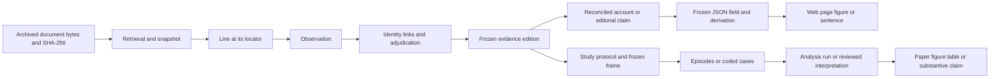

# JETP backend: evidence, reported positions and reconciled accounts

**Terminology note (2026-09-23).** This document predates the ODEM language
of [`jetp-ontology.md`](jetp-ontology.md) section 0, which governs where the two
differ. Read *evidence* (a link, a layer, a table of documentary support) as
**justification**, and *evidence cutoff* as **knowledge cutoff**; *model* (of the
data) as **schema**; *reconciliation* as **matching** for identities or
**account** for the balance computation; *edition* of the ledger or site as
**release**; *layer*, *stage* and *fact* as the pipeline **steps D1 to D4** and
**observations**. In ODEM terms the observatory is Data guided by Ontology,
Evidence is computed on top, and there is no Model.

**Revision note (2026-09-22).** [`jetp-ontology.md`](jetp-ontology.md) is now
the reference for the vocabulary, the storage contract and the migration.
Sections 2 to 4 and 9 below were rewritten against it, and sections 5 and 8
were amended where its section 8 and the
[data-model review](jetp-study/ontology-review-2026-09-22/review-3-data-model.md)
require it. Where the two documents disagree, the ontology governs the tables
and this note governs the accounts, the traceability chain and the process.

Design note — 14 September 2026, revision 5 after the
[Astra and Fable review](jetp-backend-review-2026-09-14/README.md) and the
[four-scope research review](jetp-design-four-scope-review-2026-09-14/assessment.md).
Plan phase. The [revision response](jetp-design-four-scope-review-2026-09-14/design-revision-response.md)
records how the four scopes are addressed. Revision 4 adds the explicit source
registry, sweep and intelligence-origin contracts described in the
[source-registry response](jetp-design-four-scope-review-2026-09-14/source-registry-response.md).
Revision 5 resolves display-occurrence identity from the
[fresh Astra review](jetp-backend-review-2026-09-14/astra-revision4.md); the
[response](jetp-backend-review-2026-09-14/display-identity-response.md) records the repair.
This specifies extensions to the existing backend; it does not claim that the proposed schemas or migrations are
implemented. It develops the [storage contract](jetp-storage.md) and the
[tracking contract](jetp-tracking.md). The publication programme remains under
0726–0728; observation and analytical feasibility remain under 0729/0735.

## 1. Decision and purpose

Keep structured evidence in Git-versioned CSV, interpretation in Markdown, and
original document bytes in the existing content-addressed DVC archive. Generate
reconciled accounts, website JSON and any SQLite export from reviewed inputs.
SQLite is an optional local query/export format, never a second editable store.
The public website remains static and requires no database service.

One evidence base serves the observatory, the JETP data paper, quantitative
lifecycle/causal studies and comparative political-economy research. Each product
consumes a frozen evidence edition and declares its own interpretation or analysis
rules. Research protocols, populations, observation coverage, qualitative coding
and analytical outputs are part of the contracts below; implementation remains
staged with the corresponding research work. A website release does not depend
on completion of a causal study.

Observing the whole energy transition across comparable countries, including a
PyPSA electricity modelling arm, is a future research direction. Section 12
anticipates migration only. It creates no current MVP requirement or enhancement.

Two evidence families support the account, both stored as observations in
one table (ontology, section 4), distinguished by their timing roles:

1. **Events:** documentary assertions that something happened, with an event
   date or a supported date interval.
2. **Reported positions:** what a publisher says about a subject at a
   reporting cutoff, whether or not the underlying event history is
   available.

The **reconciled account** is generated from these layers, stable identities,
reviewed relationships and explicit adjudications. It is not a third collection
of independently edited facts. Human interpretation remains authored, with its
supporting evidence identified.

An inventory entry can enter as a reported proposal before it has a lender,
agreement or known event. Official report inventories define the starting
population; project pages enrich and verify it. A project without a web page is
still a record. Inclusion in a plan does not prove financing, admission to a
later implementation cohort, or physical progress.

This is a documentary accounting system, not a replacement for a lender's
double-entry books. We cannot require debit/credit counterparts that public
sources do not disclose. We can require identities, comparable measurement
perimeters, explicit movements and transparent reconciliation differences.

## 2. Stores, formats and authority

The tables are those of the ontology's section 5, which is the reference for
this section; their column lists live there and are not repeated here. Paths are
repository-relative, and canonical CSV tables are under `data/jetp/` unless
shown otherwise. A table too large for the repository's file ceiling is chunked
by country and year into `<table>/<CODE>-<year>.csv`, which stays one table.

| Store | Location | Authority |
|---|---|---|
| Publishers, documents, publication roles | `publishers.csv`, `documents.csv`, `document-publishers.csv` | Git; publication is a relation, not a column |
| Retrievals and snapshots | `retrievals.csv`, `snapshots.csv` | Git; one row per fetch attempt, one per fingerprint |
| Original document bytes | `data/jetp/documents/objects/<prefix>/<sha256>.<ext>` | Immutable bytes; `documents.dvc` pointer in Git, archive on padme |
| Lines and their verbatim fields | `lines.csv`, `line-fields/<document_id>.csv`, `line-field-specs.csv` | Git; the first-class unit, its locator and ordinal, and the publisher's own columns validated against their spec |
| Identities | `projects.csv`, `assets.csv`, `agreements.csv`, `parties.csv`, `perimeters.csv` | Git; minted only by a reviewed match, never by ingestion |
| Reviewed matches and relations | `line-referents.csv`, `relations.csv` | Git; dated, defeasible decisions with method, confidence and evidence lines |
| Observations and their dates | `observations.csv`, `timings.csv` | Git; one statement per row citing one line, one timing row per date role |
| External identifiers | `external-ids.csv` | Git; another register's code, typed by scheme |
| Adjudications | `adjudications.csv`, `adjudication-members.csv` | Git; reviewed decisions with typed member rows |
| Sourced rates and deflators | `rates.csv`, `deflators.csv` | Git; each row cites the line that printed it |
| Crosswalks | `status-crosswalk.csv`, `sector-crosswalk.csv`, `marker-coefficients.csv` | Git; reviewed, dated mappings onto a shared axis or coefficient |
| Routes and coverage | `routes.csv`, `coverage.csv` | Git; every served identifier resolves; review effort per referent |
| Search effort and vocabulary decisions | `dry-searches.csv`, `decisions.md` | Git; unchanged |
| Extraction intermediates | Content-addressed artifacts under `data/derived/jetp/` | Derived; recipe, tool version and hashes retained |
| Reconciled accounts | `data/derived/jetp/`, per run and per pair of cutoffs | Derived; never edited |
| Schema, validator and query engine | One DDL under `config/`; `data/derived/jetp/<edition_id>.sqlite` | Derived; headers generated from the DDL, whose constraints run as the validator |
| Translated labels and machine summaries | `data/derived/jetp/line-translations.csv`, `document-summaries.csv` | Derived aids, never evidence |
| Website payloads and code | `deliverables/jetp-observatory/` | Derived JSON joined at read time, plus HTML/CSS/JS |
| Narrative and editorial dependencies | `data/jetp/editorial/` Markdown; `editorial-evidence.csv` | Git; authored summaries with evidence references and review state |
| Frozen editions | `data/jetp/releases/<edition_id>/release.json` and public artifacts | Immutable descriptor and checksummed payloads; a correction is a new edition |

What the ontology retires, and where each surviving concept now lives:

- the source-editions triple, `source-editions.csv`, `edition-snapshots.csv`
  and `edition-relations.csv`, becomes `documents`, `retrievals` and
  `snapshots`, with succession, duplication and translation as `edition_of`,
  `same_as` and `translation_of` rows in `relations`;
- `evidence-dependencies.csv` becomes the `cites` relation from a line to a
  document or to a line of one;
- `source-watches`, `source-checks` and `source-discoveries` leave the scope
  with the sweep contract;
- `reported-positions.csv` and the event journal merge into `observations`;
- `occurrences.csv` disappears as a registry, and occurrence membership
  survives as an adjudication decision type whose member rows name the
  observations it groups;
- `entity-relations.csv` becomes `relations`, which also holds a perimeter's
  `member_of` evidence in place of any membership column;
- `evidence-links.csv` disappears: an observation cites exactly one line, and
  the line resolves its snapshot, its document and its publishers;
- the concept-mapping profile and `config/jetp-application-profile.yaml` leave
  the implementation scope until a metric needs them. IATI, PROV-O, SKOS and
  OWL-Time remain the vocabularies the design borrows from, and an RDF
  projection is a derived export built when a consumer asks for it.

CSV conventions: UTF-8, header row, LF endings, standard quoting, stable column
order, and deterministic row ordering on export. Identifiers are strings. Money
is a decimal string in whole currency units plus currency; no binary-float
rounding in canonical amounts. A value of 3.92 in a table headed USD billion
becomes `3920000000` USD, retaining the original value, scale and label in the
line's verbatim fields. Formatting millions or billions is a display derivation.
No column holds a semicolon-separated list: a list is rows in a relation table.

Dates use ISO dates and timestamps use UTC. An unknown value is an empty field
with a typed missingness reason, and JSON `null` on export; zero is a measured
value.

The current vocabulary file is `config/jetp_tracking.yaml`. The closed lists of
measure, basis, flow type, modality, classification and status axis are the
ontology's sections 2 and 4; a new value is a decision recorded in
`decisions.md` before the validator accepts it.

## 3. Identities and relationships

Evidence has four layers, in the ontology's order. A **publisher** is the body
that publishes a document and answers for what it states. A **document** is a
logical publication with a type, a canonical URL and one or more publishers. A
**retrieval** is one attempt to fetch one document at one time. A **snapshot**
is the exact bytes under a SHA-256 fingerprint. An assertion cites a snapshot,
never a URL and never a retrieval, so that what was read can be re-read.

A **line** is one publisher's dated assertion at one locator in one snapshot,
and it is the first-class unit of the ledger: every identity is minted from
lines, every observation cites one, and nothing is counted except lines and the
identities that reviewed matches have produced from them.

Three identity kinds replace the former single `entity` registry. A **project**
is an undertaking with a scope, an owner and a duration. An **asset** is a
physical thing at a site, and may be a unit `part_of` a plant. An **agreement**
is funder-side money: a party commits an amount under an instrument to a
counterparty. **Party** and **perimeter** complete the registries; a party may
also be a publisher, and the two registries share an organisation identifier
when it is. A project's classification stays a dated assertion with values
`project`, `programme` and `component`, and a later classification does not
change observation keys; containment is a `component_of` relation, not a column.

Identity is minted only by a reviewed match (ontology section 11). No ingestion
script writes to `projects`, `assets`, `agreements`, `parties` or `perimeters`.
A `line-referents` row carrying method, version, confidence, evidence lines and
decider is the only route in, and it is defeasible: what is in force is the
terminal row of a supersession chain whose status is `accepted`, and a terminal
`rejected` row revokes what that chain had accepted. Until such a row exists the
line itself carries the observation, so a proposition with no identity keeps its
per-row record instead of dissolving into an aggregate.

Observation subjects are typed `(subject_kind, subject_id)` over `line`,
`project`, `asset`, `agreement`, `party`, `perimeter` and `country`. The former
`entity` and `partnership` subjects are gone: an entity subject resolves to one
of the three identity kinds, and a partnership is a perimeter whose envelope
observations cite the lines that state them. Typed references elsewhere use
`(record_kind, record_id)`; validators resolve the pair, not the bare string.
Legacy IDs need no renaming, and `routes` maps every identifier the observatory
has ever served to its new kind and identifier, so no public route breaks.

Relations are the ontology's section 3 table, held in one `relations` table
with the decision columns above:

| Relation | From | To | Meaning |
|---|---|---|---|
| `published_by` | document | publisher | many-to-many; role optional |
| `edition_of` | document | document | succession |
| `same_as` (document) | document | document | one publication, two URLs; lines belong to the canonical one |
| `translation_of` | document | document | lines extracted from one language only |
| `retrieval_of` | retrieval | document | one fetch attempt |
| `yields` | retrieval | snapshot | absent on failure |
| `in_snapshot` | line | snapshot | with locator and ordinal |
| `groups` | line | line | a heading over the lines it governs |
| `refers_to` | line | project, asset, agreement, party, perimeter | the reviewed match; dated |
| `same_as` (line) | line | line | one published item in two places |
| `cites` (line) | line | document, line | a reference held or not |
| `component_of` | project | project | containment; acyclic |
| `part_of` | asset | asset | unit within plant |
| `concerns` | project | asset | zero or more |
| `finances` | agreement | project | many-to-many |
| `tranche_of` | agreement | agreement | at most one active parent |
| `party_in` | party | agreement | one row per role |
| `role_in` | party | project, asset, perimeter, document, line | a mandate outside any agreement |
| `member_of` | line, project, asset, agreement | perimeter | dated membership evidence |
| `same_as` | any | same kind | equality evidence; chooses no route |
| `about` | observation | any subject | typed |
| `cites` (observation) | observation | line | exactly one |
| `timed` | observation | timing | one row per date role |

`same_as` records equality evidence and does not select a route. The alias
chain, its at-most-one-active-target and no-cycle rules, the flattening of a
chain by dated replacement relations, and `successor_of` are dropped in favour
of the supersession rule above: a wrong equality is revoked by a `rejected` row
that supersedes it, and nothing else has to be minted. A tranche still has at
most one active parent agreement, containment is still acyclic, and hierarchy
never authorises splitting money: a project share needs a sourced observation.

A **perimeter** is a coverage definition the ledger can count against: a pledge
envelope and its revisions, a publisher-defined portfolio, a procurement quota,
a plan's list at a cutoff. It is immutable and independent of the document that
first states it, and a changed definition takes a new ID with a reviewed
succession. Membership is evidence, not a list: `member_of` rows, which a line
may carry before any identity is minted. A publisher's aggregate with
undisclosed constituents stays usable as a count observation without fabricated
membership; the 21 Viet Nam count slots are two `count` observations on one
perimeter, not 21 registry rows. `scope` retains `jetp_strict` and
`ipg_energy_extended`, which no more define the eligible research subjects than
the four-country website selection does. A shared perimeter ID alone does not
prove comparability: a metric must also check membership changes, instrument
and measurement basis, and unknown compatibility blocks reconstruction, not
publication of the separate observations.

Every count names its unit — lines of a document, referents of a kind, or a
perimeter observation — with its classification level and perimeter. There is
no default sum of projects plus programmes plus components, and no page adds
lines of one document to lines of another or to referents. A publisher's record
count keeps that publisher's unit and is not relabelled an asset count.
Overlapping hierarchies need an explicit selection policy before an aggregate.

## 4. Observation and research schemas

These are minimum contracts, not implemented column declarations. One DDL under
`config/` declares every table, key, foreign key and check of section 2, the CSV
headers are generated from it, and its constraints run as the validator;
compatibility readers preserve current files until step 7 of the migration
retires them. The record kinds are the tables of section 2, each with a
registered resolver and schema; generated kinds resolve through pinned
manifests, and consumers declare supported schema versions.

### Shared record fields

Every record row carries `recorded_at`, the date the ledger wrote it, so an
as-of state at cutoff K is the set of rows recorded on or before K and in force.
It is system admission time, not publication or acquisition time. Every
decision row — `line-referents`, `relations`, `adjudications` — additionally
carries `status` (`accepted`, `candidate`, `rejected`), `method`,
`method_version`, `confidence`, `decided_at`, `decided_by` and `supersedes`, is
never edited or deleted, and sits in a linear chain. Any `review_status` column
is a generated, validated cache.

### Observations and timings

The event journal, event timing and reported positions merge into two tables.
An **observation** is one dated statement about one subject, cited to exactly
one line. It carries:

- `measure`, from the closed list of the ontology's section 4: `amount`, `flow`,
  `estimate`, `envelope`, `interest_rate`, `maturity_years`, `grace_years`,
  `grant_element`, `condition`, `capacity`, `length`, `state`, `target`,
  `count`, `absence`, `indicator`, `marker`. The list is extended by a decision
  recorded in `decisions.md`, never inferred from a label.
- `basis` — gross, net or unknown — wherever money is involved.
- `flow_type` from the IATI list — pledge, commitment, disbursement,
  expenditure — when the measure is `flow`.
- the value once, as `value` with `value_low` and `value_high` bounding a range
  and equal for a scalar, plus `unit` and `currency`. Currency is mandatory for
  money, a counting unit for counts, an indicator code for `indicator`.
- `own_status`, the publisher's word copied verbatim, with the axis it belongs
  to. `shared_status` appears only in `status-crosswalk`, which names who
  decided the mapping and when. Nothing is normalised in place or inferred.
- `sector`, inherited from the subject. An agreement or project carries one
  assigned through a referent decision, from a line's `own_sector` and the
  `sector-crosswalk` onto an OECD DAC purpose code. `modality` on an agreement
  is only ever the DAC type-of-aid code, likewise assigned and never inferred
  from an instrument word; a publisher's own modality scheme stays a verbatim
  field of the line.
- a `marker` measure holds the donor's policy-marker score at its reporting
  year, with `not_screened` distinct from 0. The coefficient turning a score
  into a climate-finance amount is a rule, not evidence: it lives in the sourced
  `marker-coefficients` table and applies only in a derived account.
- `recorded_at`, `status` and `supersedes`. A corrected publication is a new
  observation superseding the old one, which is retained.

An observation carries no date of its own. Each date it reports is a **timing**
row with its role, precision and bounds: event, approval, reporting cutoff,
register date, report date, planned, `target`, and `period_start` with
`period_end` for a flow covering an interval. A point flow has one `event`
timing. Bounds express uncertainty inclusively: a June-only cutoff spans 1 to 30
June. A quarterly total states the quarter it covers, so section 5 can test
coverage; no split of it into months is inferred, and a repeated cumulative
balance is never a new movement. Timing corrections supersede the owning
observation and receive new rows; old timing is immutable. An observed completed
state invents neither a commissioning date nor a payment.

Signing, approval and disbursement are different measures and states, not a
monotonic stage rank. Several documents describing one payment must not create
several payments: unresolved duplicates remain unsummed, and occurrence
membership is settled by an adjudication whose member rows name the observations
grouped, never by CSV row order or publisher priority. Values are the
publisher's, in the publisher's unit and currency; a conversion is a derivation
citing a `rates` row, and a publisher's own printed conversion is itself a
`rates` row citing that line.

### Documents, retrievals and where sweeps went

The registry of places worth checking, its watch configuration, its sweep plans
and the check and discovery tables leave the MVP. What remains is the evidence
layer of section 3: a `documents` row per publication, a `retrievals` row per
fetch attempt with its outcome and headers, and a `snapshots` row per
fingerprint. A retrieval that failed, returned 304 or returned bytes already
held is recorded as such and supports no assertion by itself. Document
deduplication runs before extraction under the same reviewed-decision record as
any other match (ontology section 11), because a duplicate extracted twice
doubles every line downstream; mirrors are not independent confirmations.

The sweep contract of section 7 and the source-management acceptance tests
of section 10 are deferred with those tables: the procedure stays in this
document as the design of a future refresh, and none of it is an MVP
requirement (decided 2026-09-22, with the ontology's decision 9).

### Study protocols, populations and analytical runs

Deferred until a study needs them, per review 3: these remain prose contracts,
with no tables, fixtures or schema work in the MVP. A commissioned study brings
a frozen protocol revision stating its question, unit, time zero, follow-up
horizon, eligibility rules, endpoints and evidence cutoff; an immutable
sampling frame whose membership decisions record verdict, reason and supporting
lines; an observation-process record keeping not published, blocked,
unreadable, not sought and loss of visibility distinct; a versioned codebook
whose annotations resolve their locator through the line they cite, with
independent codings allowed to coexist; and an immutable run manifest pinning
protocol, evidence edition, frame, code, environment, configuration, seeds and
checksummed outputs. Episodes and coded exports are reproducible views of
evidence, never a second editable history, and no correction is made by editing
one. A failed run supplies no releasable result.

External comparison datasets enter as comparator records: lines of a snapshot
whose document is the dataset edition and whose publisher is the institution,
with their fields verbatim, their identifiers in `external-ids` and their
statuses crosswalked. They stay lagged comparison evidence and cannot fill a
JETP observation without a reviewed match.

## 5. Reconciliation and generated accounts

`adjudications.csv` contains `decision_id`, `decision_type`, `verdict`, `reason`,
`reviewer`, `reviewed_at`, `recorded_at`, `policy_version` and `supersedes_id`.
Its typed member rows use a controlled role vocabulary — `candidate`,
`accepted`, `excluded`, `occurrence`, `covering_flow`, `covered_movement`,
`opening`, `closing`, `context` — and each decision type defines its allowed
roles and cardinalities. Decisions cover acceptance, identity, occurrence
membership, flow coverage, document corrections, perimeter compatibility and
interpretation, and a superseding decision replaces the whole member set. These
two tables stay record tables in Git (section 2); the accounts they feed are
derived outputs under `data/derived/jetp/`, computed at build time with the run
identifier and both cutoffs, and never edited.

An account declares subject, perimeter, measure, currency, valid cutoff and
evidence cutoff, plus pinned schema and policy versions. It retains separate
reported observations, selected opening position, included/excluded movements,
reconstructed closing value or explicit unavailability, residual, uncertainty,
observation IDs and decision IDs. Financial and physical status remain
separate. An incomplete movement subtotal is labelled as such, never as an exact
reconstructed closing position.

### First executable metric

Start with `gross_commitment_original_currency_v1` for one agreement or tranche,
in one original currency and declared coverage. The metric is a commitment
measure because no disbursement observation exists: `events.csv` today holds
235 signed, 65 approved and 45 announced rows and no disbursed row, so a
disbursement metric has no eligible movement. The rules below are written for
the gross flow of the declared `flow_type` and apply unchanged to disbursement
once such observations are collected. No general rule engine or cross-currency
reconciliation is required for the first release.

- An accepted opening cumulative gross position must have an exact cutoff and
  compatible measurement basis; zero needs evidence. Select among conflicting
  openings by an explicit adjudication, never by publisher rank alone.
- For dates `t0` and `t1`, movements cover `(t0, t1]` at calendar-day resolution.
  An event is certainly inside only if its earliest date is after `t0` and latest
  date is on/before `t1`. A possible boundary overlap blocks an exact result;
  report an interval only when evidence bounds justify one.
- Eligible movements are distinct accepted flows of that `flow_type` and
  accepted gross period flows wholly within the interval. Choose a disjoint cover:
  an adjudicated quarterly total can stand for its covered itemised payments,
  which remain visible but excluded from addition. Partially overlapping totals
  with no supported decomposition block reconstruction.
- Exact closing = opening + complete eligible movement coverage. A reviewer must
  document coverage completeness; a list of known payments is not proof of it.
  With partial coverage, show the documented subtotal and coverage gap.
- Reported closing minus reconstructed closing is the residual only when the
  reported closing has a matching exact cutoff, currency, coverage and basis.
  Otherwise display both observations with the failed comparability condition.
- Gross flows are not reduced by refunds, repayments or cancellations; retain
  those under their own measures. A verified bank reversal of a purported
  payment requires a reviewed metric-specific adjustment. A publisher's typo is
  supersession, not an economic reversing payment. Net cash accounts need a
  separately defined metric.
- Compute with decimals in whole currency units. Rounded inputs carry their
  bounds when known; propagate them instead of inventing precision or treating a
  rounding residual as discrepancy. Formatting precision is separate from value.

A verified zero opening and complete EUR 15m coverage against an exact EUR 20m
closing produce a EUR 5m residual; the same EUR 15m with unknown completeness
produces a subtotal and a gap, not a reconciliation. A EUR 12m Q2 flow with
three payments adjudicated as its components counts once.

Legacy converted amounts remain derived observations with their existing
conversion provenance, excluded from original-currency sums. Any conversion
cites a `rates` row, which states the currency pair, date, basis and the line
that printed the rate; a script never carries a rate, and no implicit USD
conversion occurs.

The South Africa Q1 report's 129 implementing and 87 completed records, and the
register's 128 and 88, both total 257: retain each snapshot and investigate
membership or timing. The USD 6.12bn instrument allocation and USD 4.32bn
portfolio allocation have different perimeters and are not a failed balance.
Mixed stages, cancellations and reversals stay visible, and the current
highest-financing-stage summary gives way to these dated assessments.

## 6. Time, corrections and change control

There are two query axes: the world described and accepted system knowledge.
Document publication, retrieval, coding (`recorded_at`) and review (`reviewed_at`)
remain distinct. A July acquisition coded in September is unavailable to a July
system-knowledge query. Retrieval remains usable for a separate “could have read”
analysis, but that is not the account's evidence cutoff.

Every consequential input follows the same immutable revision contract: assertions,
timing, relationships, classifications, evidence, editorial dependencies,
research eligibility/coding links and review/occurrence decisions. Registries carry admission time. A decision is
available no earlier than both its recording and review timestamps. Account
queries use the following algorithm at evidence cutoff `K`:

1. Admit only records with `recorded_at <= K`, and decisions whose recording and
   review timestamps are both at/before `K`. Require their referenced records and
   supporting evidence to be admitted too. Later metadata must not leak into joins.
2. Fold eligible review-decision chains to establish accepted, rejected, withdrawn
   or unresolved state. Decision supersession is operative only after its own
   admission; a pending replacement does not erase a prior accepted assertion.
3. Resolve accepted assertion/relation supersession chains within this eligible
   set. Retain history, but select only live accepted versions for calculation.
   Reject cycles and multiple active accepted successors; conflicting source
   assertions may coexist as separate chains pending adjudication.
4. Resolve identity, classification, occurrence membership, flow coverage and
   perimeter decisions from that same eligible set, then apply world-validity and
   metric rules. Unresolved consequential mappings block affected calculations.

Review decisions are immutable authorized human decisions, not recursively
self-approved assertions. A correction/withdrawal supersedes a decision or creates
an explicit decision about an assertion. Unknown migration admission/review times
are never backdated from publication: record admission at migration, preserve any
separately documented prior timestamp, and mark historical knowledge unavailable
where it cannot be established.

Thus a September duplicate decision can change September's account while leaving
an August evidence-cutoff result unchanged. A later source correction can change
what the system says about June at a September evidence cutoff. Frozen old editions
remain separately reproducible. Policy changes require an explicit policy version:
historical data cutoffs alone do not promise equality across different algorithms.

No account-affecting identity or review metadata is edited in place. Cosmetic
labels may be revised in Git; published wording is frozen with each edition.
Breaking schema/meaning changes require version increments, crosswalks and release
notes. Source disagreement may remain unresolved in a releasable account; gaps do
not require manufacturing a preferred figure.

Research freezes pin both evidence cutoff and protocol revision. The protocol
specifies whether historical eligibility may use subsequently discovered evidence
and which publication/admission constraints apply; retrospective reconstruction
must not masquerade as information known before intervention. A source correction,
a protocol amendment and a codebook/mapping revision are different change reasons.
Source classifications, watch policies and evidence-origin/dependency decisions
also obey immutable revisions and knowledge cutoffs. Changing today's priority,
owner or origin assessment cannot rewrite an earlier sweep plan or released claim.
Each receives a new immutable revision and a dependency impact report. A corrected
current account cannot silently refresh a released study, its frame or its results.
A revised study export/run receives a new descriptor while retaining the old one.
Record prior outcome inspection; a frozen protocol is not automatically a claim
of prospective preregistration.

Canonical edits are reviewed branch changes. Stage automated extraction before
promotion; validate uniqueness, typed references, temporal chains and complete
provenance after CSV merges. Allocate immutable assertion IDs and retain an ingest
crosswalk keyed by snapshot, extraction item and measure. Unchanged reruns reuse
it. Parser changes that move a locator require a reviewed crosswalk to the existing
assertion if meaning is unchanged, otherwise a superseding assertion. Neither a
mutable locator nor a row-content hash alone defines enduring identity.

## 7. Updating and publication

### Registry-driven sweeps

Deferred with its tables (section 4): kept as the design of a future
refresh, not an MVP requirement.

At a deliberate refresh, derive a queue from active documents and channels with triage
`accepted_for_use` or `context_only` and reviewed watches, plus discovered
candidates explicitly selected for triage.
Freeze the target watch revisions and scheduling policy before checks start.
For each watch, derive `last_attempt_at`, `last_successful_check_at`,
`last_changed_at`, failure streak and `next_check_at` from its policy and check log.
These are generated views, not separately editable catalogue fields.

A complete successful check advances the normal check interval; blocked, failed
or partial checks follow the pinned retry policy and retain the previous successful
coverage date. Expected-publication windows can accelerate checks only by an
explicit policy rule. A manual scheduling override is a new reviewed watch revision
with a reason. Retired watches remain in history. Due-date rules specify UTC,
calendar/interval handling and retry bounds so replaying a queue is deterministic.

The sweep summary is generated against the frozen plan. Every target resolves to
completed, partial/failed or explicitly deferred, with check IDs and reasons;
new out-of-plan targets require a linked supplemental plan. Report new candidates,
changed documents, unchanged checks and access gaps separately. Acquisition hashes
trigger candidate review, not automatic promotion of content. Triage discoveries
before use; a rejected document stays discoverable in history. Sweep completion
means the planned effort is accounted for, not that all documents were accessible
or all assertions have been reviewed. No unattended scheduler is implied.

### Evidence refresh and publication

1. **Discover:** run the planned document checks, including official report
   inventories, subsequent official news and relevant secondary leads.
   Record the named document, routes, search date, budget and acceptance criteria.
   Recheck South Africa Q2 and other successor reports during refreshes; do not
   imply background monitoring merely because a refresh policy exists.
2. **Acquire:** fetch through the existing harvester, validate content type, save
   bytes by hash, append acquisition metadata. A failed or unchanged retrieval
   creates no new substantive event. DVC push remains padme's responsibility.
3. **Extract:** produce reproducible candidate inventory/position/event rows.
   Reconcile every official inventory section to extracted rows or explicit
   exclusions. Preserve every line as printed before identity matching.
4. **Review:** match entities and agreements, classify measure and timing, add
   evidence links and adjudications. Automated extraction does not ratify its own
   outputs. Repeated runs must be idempotent for unchanged source assertions.
5. **Reconcile:** rebuild affected accounts and identify affected study inputs.
   Do not rerun a frozen analysis implicitly. Compute changes in values, statuses,
   perimeters and document availability; distinguish real developments, late reports,
   corrected publisher data and changed interpretation.
6. **Edit:** flag website narratives, coded interpretations, study exports and
   manuscript exhibits whose dependencies changed. Preserve
   relevant existing summaries; revise their interpretation and evidence links.
   A principal report need not be the sole source of a country summary.
7. **Freeze:** commit reviewed inputs first, then build the package and descriptor
   from that existing SHA. Include schema/policy versions, code/environment versions,
   DVC object references, application-profile version/hash, row/coverage validation
   and artifact hashes. A study package additionally pins protocol, frame,
   codebook and run descriptors; a release lists only products actually included.
8. **Publish:** validate the complete static package, then advance the current
   edition pointer. A failed build leaves the prior edition available. Corrections
   create `YYYY-MM-rN`; they never rewrite a previously published edition's bytes.

Study releases follow the same reviewed-input and immutable-artifact process,
with their own release IDs and evidence dependencies; monthly website publication
does not advance a study's evidence cutoff. Before a new study run, validate its
protocol, historical frame, endpoints or coding scheme, input access and coverage.
Afterwards validate output schemas, diagnostics and claim dependencies. Estimator
choice and substantive interpretation remain research decisions.

Collection, transformation and rendering remain separate stages. Extend each
Make/DVC target's declared inputs when adding tables, schemas or policies. Preserve
the repository's one-output-per-build-invocation convention. There is no network
fetch during website generation and no live database dependency for readers.

## 8. Full traceability to publications

The required chain is bidirectional:

Every published number, status and substantive narrative claim resolves to
observation IDs or to an explicitly identified calculation.

**The provenance index is a build-time validation artifact, never a served
file.** The index keyed by stable semantic `claim_id`, with observation IDs,
derivation and policy ID, input and output hashes and editorial evidence, is
generated and validated during the build so that the chain above is proved to
resolve and a correction can be traced to every claim it touches. The same
holds for the display-occurrence table, which records for each claim its
`display_id`, payload, JSON pointer, page route, rendered-instance locator and
rendering role. Neither is published. The site's climb from a displayed number
to its evidence stays a read-time join over the served tables, as ticket 0858
decided when it removed the 874 kB materialised join; rebuilding that join
under another name is what this paragraph forbids.

Within the build, `(release_id, display_id)` is the occurrence identity, unique
across every publication in a release, so repeated components on one page and
the same claim on two pages stay distinct; payload, pointer and rendering role
are non-unique attributes. A manuscript occurrence replaces the route and
pointer with a stable figure, table or block label plus a cell or paragraph
locator, since a PDF page number is not a durable key. Reverse traversal
enumerates display IDs rather than deduplicating by a shared locator, and
returns every occurrence and authored claim a correction touches.

`editorial-evidence.csv` links a stable narrative claim ID and Markdown block ID
to supporting and contradicting observations and review state. Give authored
claims stable block identifiers; a file and line alone are fragile across edits.
Rewording a claim requires review of its links. General explanatory prose needs
no invented numeric observation, but substantive interpretation must identify
its evidence.

A provenance entry resolves through the observation's line to the exact
archived snapshot: the latest retrieval of a document is discovery metadata and
cannot stand in for the bytes that supported an older observation. Export
record-specific hashes and locators, not a country-level list of documents.

A research claim, when a study exists, resolves the same way through its run
manifest to the protocol, frame decisions, accepted observations and exact
bytes; an earlier paper's package keeps its inputs and results until a versioned
correction is published.

The public package carries the evidence graph, IDs, document URLs, hashes,
locators, calculation definitions and editorial dependencies needed to inspect
claims; raw documents are redistributed only under applicable terms, and where
bytes cannot be public the limit is explained. The release descriptor must cover
every asset that affects rendering, with software and environment versions
pinned for byte-level regeneration and output hashes in a later commit to avoid
a self-referential checksum. Reproducing the website from a frozen package and
examining every original document are distinct capabilities.

### Country cards and pages

Preserve two document roles: **principal official reference** and **latest
subsequent official news**. Each pins its document and the snapshot its
retrieval yielded, with the publication date, the selection date and any scope
qualification recorded independently of the headline; the live URL remains the
clickable link while the selected bytes stay fixed. The principal reference is
normally the latest comprehensive Secretariat report; Viet Nam may need an
identified local substitute, and Senegal currently uses its plan.

The homepage country box links only to the principal reference, and its text is
a reviewed synthesis of the total evidence rather than an extract from that one
document. The country page shows both roles, their dates, the incremental update
and the retained summaries. A newer news figure carries its own evidence in the
export even when the card's sole link remains older, and where no later official
item is found the gap is explicit rather than filled by relabelling an earlier
article. Indonesia's USD 3.92bn approval headline may rest on the 8 September
2026 JDU newsletter while its principal reference remains the 2025 report with
an older USD 3.1bn snapshot: different dated observations, neither a payment
total.

The country publication contract exposes `principal_reference_document_id`,
`latest_news_document_id`, their snapshot fingerprints,
`document_selection_checked_on`, `headline_claim_id` and `summary_claim_ids`,
with null role IDs and an explicit reason when no later news is found.
`headline_source` stays a compatibility alias for the principal reference until
the frontend migrates, and is never read as exhaustive support for the headline.
Country-level claims must be exported even when they have no project
association; the current project-only selection is insufficient.

Terms such as allocation, approval, disbursement, record, project, plan and
programme can have short hover definitions generated from the vocabulary of
sections 2 and 4, without changing a publisher's semantics or implying
cross-country equivalence. Keep methodological caveats in the account or
evidence view, and build scaffolding out of the country narratives.

## 9. Migration from the current backend

The migration is the ontology's section 6: a rebuild from snapshots, not a
rename of columns. Each current table is read once, its rows become lines and
observations under the target contract, and the result is checked against the
served views before the old tables go. Audit baseline `bbb3a215` on main; row
counts are those of 2026-09-22.

| Current | Rows | Target | Notes |
|---|---|---|---|
| `sources.csv` | 301 | 103 publishers, 301 documents, 301 publications | joint publications added by review, none derivable from the free text |
| `manifest.csv` | 314 | 314 retrievals, 264 snapshots | 41 failed retrievals carry no snapshot; 9 snapshots are yielded by two retrievals |
| `projects.csv` ZAF register | 257 | 257 lines of the Q1 2026 register, `register_allocation`; 257 agreements minted by basis `register_row`; projects only where the reviewed name match holds | the status letter becomes `own_status`, axis delivery |
| `projects.csv` VNM count slots | 21 | 1 perimeter, 2 observations of measure `count` (7 initial, 17 screened) citing the portfolio lines | routes for the 21 slot identifiers point at the perimeter |
| `projects.csv` SEN | 43 | the 49 lines already exist; 43 referents re-decided from the plan's submission and quick-win lines | quick win is a line classification, not a kind |
| `projects.csv` IDN | 74 | 44 grant lines become agreements; 19 pipeline and 9 finance rows become projects or agreements on review; 2 monitoring rows become lines | |
| `projects.csv` remainder | 9 | projects | |
| `plan-projects.csv` | 1 628 | 1 628 lines in two IDN and two SEN documents; 67 `matched` become `refers_to` rows; capacity and estimates become observations on the line | the 230 `plan_only` lines flagged `ruptl` become `member_of` a RUPTL perimeter, no identity minted |
| Viet Nam RMP release | 279 | 279 lines; 73 programme rows are `heading`, 181 unresolved are `unnamed_item` | |
| `events.csv` | 380 | 380 observations, axis money; the 34 `need` rows become measure `estimate` on their plan lines | subject is the agreement minted from the same line |
| `implementation-events.csv` | 71 | 71 observations on assets or projects after the subject review | `suspended` on a retirement is an asset state, not a project stage |
| `event-timing.csv` | 451 | 451 timings, one per date role | a year-bounded approval and the report's cutoff are two rows of one observation |
| `project-source-links.csv` | 315 | 315 `refers_to` rows of basis `discovery` or `possible_match` | the 11 `project_page_component` rows become `component_of` |
| `source-claims.csv` | 151 | lines and observations | the two finance aggregates become perimeter observations replacing the hard-coded headlines |
| `config/jetp_observatory.yaml` headlines | 4 | perimeter observations citing their lines | configuration keeps only display choices |
| `data/jetp/comparison/*.json` | 1 119 records, 97 in the reference pool | lines of World Bank API snapshots, external identifiers, comparator crosswalk | the reference pool is a perimeter of those lines |
| figure scripts' inline exchange rates | 1 known (`2500 * 1.09`) | `rates` rows citing their line | a script never carries a rate |

Order of work, each step a ticket with its own byte-level check:

1. Publishers, documents, publications, snapshots. A read-only rename of the
   evidence layer; the observatory's Documents page is the check.
2. Lines and line fields for the four M1a documents, replacing the M1a
   builder's product with the same rows under the new contract. The inventory
   tab is the check: same rows, same order, same fields.
3. Lines for the remaining documents: plan-projects, portfolio, pilot, claims.
4. Identity split: referents, routes, the five identity tables, every old
   identifier resolving through `routes`. The party table is built here at its
   minimum shape, identifier, name, kind, country and optional IATI
   organisation identifier, with `party_in` carrying the role. The 61 funder
   strings and the register's 14 funder prefixes are adjudicated into funder and
   channel roles now; the other roles are filled as their lines are reviewed. A
   party is minted from a line like every other identity.
5. Observations and the status crosswalk, replacing events, implementation
   events and event timing. The Observations tab and each record's evidence
   fold-out are the check.
6. Perimeter observations replace configured headlines.
7. Remove the retired tables and the compatibility readers.

Each step retires its legacy write path only after row-by-row reconciliation,
and no combination is ever editable in two places at once. A migration manifest
records old table and ID, new table and ID, transformation, reason and review
status; a partly migrated combination cannot publish a reconciled total, and
retained legacy rows remain provenance, not additional movements. Unknown
historical admission and review times follow section 6: record admission at
migration and mark earlier knowledge unavailable where it cannot be established.

The current `scripts/jetp/build_observatory.py` and `_observatory_data.py`,
their Make inputs and the browser renderer are the extension points. Reuse the
existing harvester and DVC archive. Tickets 0762, 0768 and 0769 closed on the
previous contract; their readers are retired at step 7. Update the 0726–0728
handoffs from this note before implementation.

## 10. Acceptance and first tests

Prove the contracts with a small hand-written schema/account/export fixture before
bulk ingestion. Include a report-listed line with no project page, unknown-to-
programme reclassification, two agreements at different stages, duplicate payment
reports, a Q2 flow covering itemised payments, and an exact closing position.
Required outcomes: stable references, retained inventory membership, mixed stages,
one inclusion of each movement and a residual only when coverage supports it.

Then test these independent failure cases:

- A September duplicate decision changes the September account, not an August
  evidence-cutoff query under the same policy; later acceptance, withdrawal,
  alias changes and pending supersession obey the same rule.
- A quarterly flow has coverage distinct from a month-precision cumulative cutoff.
  An uncertain payment crossing an opening boundary blocks exact reconstruction;
  unknown openings, partial coverage and partial flow overlap do likewise.
- USD 3.92 billion normalises to `3920000000` whole units. Gross versus net,
  currency and status/amount-basis mismatches fail metric eligibility; rounded
  inputs cannot produce an apparently exact residual.
- A refreshed URL, mirror, HTTP 304 or repeated timestamp cannot redirect older
  evidence. Invalid edition/acquisition/hash/extraction tuples fail validation;
  failed acquisitions remain auditable without becoming evidence.
- Financial and implementation events sharing an ID string retain distinct timing.
  Unknown-to-programme classification preserves references and routes. Alias and
  containment cycles, multiple active parents and supersession forks fail.
- Every official inventory row maps to retained positions, a reviewed crosswalk or
  explicit exclusion. Unknown count slots never become invented identities; a
  programme and component do not double-count finance or asset totals.
- A correction reaches all homepage, country-page and download occurrences and
  dependent narratives. Every displayed claim resolves to its exact saved bytes.
- A migration switches each combination once; retained legacy evidence plus its
  new position cannot produce two independently counted observations.
- A card can use newer evidence while linking to the older principal report;
  country pages expose both selected editions and their distinct dates.
- A completed-state observation creates neither commissioning nor payment dates.
  A frozen edition renders without network/DVC access; raw-evidence replay is a
  separate check against the pinned internal archive where access is allowed.

Source-management implementation must additionally prove that a blocked check
records an attempt without advancing successful coverage; a complete unchanged
check advances scheduling without creating an event; and every frozen sweep target
has a check result or explicit deferral. Repeated discovery preserves one document
identity with multiple discovery links. A publisher/cadence/classification revision
must leave an old sweep and evidence-cutoff query unchanged. Acquisitions referencing
a mismatched source revision or check/watch target fail validation; discovery-page
and linked-document acquisitions distinguish their actual document IDs and roles.
A newspaper interview and an official reprint must permit different claim-level
origin classifications, while copied reports cannot create independent support
or duplicate payments. An unresolved upstream citation must not manufacture an
archived evidence reference.

Research implementation adds a small substantive fixture: reconstruct a
pre-intervention frame with one active and one cancelled operation, retain both
through follow-up, and reject a completed-only list as that frame. Derive an
interval-censored milestone and a missing endpoint without invented dates. Keep
a later support decision out of baseline eligibility where the protocol requires.
A revised official inventory must leave the frozen frame unchanged.

Also verify that a source correction identifies dependent website claims and
manuscript exhibits while the old research package still replays; conflicting
qualitative annotations survive an adjudication; a new codebook or concept mapping
cannot silently change an older export; and a failed run cannot supply a published
estimate. Export validators reject unresolved typed references, including collisions
between country, agreement and project IDs. These checks belong to the respective
research implementation tickets, not the immediate website increment.

Implementation tests belong to the affected contracts and tickets. This note is
validated by document/schema consistency review, working links and parseable
examples; no placeholder tables or data-pipeline execution are needed to revise it.

## 11. Research sufficiency and scientific decision gates

This design provides a coherent documentary and reproducibility foundation for
the present programme, conditional on implementation and empirical coverage.
Research contracts are defined in sections 2–9. Storage completeness does not
establish substantive comparability or causal identification.

| Product/question | Required evidence before release or estimation |
|---|---|
| Observatory and data paper: what was planned, financed, implemented and disclosed? | Full-inventory coverage assessment, reviewed identities and perimeters, exact provenance and bounded account tests; named web profiles alone do not define coverage |
| Comparative political economy: how and why did trajectories or official accounts change? | Defensible case selection, codebooks and excerpt-level evidence, competing interpretations and negative cases, with traceable substantive claims |
| Disclosure and implementation gaps | Distinct observation-process evidence and physical/financial assertions; unavailable documents do not establish stalled projects |
| Descriptive durations | Comparable endpoints, entry maturity, date bounds, supported follow-up and censoring/competing-outcome rules |
| Causal acceleration | Frozen historical populations, exposure/anticipation and baseline evidence, defensible comparison units and an explicitly justified identification design |

Audit source availability and comparability across treated and candidate comparison
populations before estimating durations or effects. The outstanding choices in
[0729](../tickets/0729-jetp-lifecycle-feasibility.erg) follow the historical-population
and selection/anticipation audits in
[0735](../tickets/closed/0735-audit-historical-pipeline-populations-an.erg) and 0736.
Selection bias, concurrent reforms, spillovers, measurement changes and the limited
number of independent treated countries remain research problems. If no supported
causal design survives, record DEFER and return the scope decision to the author;
do not quietly substitute a descriptive comparison. The observatory and data
paper can proceed under their own evidence gates.

## 12. Future migration beyond JETPs

This section anticipates a possible research direction: observation of the whole
energy transition across comparable countries, with a PyPSA modelling arm for
electricity in particular. It requires no current implementation, empty tables,
model installation or added MVP acceptance gate.

### Identities, coverage and external data

A future schema can separate initiative identities from jurisdiction identities
and connect them many-to-many, including cross-border systems. Migrate the current
country-keyed partnership convention through a versioned crosswalk; preserve old
references and public routes. Treat JETP scope values as one application profile.
Programme affiliation remains a sourced, dated relationship, not a prerequisite
for an asset, policy or observation to exist.

Introduce explicit physical site/unit, policy and other entity types only when
those domains enter research scope. A financing operation, programme, generating
unit and analytical unit can be related without becoming the same identity.
Future technology, demand, policy and distributional datasets retain their own
coverage and provenance through the external-data contracts. Comparable-country
selection remains study-defined; a current income category does not silently
become a permanent research population.

### Possible electricity modelling arm

[Open Energy Platform scenario bundles](https://openenergyplatform.org/scenario-bundles/main)
provide a precedent for linking studies, models, scenarios and datasets.
[PyPSA-Earth](https://github.com/pypsa-meets-earth/pypsa-earth) is a candidate future
workflow, including its documented sector-coupling capability. Selection and local
validation would belong to that later research. Neither advertised geographic
coverage nor a successful model solve establishes adequate national evidence.

A future model package would consume a frozen evidence edition through a versioned
adapter, with a many-to-many crosswalk from ledger assets to model components.
Keep observed values, external estimates, scenario assumptions and simulated
outputs distinct. Pin topology/aggregation, demand and weather series, units and
cost base year, conversions/defaults, scenario constraints, environment and solver
configuration, termination diagnostics and result hashes. Missing source data
must not acquire factual status through an import default. PyPSA's
[network import/export formats](https://docs.pypsa.org/latest/user-guide/import-export/)
provide a possible boundary; netCDF is a candidate for network artifacts.

The analytical-run and artifact contracts can be extended with model/scenario
kinds when needed. A simulated build or dispatch outcome never overwrites a
reported investment or commissioning event. A scenario comparison is not, by
itself, an empirical causal estimate of JETP effects. Attribute scaling or fuzzy
matching tools such as
[powerplantmatching](https://github.com/PyPSA/powerplantmatching) would produce
traceable candidate links or derived model inputs while retaining source values.

### Storage migration triggers

Keep small reviewed metadata and documentary tables in Git. If later research
introduces large time series, arrays or spatial datasets, choose appropriate
columnar, array or geospatial artifacts with checksummed manifests in versioned
storage. The scientific formats need not become website payload formats.

Revisit a database service when measured query/build costs, memory or file size,
concurrent-edit conflicts or access-control needs justify it. Preserve IDs,
revision semantics and one declared authority through any migration; compatibility
exports can retain CSV and static JSON consumers. Benchmark the actual workload
before selecting storage or making capacity promises. Broad transition coverage
and a validated model remain separate future work, not claims of this design.
