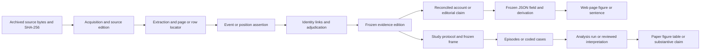

# JETP backend: evidence, reported positions and reconciled accounts

Design note — 14 September 2026, revision 4 after the
[Astra and Fable review](jetp-backend-review-2026-09-14/README.md) and the
[four-scope research review](jetp-design-four-scope-review-2026-09-14/assessment.md).
Plan phase. The [revision response](jetp-design-four-scope-review-2026-09-14/design-revision-response.md)
records how the four scopes are addressed. Revision 4 adds the explicit source
registry, sweep and intelligence-origin contracts described in the
[source-registry response](jetp-design-four-scope-review-2026-09-14/source-registry-response.md).
This specifies extensions to the existing backend; it does not claim that the proposed schemas or migrations are
implemented. It develops the [storage contract](jetp-storage.md) and the
[tracking contract](jetp-tracking.md). The publication programme remains under
0726–0728; observation and analytical feasibility remain under 0729/0735.

## 1. Decision and purpose

Keep structured evidence in Git-versioned CSV, interpretation in Markdown, and
original source bytes in the existing content-addressed DVC archive. Generate
reconciled accounts, website JSON and any SQLite export from reviewed inputs.
SQLite is an optional local query/export format, never a second editable store.
The public website remains static and requires no database service.

One evidence base serves the observatory, the JETP data paper, quantitative
lifecycle/causal studies and comparative political-economy research. Each product
consumes a frozen evidence edition and declares its own interpretation or analysis
rules. Research protocols, populations, observation coverage, qualitative coding
and analytical outputs are part of the contracts below; implementation remains
staged with the corresponding research work. A website release does not depend
on completion of a causal study.

Observing the whole energy transition across comparable countries, including a
PyPSA electricity modelling arm, is a future research direction. Section 12
anticipates migration only. It creates no current MVP requirement or enhancement.

Two evidence layers support the account:

1. **Event journal:** documentary assertions that something happened, with an
   event date or supported date interval.
2. **Reported positions:** what a source says about an entity at a reporting
   cutoff, whether or not the underlying event history is available.

The **reconciled account** is generated from these layers, stable identities,
reviewed relationships and explicit adjudications. It is not a third collection
of independently edited facts. Human interpretation remains authored, with its
supporting evidence identified.

An inventory entry can enter as a reported proposal before it has a lender,
agreement or known event. Official report inventories define the starting
population; project pages enrich and verify it. A project without a web page is
still a record. Inclusion in a plan does not prove financing, admission to a
later implementation cohort, or physical progress.

This is a documentary accounting system, not a replacement for a lender's
double-entry books. We cannot require debit/credit counterparts that public
sources do not disclose. We can require identities, comparable measurement
perimeters, explicit movements and transparent reconciliation differences.

## 2. Stores, formats and authority

Paths in this table are repository-relative. New filenames are proposed. Unless
shown otherwise, canonical CSV tables below are under `data/jetp/`. Research
contracts use the same authority rules as documentary accounts; they are not a
second editable copy of the event history.

| Store | Format and location | Authority and persistence |
|---|---|---|
| Observation coverage and dry searches | Existing `project-coverage.csv`, `dry-searches.csv`, extended with immutable review/attempt IDs | Git; preserve search effort and unavailable evidence independently of project progress |
| Source catalogue and retrieval history | `data/jetp/sources.csv`, `manifest.csv` | Git; stable source identities, immutable metadata revisions and triage; manifest preserves acquisitions |
| Source watches and sweep plans | `config/jetp-source-watches.yaml`; `data/jetp/source-sweeps/<sweep_id>/plan.json` | Git; reviewed monitoring policies and immutable planned target lists, including deferred targets |
| Source checks and discoveries | `source-checks.csv`, `source-discoveries.csv` | Git; append-only check attempts, discovered-source links and explicit outcomes; scheduling summaries are derived |
| Claim-specific source dependencies | `evidence-dependencies.csv` | Git; reviewed, dated dependencies between evidence links, distinct from document-wide edition relations |
| Source editions and dependencies | New `source-editions.csv`, `edition-snapshots.csv`, `edition-relations.csv` | Git; mandatory mapping between logical editions, exact bytes and upstream editions |
| Original documents and register snapshots | `data/jetp/documents/objects/<prefix>/<sha256>.<ext>` | Immutable bytes; existing `documents.dvc` pointer in Git; archive ownership remains on padme |
| Extracted text, OCR and table intermediates | Content-addressed extraction artifacts under `data/derived/jetp/` | Regenerable; retain extraction recipe, tool/version and input/output hashes |
| Identities, relationships and financing agreements | Existing `projects.csv`; new `agreements.csv`, `occurrences.csv`, `entity-relations.csv`, `perimeters.csv` | Git; reviewed identifiers and links, independent of observation dates |
| Event assertions | Existing `events.csv`, `implementation-events.csv`, `event-timing.csv`, with extensions | Git; retain original observations and explicit correction history |
| Reported positions | New `reported-positions.csv` | Git; one assertion about one measure/status, subject and reporting cutoff |
| Evidence and adjudications | New `evidence-links.csv`, `adjudications.csv`, `adjudication-members.csv` | Git; exact source support and reviewed decisions, including unresolved conflicts |
| Legacy staging | `plan-projects.csv`, country-specific observation tables and `source-claims.csv` | Retained during migration with stable crosswalks; no competing long-term ownership of the same assertion |
| Narrative and editorial dependencies | `data/jetp/editorial/` Markdown; new `editorial-evidence.csv` | Git; authored summaries with evidence references and review state |
| Schema and interpretation policies | Existing configuration plus proposed versioned schema/metric definitions and `config/jetp-application-profile.yaml` | Git; one definition per field/concept, with reviewed mappings to external standards |
| Study identities and protocols | `data/jetp/research/studies.csv`; `protocols/<study_id>/<protocol_revision_id>.yaml` with accompanying Markdown under that research directory | Git; stable study ID, immutable frozen protocol revisions and explicit amendments |
| Study frames and eligibility evidence | `data/jetp/research/study-frames.csv`, `frame-members.csv`, `research-links.csv` | Git; immutable frame definitions, reviewed membership decisions and typed evidence links |
| Qualitative codebooks and annotations | `data/jetp/research/codebooks/`, `annotations.csv`; existing editorial Markdown and evidence links for interpretations | Git; versioned codes and excerpt annotations; coding is distinct from factual acceptance |
| Analytical run descriptors | `data/jetp/research/runs/<run_id>.json` | Git; generated immutable manifests pin protocol, input editions, configuration, code/environment, dependencies and output hashes |
| Research datasets and exhibits | `data/derived/jetp/research/` for regenerable episodes/coded exports; durable publication tables, figures and packages in their owning deliverable/release | Generated; retain versioned release artifacts and hashes, with large artifacts in the versioned archive rather than Git |
| Reconciled accounts and query exports | `data/derived/jetp/`; optional `<edition_id>.sqlite` | Generated; disposable, deterministic within a pinned build environment |
| Website payloads and code | `deliverables/jetp-observatory/` | Generated JSON plus HTML/CSS/JS; existing small handoffs remain reviewable in Git |
| Frozen editions | `data/jetp/releases/<edition_id>/release.json` and versioned public artifacts | Immutable descriptor and checksummed payloads; new correction edition for changed published content |

CSV conventions: UTF-8, header row, LF endings, standard quoting, stable column
order, and deterministic row ordering on export. Identifiers are strings. Money
is a decimal string in whole currency units plus currency; no binary-float
rounding in canonical amounts. A source value of 3.92 in a table headed USD billion
becomes `3920000000` USD, retaining the original value, scale and label in the
extraction/evidence record. Formatting millions or billions is a display derivation.
Do not add new semicolon-separated identifier lists: use relationship rows.

Dates use ISO dates; timestamps use UTC with an explicit timezone. Unknown values
are empty CSV fields with a typed missingness field where the distinction matters,
and JSON `null` on export. Zero is a measured value. Distinguish `not_reported`,
`not_applicable`, `withheld`, `unreadable` and `unresolved` rather than substituting
zero. Estimated and rounded values carry a qualifier and, when supplied, bounds.

The current vocabulary file is `config/jetp_tracking.yaml`; proposed measures,
value types, units and aggregation rules should be defined in a versioned metric
dictionary, referenced by validators and exporters. Documentation describes that
dictionary rather than maintaining another executable taxonomy.

### Application profile and reusable precedents

Define the local terms actually used by the observatory and present studies in a
small application profile. It references the metric dictionary for executable
value/unit/aggregation rules; it does not duplicate those rules. Each mapping has
`mapping_id`, `local_term_id`, external concept URI or code plus scheme URI,
external edition/version, mapping relation, explanation, recording fields and
review decision. Definitions have stable local IDs, versioned wording and optional
plain-language display wording. Preserve original source labels on assertions.

Use [IATI 2.03](https://iatistandard.org/en/iati-standard/203/activity-standard/)
for relevant activity, organisation, budget and transaction concepts; it is an
exchange standard, not an OWL ontology. Use
[PROV-O](https://www.w3.org/TR/prov-o/) to describe entities, activities, agents
and derivation; [SKOS](https://www.w3.org/TR/skos-reference/) for concept labels
and mappings; and [OWL-Time](https://www.w3.org/TR/owl-time/) for temporal concepts.
Our distinction between an uncertain event-date bound and an observed period
remains explicit. Consult [FIBO](https://spec.edmcouncil.org/fibo/) for specific
financial semantics if needed and the
[Open Energy Ontology](https://openenergyplatform.org/ontology/) when energy-system
terms enter scope. Neither requires wholesale adoption.

Mappings distinguish equivalent, narrower, broader, related and unmapped meanings;
define direction from the local term to the external concept. Similar labels alone
cannot justify equivalence. Pin the actual concept identifiers when implementing
a mapping. Approval, disbursement, expenditure and a source's use of allocation
must retain their separate meanings. Evidential concepts such as reported
position, disputed occurrence and observation gap remain local where needed.
The profile is serialisable from the existing stores; no RDF service is required.

The [comparison research](jetp-design-four-scope-review-2026-09-14/comparables.md)
supports selective reuse. AidData TUFF supplies documentary reconstruction methods;
GEM informs inventory coverage and asset hierarchy; Oxford's Climate Policy Monitor
informs independent coding and adjudication; Climate Policy Radar supplies passage
annotation precedents. Climate Funds Update and CPI reinforce financial stage and
perimeter distinctions. OWID's staged ETL supports the source-to-publication
pipeline. OCDS releases and compiled records are a useful journal/status precedent,
but publisher merge rules cannot adjudicate competing independent sources.
These are adopted design patterns, not dependencies on the complete platforms.

## 3. Identities and relationships

Preserve every existing `project_id` and public route. Registry identity is stable;
classification is a dated assertion (`measure=entity_type`, value `project`,
`programme`, `component` or `unknown`). A later classification does not change
observation keys. A technical-assistance project is not automatically a physical
asset. Unnamed legacy count slots retain their routes and crosswalks, but cannot
be used as subjects representing inferred projects; report their aggregate count
against its source-defined perimeter.

Use `subject_type` plus `subject_id` for observation subjects:

| Subject type | Identifier resolves to |
|---|---|
| `country` | Stable country code in the country registry/configuration, including admitted research comparators |
| `partnership` | Current JETP entry in country configuration, keyed by country code as a legacy convention |
| `perimeter` | `perimeters.csv` |
| `entity` | `projects.csv`, irrespective of current classification |
| `agreement` | `agreements.csv`, including tranches |

Typed references throughout the backend use `(record_kind, record_id)` where a
reference can target several tables. Financial events and implementation events
are distinct record kinds even if their legacy ID strings coincide. Validators
resolve the pair, not the bare string. New IDs may use readable prefixes; legacy
IDs need no renaming. A derived SQLite subject/record index enforces the same keys.

`agreements.csv` minimum fields are `agreement_id`, `country`, `recorded_at` and
`recorded_by`. Descriptive party names and original agreement identifiers may
remain registry metadata initially. Agreement kind and instrument are sourced,
dated classification assertions when they affect an account. An agreement or
tranche has its own stable ID, including a named financing proposal before
signature. Registry presence does not assert legal execution. Amounts and states
belong to observations. Introduce a party registry only when matching requires it.

`entity-relations.csv` contains `relation_id`, typed `from` and `to` references,
`relationship`, `valid_from`, `valid_to`, `date_precision`, `recorded_at`,
`recorded_by`, `supersedes_id` and `correction_reason`. Review state is derived
from adjudications. Validity is a half-open interval `[valid_from, valid_to)`;
unknown bounds carry explicit missingness and are not silently read as infinity.
A separately declared open-ended bound is allowed. Uncertain validity that affects
an account leaves the relationship unresolved at that cutoff.

Relationships include `component_of`, `finances`, `tranche_of`, `member_of`,
`perimeter_within`, `same_as`, `alias_of` and `successor_of`. These rows own all
parentage: omit editable `parent_agreement_id` and `parent_perimeter_id` columns.
A tranche has at most one active parent agreement; containment must be acyclic.
An agreement may finance many projects and vice versa. Hierarchy never authorises
splitting money; a project share needs a sourced observation.

`same_as` records equality evidence; it does not select a route. An accepted,
directed `alias_of` chooses one canonical target at a specified evidence cutoff.
Each alias has at most one active target of the same subject type; no cycles or active alias targets that
are themselves aliases are allowed. Flattening a chain requires dated replacement
relations. Old IDs remain valid and historical queries retain the former mapping.
Equality, overlap and succession remain distinct findings.

`perimeters.csv` contains `perimeter_id`, `country`, `name`, `scope`, `definition`,
`membership_basis`, `recorded_at` and `recorded_by`. A perimeter is an immutable
coverage definition, independent of the edition that first documents it; evidence
links provide that attribution. A changed definition receives a new ID and a
reviewed succession relation. Membership is time-varying `member_of` evidence,
not a mutable list. A source-defined aggregate with undisclosed constituents
remains usable as a reported position without fabricated membership.

`scope` retains `jetp_strict` / `ipg_energy_extended` for the current JETP profile.
Neither these values nor the four-country website selection define all eligible
research subjects. A perimeter further defines
such coverage as IPG-only pledges, all-partner allocations or register allocations,
and gross/net treatment where relevant. A shared perimeter ID alone does not
prove comparability: a metric must also check membership changes, instrument and
measurement basis. Unknown compatibility blocks reconstruction, not publication
of the separate source positions.

Count exports must declare a counting unit, classification level and perimeter.
There is no default sum of projects plus programmes plus components. Asset counts
exclude unknown and count-slot rows; official record counts retain the source's
unit and are not relabelled as asset counts. Overlapping hierarchies require an
explicit selection policy before an aggregate is generated.

Research units may be countries, operations, agreements or parent entities. Use
typed references and reviewed crosswalks rather than equating these units. A study
frame owns its frozen eligibility definition and decisions; a reporting perimeter
owns official coverage. Changing the official inventory never silently changes a
frozen study population. Country selection for each study is protocol-defined;
the website's country list remains a publication choice.

The country-keyed partnership lookup is a compatibility convention, not equality
between a country and an initiative. Future initiatives and physical assets can
receive separate identities without renaming current project IDs or public routes;
section 12 describes the migration boundary.

## 4. Observation and research schemas

These are minimum contracts, not implemented column declarations. Schemas validate
all readers and writers; compatibility readers preserve current files during the
migration. The core record kinds are `entity`, `agreement`, `perimeter`,
`occurrence`, `financial_event`, `implementation_event`, `position`, `relation`,
`evidence`, `editorial_claim`, `adjudication`, `edition`, `edition_snapshot` and
`edition_relation`, plus `country` and `partnership` subjects and
`concept_mapping` for reviewed profile entries. Source management adds `source`,
`source_revision`, `source_watch`, `source_watch_revision`, `source_sweep`,
`source_check`, `source_discovery` and `evidence_dependency`, resolved by the
catalogue, watch configuration, sweep plans and corresponding tables. Research adds
`study`, `protocol_revision`, `frame`, `frame_member`, `observation_attempt`,
`codebook_revision`, `annotation`, `analysis_run`, `release` and `artifact`. Each kind has a
registered resolver and schema; generated kinds resolve through pinned manifests
or exports. Consumers declare supported schema versions. No unconstrained
polymorphic references or placeholder research tables are required for the MVP.

### Shared assertion fields

Each event or position has a stable ID, typed subject, `measure`, typed value,
`recorded_at`, `recorded_by`, `supersedes_id`, `correction_reason` and evidence
links. Monetary assertions require `perimeter_id`; nonfinancial entity status or
classification may omit it. Aggregate counts and partnership/perimeter subjects
require coverage. A sourced single-agreement monetary coverage can be narrow;
unknown coverage remains explicit and the assertion is excluded from sums.
`scope` alone is not a substitute for financial coverage.

Use `value_type` (`money`, `number`, `count`, `status`, `text`), `value_decimal`,
`value_text`, `unit`, `currency`, `value_qualifier`, `value_lower`, `value_upper`
and `missing_reason` as applicable. Exactly one scalar representation is populated
unless explicitly missing; optional numeric bounds qualify that value. Currency
is mandatory for money, counting unit for counts. Preserve the original source
label and amount scale. Dimensions for financing, preparation, implementation and
disclosure remain separate. The versioned metric dictionary specifies allowed
combinations of measure, status, `basis`, `amount_basis`, unit and currency.

`recorded_at` is immutable system admission time, not publication or acquisition
time. Review changes are adjudications; any `review_status` convenience column is
a generated, validated cache. Corrections create new assertions and typed
supersession links. Derived values identify their calculation and inputs.

### Event journal and occurrences

Keep `events.csv` and `implementation-events.csv` and their legacy IDs. Extend
subject, measure and `amount_basis` contracts; do not edit occurrence assignments
onto these evidence rows. `occurrences.csv` supplies stable `occurrence_id`,
`recorded_at` and `recorded_by` for underlying events, including singletons.
Accepted occurrence-membership adjudications link assertions to an occurrence.
Membership is derived at the evidence cutoff; later merging or splitting decisions
retain old occurrence IDs and history. Each eligible event assertion has at most
one active occurrence assignment. Conflicting accepted assignments must be resolved
by a replacement decision; they are not ordered by CSV row or source priority. Several documents describing one payment must
not create several payments; unresolved possible duplicates remain unsummed.

Migrate `event-timing.csv` to `(record_kind, record_id, date_role)` keys, keeping
`event_start`, `event_end` and `event_precision` for financial and implementation
events. Date bounds express uncertainty about when an event happened, inclusively.
Position dates are stored on positions, not duplicated here. Timing corrections
supersede the owning assertion and receive new timing rows; old timing is immutable.
An observed completed state does not invent a commissioning date.

`amount_basis` distinguishes incremental payments, agreement face value,
adjustments and cancellations. Signing, approval and disbursement are different
measures; the metric dictionary determines eligibility, not a monotonic stage rank.

### Reported positions and period flows

`reported-positions.csv` adds `position_id`, `basis`, `cutoff_earliest`,
`cutoff_latest`, `cutoff_precision`, `coverage_start`, `coverage_end`,
`coverage_precision` and `original_label`. Source editions resolve through evidence
links; do not duplicate one privileged edition FK when an assertion has several
supporting documents.

`basis` distinguishes cumulative amount, period flow, balance, status and inventory
membership. Cumulative and status positions use cutoff bounds, which represent
uncertainty about a point. A June-only cutoff spans 1–30 June; it is not an exact
30 June observation. Period flows use coverage dates, inclusive calendar dates:
Q2 covers 1 April through 30 June. Cutoff fields remain empty unless the source
also states a distinct reference cutoff. Publication and retrieval are separate.
Unknown or uncertain coverage cannot be treated as an exact account interval.

A period-flow position is eligible movement evidence when the metric permits it;
it is not converted into fictitious individual payments. If it overlaps itemised
payments or another flow, a coverage adjudication must establish containment or
disjointness and select a non-overlapping representation. No proportional split
of a quarterly total into months is inferred. A repeated cumulative balance is
never a new movement.

One inventory row can yield several positions sharing the original row locator.
An identified project may lack money or financing evidence. Preserve every source
row, original label and inventory order through extraction and mapping.

### Source registry, monitoring policy and intelligence origin

The registry is both a catalogue of acquired publications and a directory of
places worth checking. A Secretariat reports page, lender register, newsletter
feed or a specific document can be a source even before useful bytes are acquired.
A publication channel is not a document edition, and a publisher's institutional
status is not a judgement that every claim it publishes is firsthand or correct.

**Catalogue.** Preserve existing `source_id` values and the current fields
`country`, `authority_category`, `publisher`, `source_type`, `title`,
`published_date`, `url`, `project_id`, `expected_format`, `priority`, `active` and
`notes`. Add `source_revision_id`, `source_kind` (`channel` or `document`),
`intelligence_role_default` (`primary`, `secondary`, `mixed`, `unknown`), rationale,
triage state/reason, and recording/supersession fields. Source revisions are
immutable; `source_id` groups their history and `source_revision_id` uniquely keys
a row. Compatibility readers expose one selected revision per source ID. URLs and
publisher names are descriptive metadata, not identity keys. Unknown legacy
classification stays unknown until reviewed.

Triage distinguishes `discovered`, `accepted_for_use`, `context_only` and `rejected`.
Acquisition is a separate dimension, derived from the manifest: a source can be
retrieved yet rejected, or accepted as worth using but not yet accessible.
`active` concerns monitoring eligibility; it does not delete evidence or invalidate
an older citation. Priority controls search effort, not credibility. Review
decisions about revisions follow the existing adjudication contract; any status
column is a validated current-view cache. Rejection/deactivation retains the reason
and prior history. Register a new source for a distinct channel or publication;
revise metadata for the same source and preserve redirects through acquisitions.

**Watches.** `config/jetp-source-watches.yaml` defines stable `watch_id` and immutable
`watch_revision_id`, target `source_id`, owner, purpose, active state, priority,
expected publication cadence, check interval, optional expected-publication window,
retrieval method/adapter, route or query, access limitations and call/time budget.
It also records scope as validated country, sector, language and topic arrays,
acceptance criteria, recording/supersession fields and reviewed scheduling rules.
Expected publisher cadence and our check interval are separate: neither promises
that a report will appear. A watch may target a channel or a changing document URL;
several watches may share a source for different scopes/routes. Static archived
editions need not be polled individually. Credentials never belong in the registry.

**Checks and discoveries.** A sweep plan pins `sweep_id`, creation time, owner,
purpose, registry/configuration revision, budget and the selected watch revisions.
Its target list includes initial due dates and reasons for explicit deferrals.
`source-checks.csv` records immutable `check_id`, sweep and watch revision, start/end
times, actual route/method, outcome, coverage limit, error/retry information and
recording fields. A check may have multiple acquisition attempts; each manifest
attempt carries its nullable `check_id`. `source-discoveries.csv` records immutable
`discovery_id`, `check_id`, discovered `source_id`, discovery locator and
recording/supersession fields. Repeated sightings of one source remain separate
check links and do not create duplicate source identities.

Outcomes distinguish `new_candidate`, `changed`, `checked_no_change`, `blocked`,
`error` and `partial`; a deferred target is not a completed check. A new candidate
can be logged without fetched bytes. A claim about its contents still requires
acquisition and the ordinary evidence contract. Listing pagination, date filters
and other limits determine whether a check was complete. No change means no change
found through that route and scope, not proof of no national progress or no new
publication anywhere. Source checks link to study observation attempts where
relevant, but a successful channel check alone does not establish project follow-up.

**Primary and secondary intelligence.** `authority_category` identifies the kind
of publisher; `intelligence_role_default` describes expected information origin
for discovery/triage. Neither replaces claim-level assessment. Extend each
`evidence-links.csv` row with a reviewed `intelligence_role` using the same four
values, `origin_rationale` and `upstream_status` (`linked`, `cited_not_acquired`,
`unknown`, `not_applicable`), with an upstream citation description when useful.
The link concerns one source's support for one assertion: the same document can
be primary for one claim and secondary for another. Missing assessment is unknown;
no catalogue default silently becomes a verified claim classification.

Primary evidence originates the relevant record, observation or testimony;
secondary evidence relays or interprets another origin. These labels do not rank
truthfulness or imply direct physical measurement. A newspaper interview can be
primary evidence of an official's statement, without proving a payment settled.
An official report repeating a lender's total is secondary for that total. A
source's own estimated series still needs its estimation method and qualifiers.
When a passage combines origins, split evidence links where possible; otherwise
retain `mixed` and explain the ambiguity. Accepted secondary evidence can support
an attributed position; metric eligibility remains governed by section 5.

`evidence-dependencies.csv` has stable dependency IDs, downstream/upstream evidence
IDs, relation (`quotes`, `reproduces`, `derived_from`, `translation_of`), rationale,
recording/supersession fields and review decisions. Both ends must resolve to
acquired evidence. If the upstream is known only by citation, retain that citation
and `cited_not_acquired` status rather than inventing an evidence ID. An unknown
origin remains `unknown`; `linked` requires a reviewed dependency row.
Use `edition-relations.csv` for broader document dependencies. Neither a different
publisher nor a different URL proves independent confirmation. Dependency and
occurrence decisions prevent copied claims from inflating support or amounts;
unknown independence remains explicit. These fields describe origin, not the
supporting/contradicting/contextual role already carried by evidence links.

### Evidence, editions and acquisitions

`sources.csv` keeps its curated source/URL IDs. An acquisition attempt has a stable
`acquisition_id`, `source_id`, `source_revision_id`, nullable `check_id`,
`retrieved_at`, `recorded_at`, outcome and, when material exists,
`document_sha256`. A check-linked acquisition also has `check_role` (`target` or
`discovered_document`): target acquisitions resolve to the pinned watch source;
discovered-document acquisitions require a discovery link for that check/source.
Direct acquisitions outside a sweep leave check fields null. Allocate collision-resistant attempt IDs; timestamps alone are
not unique across runs. Migrate old attempts with a committed row-to-ID crosswalk,
retaining repeated and failed attempts. Pin the consulted source revision and the
actual requested/final URL, including redirects; validate its source identity.
A 304 acquisition may reference the prior
material hash; a failed attempt without bytes cannot support document evidence.

The following Git tables are mandatory for snapshot-backed assertions:

| Table | Minimum contract and cardinality |
|---|---|
| `source-editions.csv` | `report_edition_id`, `publication_key`, `title`, `publisher`, publication date/precision, `recorded_at`, `recorded_by`; one logical edition per ID, several editions per publication |
| `edition-snapshots.csv` | Stable mapping ID, `report_edition_id`, `document_sha256`, recording/supersession fields; many-to-many reviewed mapping, allowing multi-file editions and identical bytes reused by distinct publications |
| `edition-relations.csv` | Stable relation ID, from/to edition IDs, relation kind (`derived_from`, `corrects`, `translation_of`), recording/supersession fields and evidence; multiple upstream editions allowed |

One source URL can yield many hashes; many URLs can yield the same hash. An
acquisition fixes one source and at most one material hash; an edition can have
many acquisitions through its mapped snapshots. Byte changes trigger review, not
automatic equivalence or an automatically new logical edition. Evidence always
pins exact bytes even when two snapshots belong to one logical edition.
Edition metadata corrections use immutable revisions of the edition record with
an explicit supersession crosswalk; old evidence remains attached to its original
record. Snapshot membership and dependency corrections likewise create revised
mapping/relation rows. All edition joins obey the evidence cutoff. Shared byte
hashes do not imply shared publication dates, publishers or independent support.

`evidence-links.csv` contains `evidence_id`, typed target reference,
`report_edition_id`, `acquisition_id`, `document_sha256`, `locator`,
`extraction_id`, `support_role` and recording/supersession fields. Supporting,
contradicting and contextual links remain distinct. `source_id` is obtained from
the acquisition; if exported redundantly, validate it against that acquisition.
Validate the whole tuple: acquisition hash equals evidence hash, that hash belongs
to the cited edition, and extraction input and locator resolve to those same bytes.
Edition metadata does not override a source mismatch. Assertions without acquired
bytes stay staged with an explicit evidence gap until this contract is satisfied.

PDF locators retain printed and PDF page numbers plus table/row/cell; HTML locators
retain heading and element/row identifiers. Extraction manifests record input hash,
parser/OCR version/configuration and output hashes. Manual corrections and
translations are versioned derivatives with their own inputs and authors; preserve
original-language text. Generated intermediates can be rebuilt, but non-regenerable
manual correction instructions must be retained in Git, not only in a scratch file.
Mirrors do not count as independent confirmations; upstream edition relations
support dependency analysis, with unresolved dependence shown explicitly.

### Study protocols, populations and observation process

These are contracts for the present research programme. Implement each with its
own study/evidence work while preserving research-critical history during initial
ingestion. Do not encode analytical eligibility by changing project identities.
`research-links.csv` supplies immutable link IDs, typed from/to references, role,
recording/supersession fields and review decisions. It links frame decisions,
annotations and research claims to evidence without semicolon-separated ID lists.
Authored research records carry `recorded_at` and `recorded_by`; revisions retain
supersession links and reasons. Frozen protocol/codebook versions additionally
record `frozen_at` and the responsible reviewer. Profile mappings use the same
admission and reviewed-revision rules. These timestamps support section 6's
knowledge-cutoff checks; a Git commit date alone is not a substitute.

- **Frozen study protocol:** versioned YAML/Markdown with `study_id`, immutable
  `protocol_revision_id`, research question and, where applicable, estimand,
  unit, intervention definition, time zero, follow-up horizon, inclusion/exclusion
  rules, endpoint definitions, policy versions and evidence cutoffs. Record prior
  outcome inspection and freeze before primary estimation. Amendments receive
  new versions and reasons. `studies.csv` owns stable study identity and
  admission metadata; protocol revisions own study rules. State which exposure,
  endpoint and observation definitions apply; a qualitative study need not invent
  an estimand or a treatment date. Pin codebook revisions when used.
- **Sampling frames:** `study-frames.csv` defines immutable `frame_id`,
  `protocol_revision_id`, country, sector/lender/instrument stratum, historical
  landmark, eligibility rule and evidence cutoff. `frame-members.csv` retains
  immutable `frame_member_id`, `frame_id`, typed unit ID, inclusion verdict, reason,
  source assertion IDs through joins and baseline maturity. Membership assertions
  carry recording/supersession fields;
  acceptance follows section 6. Frozen exports select decisions at their pinned
  evidence cutoff and admit at most one operative verdict per typed unit/frame.
  Changed frame definitions receive new frame IDs. Preserve active, cancelled and
  failed cases; absence from a present-day completed list
  cannot exclude a unit from a historical frame. Include source-frame coverage
  verdicts for whole populations that cannot be reconstructed.
- **Exposure and baseline evidence:** encode negotiations, anticipation,
  partnership onset, actual project support and concurrent interventions as
  distinct measures with source-backed date bounds. Extend the country registry
  to candidate comparators, and the sector vocabulary to non-energy cases while
  preserving the four-country website selection. Lack of JETP attribution is
  unknown exposure, not an untreated control. Lender, instrument, technology,
  scale, maturity and country conditions are dated baseline assertions; freeze
  their admissible dates before treatment as the protocol requires.
- **Observation process:** extend coverage/search records with immutable attempt
  IDs, typed subject, sought milestone/document, route, check date, result and
  source/evidence links. Derive observation windows from explicit follow-up
  evidence, not simply the latest successful URL fetch. Preserve not published,
  blocked, unreadable, not sought and loss of visibility separately. Actual searches
  use attempt records; `not_sought`
  is a dated coverage assessment, never a fictitious acquisition. A negative search
  result needs its search record, not invented source bytes. Claims that a document
  exists or states something require the ordinary source-evidence contract.
- **Analysis episodes:** generated rows key `(protocol_revision_id, frame_id,
  unit_kind, unit_id, endpoint_definition_id)` within a frozen study export. They
  carry entry-date bounds, baseline state, endpoint bounds, follow-up cutoff,
  observation/censoring classification, cancellation or other competing outcome,
  included assertions through typed dependency links and exclusion reasons.
  Distinguish exact, interval-censored, right-censored and left-censored endpoints,
  delayed entry and genuinely missing endpoints. Missing publication does not
  alone justify administrative right-censoring. Episode rows are reproducible
  views of evidence, never a second editable event history.

Research units may be countries, operations, agreements or parent projects; retain
explicit crosswalks rather than equating them. External comparison datasets such
as CRS keep their own snapshot/version, definition and operation-ID crosswalks.
They remain lagged comparison evidence and cannot fill current JETP observations
without a verified match. Frame membership frozen for a study is separate from a
changing official reporting perimeter.

### Qualitative coding, external datasets and analytical artifacts

A versioned codebook defines codes, inclusion/exclusion guidance, interpretation
rules and its `codebook_revision_id`. `annotations.csv` holds `annotation_id`,
`study_id`, protocol/codebook revisions, code, coder and recording/supersession
fields. Its evidence links resolve the exact extraction/span locator and bytes;
the annotation does not maintain a second copy of source metadata. Several independent codings may coexist;
reconciliation is a separate decision. A code attached to a passage is not an
accepted financial or implementation event. Substantive interpretations use stable
editorial claim/block IDs and supporting, contradicting or contextual links,
including links to annotations and competing explanations. Case-selection rules
belong to the protocol and frame contracts.

External datasets use the source-edition/acquisition/archive contracts. Add an
adapter manifest pinning schema, units, country/sector coverage, missingness,
licence/access conditions, original identifiers and transformations. Review identity
crosswalks independently from attribute compatibility. Preserve estimated dates,
source classifications and aggregation thresholds; a shared identifier or unit
alone does not establish comparability. Dataset versions may be upstream evidence
without becoming new named JETP entities.

Each `analysis_run` manifest has an immutable `run_id`, `study_id`,
`protocol_revision_id`, `evidence_edition_id`, frame IDs, semantic/metric/codebook
versions, code revision, environment lock/hash, configuration/hash, seeds where
applicable, execution timestamps, outcome and diagnostics. Its structured input
and output arrays contain typed references and checksummed artifact descriptors
with `artifact_id`, role, format/schema version and location. The manifest is
created after execution from pinned inputs; a failed run is retained but cannot
supply a releasable result. A publication artifact must trace through its run or
reviewed editorial derivation to evidence, not merely cite the dataset homepage.

Episode tables, coded-case exports, estimates and figures are generated outputs.
No analytical correction is made by editing a generated episode or chart value.
Small durable descriptors and publication handoffs stay in Git; large released
artifacts use the existing versioned archive with hashes in the manifest. Preserve
released artifacts even when an intermediate could otherwise be regenerated.
An artifact index/SQLite view is generated from these descriptors, not maintained
as an independent registry of facts. `release` resolves to an immutable package
descriptor: `evidence_edition_id` identifies a released evidence package, distinct
from a source document's `report_edition_id` (`edition` record kind). Artifact IDs
identify immutable artifact versions; descriptors supply their byte hashes and
locations. Retain semantic exhibit/claim IDs separately across artifact revisions.

## 5. Reconciliation and generated accounts

`adjudications.csv` contains `decision_id`, `decision_type`, `verdict`, `reason`,
`reviewer`, `reviewed_at`, `recorded_at`, `policy_version` and `supersedes_id`.
Its typed member rows have a controlled role vocabulary: `candidate`, `accepted`,
`excluded`, `occurrence`, `covering_flow`, `covered_movement`, `opening`, `closing`
and `context`. Each decision type defines its allowed roles and cardinalities.
Decisions cover acceptance/withdrawal, identity, occurrence membership, flow
coverage, source corrections, perimeter compatibility and interpretation. A
superseding decision is a complete replacement of that decision's member set.

An account declares subject, perimeter, measure, currency, valid cutoff and
evidence cutoff, plus pinned schema and policy versions. It retains separate
reported positions, selected opening position, included/excluded movements,
reconstructed closing value or explicit unavailability, residual, uncertainty,
assertion/occurrence IDs and decision IDs. Financial and physical status remain
separate. An incomplete movement subtotal is labelled as such, never as an exact
reconstructed closing position.

### First executable metric

Start with `gross_disbursement_original_currency_v1` for one agreement or tranche,
in one original currency and declared coverage. No general rule engine or
cross-currency reconciliation is required for the first release.

- An accepted opening cumulative gross position must have an exact cutoff and
  compatible measurement basis; zero needs evidence. Select among conflicting
  openings by an explicit adjudication, never by source rank alone.
- For dates `t0` and `t1`, movements cover `(t0, t1]` at calendar-day resolution.
  An event is certainly inside only if its earliest date is after `t0` and latest
  date is on/before `t1`. A possible boundary overlap blocks an exact result;
  report an interval only when evidence bounds justify one.
- Eligible movements are distinct accepted disbursements and accepted gross
  period-flow positions wholly within that interval. Choose a disjoint cover:
  an adjudicated quarterly total can stand for its covered itemised payments,
  which remain visible but excluded from addition. Partially overlapping totals
  with no supported decomposition block reconstruction.
- Exact closing = opening + complete eligible movement coverage. A reviewer must
  document coverage completeness; a list of known payments is not proof of it.
  With partial coverage, show the documented subtotal and coverage gap.
- Reported closing minus reconstructed closing is the residual only when the
  reported closing has a matching exact cutoff, currency, coverage and basis.
  Otherwise display both observations with the failed comparability condition.
- Gross disbursements are not reduced by refunds, repayments or commitment
  cancellations; retain those under their own measures. A verified bank reversal
  of a purported payment requires a reviewed metric-specific adjustment. A source
  typo is supersession, not an economic reversing payment. Net cash accounts need
  a separately defined metric.
- Compute with decimals in whole currency units. Rounded inputs carry source
  bounds when known; propagate them instead of inventing precision or treating a
  rounding residual as discrepancy. Formatting precision is separate from value.

For example, a verified zero opening and complete EUR 15m movement coverage against
an exact EUR 20m closing produce a EUR 5m unexplained residual. If only EUR 15m of
known payments is available and completeness is unknown, publish a documented
subtotal and gap, not that exact reconciliation. With a EUR 12m Q2 flow and three
payments adjudicated as its components, include EUR 12m once, not flow plus payments.

Legacy converted amounts remain sourced/derived observations with their existing
conversion provenance, excluded from original-currency sums. A future conversion
contract must specify currency pair, quote direction, rate kind, date, rate source
assertion and rounding policy, and distinguish conversion effects from cash flows.
That extension requires its own schema and tests; no implicit USD conversion occurs.

The South Africa Q1 report's 129 implementing/87 completed records and register's
128/88 both total 257; retain each snapshot and investigate membership or timing.
The USD 6.12bn instrument allocation and USD 4.32bn portfolio allocation have
different perimeters and are not a failed balance reconciliation. Mixed agreement
stages, cancellations and reversals must remain visible; replace the current
highest-financing-stage summary progressively with these dated assessments.

## 6. Time, corrections and change control

There are two query axes: the world described and accepted system knowledge.
Source publication, retrieval, coding (`recorded_at`) and review (`reviewed_at`)
remain distinct. A July acquisition coded in September is unavailable to a July
system-knowledge query. Retrieval remains usable for a separate “could have read”
analysis, but that is not the account's evidence cutoff.

Every consequential input follows the same immutable revision contract: assertions,
timing, relationships, classifications, evidence, editorial dependencies,
research eligibility/coding links and review/occurrence decisions. Registries carry admission time. A decision is
available no earlier than both its recording and review timestamps. Account
queries use the following algorithm at evidence cutoff `K`:

1. Admit only records with `recorded_at <= K`, and decisions whose recording and
   review timestamps are both at/before `K`. Require their referenced records and
   supporting evidence to be admitted too. Later metadata must not leak into joins.
2. Fold eligible review-decision chains to establish accepted, rejected, withdrawn
   or unresolved state. Decision supersession is operative only after its own
   admission; a pending replacement does not erase a prior accepted assertion.
3. Resolve accepted assertion/relation supersession chains within this eligible
   set. Retain history, but select only live accepted versions for calculation.
   Reject cycles and multiple active accepted successors; conflicting source
   assertions may coexist as separate chains pending adjudication.
4. Resolve identity, classification, occurrence membership, flow coverage and
   perimeter decisions from that same eligible set, then apply world-validity and
   metric rules. Unresolved consequential mappings block affected calculations.

Review decisions are immutable authorized human decisions, not recursively
self-approved assertions. A correction/withdrawal supersedes a decision or creates
an explicit decision about an assertion. Unknown migration admission/review times
are never backdated from publication: record admission at migration, preserve any
separately documented prior timestamp, and mark historical knowledge unavailable
where it cannot be established.

Thus a September duplicate decision can change September's account while leaving
an August evidence-cutoff result unchanged. A later source correction can change
what the system says about June at a September evidence cutoff. Frozen old editions
remain separately reproducible. Policy changes require an explicit policy version:
historical data cutoffs alone do not promise equality across different algorithms.

No account-affecting identity or review metadata is edited in place. Cosmetic
labels may be revised in Git; published wording is frozen with each edition.
Breaking schema/meaning changes require version increments, crosswalks and release
notes. Source disagreement may remain unresolved in a releasable account; gaps do
not require manufacturing a preferred figure.

Research freezes pin both evidence cutoff and protocol revision. The protocol
specifies whether historical eligibility may use subsequently discovered evidence
and which publication/admission constraints apply; retrospective reconstruction
must not masquerade as information known before intervention. A source correction,
a protocol amendment and a codebook/mapping revision are different change reasons.
Source classifications, watch policies and evidence-origin/dependency decisions
also obey immutable revisions and knowledge cutoffs. Changing today's priority,
owner or origin assessment cannot rewrite an earlier sweep plan or released claim.
Each receives a new immutable revision and a dependency impact report. A corrected
current account cannot silently refresh a released study, its frame or its results.
A revised study export/run receives a new descriptor while retaining the old one.
Record prior outcome inspection; a frozen protocol is not automatically a claim
of prospective preregistration.

Canonical edits are reviewed branch changes. Stage automated extraction before
promotion; validate uniqueness, typed references, temporal chains and complete
provenance after CSV merges. Allocate immutable assertion IDs and retain an ingest
crosswalk keyed by snapshot, extraction item and measure. Unchanged reruns reuse
it. Parser changes that move a locator require a reviewed crosswalk to the existing
assertion if meaning is unchanged, otherwise a superseding assertion. Neither a
mutable locator nor a row-content hash alone defines enduring identity.

## 7. Updating and publication

### Registry-driven sweeps

At a deliberate refresh, derive a queue from active sources with triage
`accepted_for_use` or `context_only` and reviewed watches, plus discovered
candidates explicitly selected for triage.
Freeze the target watch revisions and scheduling policy before checks start.
For each watch, derive `last_attempt_at`, `last_successful_check_at`,
`last_changed_at`, failure streak and `next_check_at` from its policy and check log.
These are generated views, not separately editable catalogue fields.

A complete successful check advances the normal check interval; blocked, failed
or partial checks follow the pinned retry policy and retain the previous successful
coverage date. Expected-publication windows can accelerate checks only by an
explicit policy rule. A manual scheduling override is a new reviewed watch revision
with a reason. Retired watches remain in history. Due-date rules specify UTC,
calendar/interval handling and retry bounds so replaying a queue is deterministic.

The sweep summary is generated against the frozen plan. Every target resolves to
completed, partial/failed or explicitly deferred, with check IDs and reasons;
new out-of-plan targets require a linked supplemental plan. Report new candidates,
changed documents, unchanged checks and access gaps separately. Acquisition hashes
trigger candidate review, not automatic promotion of content. Triage discoveries
before use; a rejected source stays discoverable in history. Sweep completion
means the planned effort is accounted for, not that all sources were accessible
or all assertions have been reviewed. No unattended scheduler is implied.

### Evidence refresh and publication

1. **Discover:** run the planned source checks, including official report
   inventories, subsequent official news and relevant secondary leads.
   Record the named document, routes, search date, budget and acceptance criteria.
   Recheck South Africa Q2 and other successor reports during refreshes; do not
   imply background monitoring merely because a refresh policy exists.
2. **Acquire:** fetch through the existing harvester, validate content type, save
   bytes by hash, append acquisition metadata. A failed or unchanged retrieval
   creates no new substantive event. DVC push remains padme's responsibility.
3. **Extract:** produce reproducible candidate inventory/position/event rows.
   Reconcile every official inventory section to extracted rows or explicit
   exclusions. Preserve source rows before identity matching.
4. **Review:** match entities and agreements, classify measure and timing, add
   evidence links and adjudications. Automated extraction does not ratify its own
   outputs. Repeated runs must be idempotent for unchanged source assertions.
5. **Reconcile:** rebuild affected accounts and identify affected study inputs.
   Do not rerun a frozen analysis implicitly. Compute changes in values, statuses,
   perimeters and source availability; distinguish real developments, late reports,
   corrected source data and changed interpretation.
6. **Edit:** flag website narratives, coded interpretations, study exports and
   manuscript exhibits whose dependencies changed. Preserve
   relevant existing summaries; revise their interpretation and evidence links.
   A principal report need not be the sole source of a country summary.
7. **Freeze:** commit reviewed inputs first, then build the package and descriptor
   from that existing SHA. Include schema/policy versions, code/environment versions,
   DVC object references, application-profile version/hash, row/coverage validation
   and artifact hashes. A study package additionally pins protocol, frame,
   codebook and run descriptors; a release lists only products actually included.
8. **Publish:** validate the complete static package, then advance the current
   edition pointer. A failed build leaves the prior edition available. Corrections
   create `YYYY-MM-rN`; they never rewrite a previously published edition's bytes.

Study releases follow the same reviewed-input and immutable-artifact process,
with their own release IDs and evidence dependencies; monthly website publication
does not advance a study's evidence cutoff. Before a new study run, validate its
protocol, historical frame, endpoints or coding scheme, input access and coverage.
Afterwards validate output schemas, diagnostics and claim dependencies. Estimator
choice and substantive interpretation remain research decisions.

Collection, transformation and rendering remain separate stages. Extend each
Make/DVC target's declared inputs when adding tables, schemas or policies. Preserve
the repository's one-output-per-build-invocation convention. There is no network
fetch during website generation and no live database dependency for readers.

## 8. Full traceability to publications

<a id="8-full-traceability-to-the-web-page"></a>

The required chain is bidirectional:



Every published number, status and substantive narrative claim must resolve to
assertion IDs or an explicitly identified calculation. Add an exported provenance
index keyed by stable semantic `claim_id`, with assertion IDs, derivation/policy
ID, input/output hashes and editorial evidence. For website output, each claim has one or more display
occurrences, each with `display_id`, `payload`, `json_pointer`, page route and
rendering role. `display_id` is unique within an edition; `(payload, json_pointer,
rendering role)` identifies one occurrence. Several occurrences may reference the
same claim; never overwrite the homepage location with the country-page location.
Generated HTML carries both claim and display IDs. Reverse dependency traversal
finds every affected occurrence and authored claim after a correction. The page
provides a quiet evidence link/popover rather than internal build details.

`editorial-evidence.csv` links a stable narrative claim ID and Markdown block ID
to supporting/contradicting assertions and review state. Give authored claims
stable block identifiers; a file/line alone is fragile across edits. Rewording a
claim requires review of its links. General explanatory prose needs no invented
numeric assertion, but substantive interpretation must identify its evidence.

A provenance entry must resolve through the exact observation evidence link to
the exact archived snapshot. The current source catalogue's latest retrieval is
useful discovery metadata, but cannot stand in for the document used to support
an older event. Export record-specific hashes and locators, not just a country-level
list of sources. Identical bytes from two mirrors do not constitute two independent
confirmations; derivative reports should retain their upstream evidence relationship.

The public package includes the evidence graph, IDs, source URLs, hashes, locators,
calculation definitions and editorial dependencies needed to inspect claims.
Redistribute raw documents only under applicable terms. Where raw bytes cannot
be public, retain internal archive availability and explain the public access
limit. Reproducing the website from a frozen package and independently examining
every original document are distinct capabilities.

The release descriptor must cover all assets that affect rendering: country and
overview JSON, HTML, JS, CSS, definitions, editorial payloads and provenance index.
Pin software/environment versions for byte-level regeneration; a Git SHA alone
does not identify external dependencies. Put output hashes in a later descriptor
commit to avoid a self-referential checksum/commit dependency. Semantic claims
remain reproducible even when an external live URL later changes or disappears.

### Study and manuscript provenance

The same semantic claim may appear on the website, in a data-paper table and in
a research narrative. Add `publication_id` and `artifact_id` to the occurrence
contract; `publication_id` resolves within the release's product list and
`artifact_id` through its artifact descriptors. Website occurrences retain their
routes and JSON pointers. Manuscript
occurrences use a stable figure/table/block label plus a cell, series or paragraph
locator where applicable. A PDF page number alone is not a durable semantic key.
Use a discriminated website/manuscript occurrence schema so manuscript entries
need no fictitious JSON pointer. Within a release, the publication, artifact,
locator and rendering role identify one occurrence. `display_id` remains unique
within the release; generalise its role to publication occurrence without changing
existing website IDs.

A research claim resolves through its artifact/run manifest to the protocol,
frame membership decisions, accepted assertions and exact source bytes. Qualitative
claims also resolve to codebook revisions, annotations and any contrary evidence.
Keep data derivation, analytical method and interpretation as distinct dependency
roles. General exposition does not require fabricated observation records.

For example, a corrected financing date may affect a country timeline, one unit's
analysis episode, a duration figure and a case interpretation. Reverse traversal
must identify all four. The current evidence view can change immediately after
review; an earlier paper's package retains its original inputs and results until
an explicitly versioned correction or new analysis is published. Renderable public
packages and full scientific replay have separate checks: replay additionally
requires the pinned data, environment and access to permitted source artifacts.
No live API call or latest-release lookup may alter a frozen study during replay.

### Country cards and pages

Preserve two source roles: **principal official reference** and **latest subsequent
official news**. Record source IDs, publication dates, selection/check date and
scope qualifications independently of the headline. Each selected role also pins
`report_edition_id` and `acquisition_id`; their snapshot mapping must validate.
A live source URL remains the clickable link, while the selected bytes are fixed
in the edition. Country source selections and editorial links follow the same
recording/revision rules as other consequential publication inputs. The principal
reference is normally the latest comprehensive Secretariat report; Vietnam may need an
explicitly identified local substitute, and Senegal currently uses its plan.

The homepage country box links only to the principal reference. Its text is a
reviewed synthesis of the total evidence, not an extract constrained to that
reference. The country page shows both source roles, their dates, the incremental
update and the retained substantive summaries. A newer news figure must carry its
own evidence in the export even when the card's sole reference link remains older.
If no subsequent official item is located, retain an explicit gap rather than
mislabel an earlier article as later news.

For example, Indonesia's USD 3.92bn approval headline may be supported by the
8 September 2026 JDU newsletter while its principal reference remains the 2025
report with an older USD 3.1bn snapshot. They are different dated observations;
neither is a payment total. The source-role distinction must survive the JSON
handoff and cannot be encoded only in prose.

The country publication contract should expose `principal_reference_source_id`,
`latest_news_source_id`, the corresponding
`principal_reference_edition_id` / `latest_news_edition_id` and acquisition IDs,
`source_selection_checked_on`, `headline_claim_id` and `summary_claim_ids`.
When no later news is found, its role IDs are null with an explicit gap reason.
Keep `headline_source` as a compatibility alias for the principal reference until the frontend migrates; never interpret that alias as
exhaustive support for the headline. Each claim ID resolves to the exported
provenance index. Country-level claims must be exported even when they have no
project association; the current project-only claim selection is insufficient.

A generated provenance entry has this logical shape (illustrative IDs, routes
and pointers; the exporter validates each location against its actual payload):

```json
{
  "claim_id": "idn-approved-finance-20260908",
  "displays": [
    {"display_id": "idn-country-headline",
     "publication_id": "jetp-observatory-202609",
     "artifact_id": "artifact-idn-json-202609", "payload": "data/IDN.json",
     "json_pointer": "/country/headline", "page_route": "country/IDN",
     "rendering_role": "headline"},
    {"display_id": "idn-overview-headline",
     "publication_id": "jetp-observatory-202609",
     "artifact_id": "artifact-overview-json-202609", "payload": "data/overview.json",
     "json_pointer": "/countries/1/headline", "page_route": "/",
     "rendering_role": "country-card"}
  ],
  "assertions": [{"record_kind": "position",
                  "record_id": "position-idn-jdu-approved-20260908"}],
  "adjudication_ids": [],
  "derivation": {"id": "format-money-billions", "version": "1"},
  "evidence_ids": ["evidence-idn-jdu-newsletter-1"],
  "editorial_claim_id": null
}
```

The evidence ID resolves to a document hash, acquisition and paragraph locator;
the release descriptor supplies the input revision and payload/code hashes. For
a computed aggregate, typed assertion references enumerate the contributing
observations and the derivation identifies exclusions and overlap rules. An authored summary uses
an editorial claim ID and its evidence joins instead of pretending to be a formula.

Terms such as allocation, approval, disbursement, record, project, plan and
programme can have short hover/focus/tap definitions generated from a shared
public glossary derived from the reviewed application profile and metric dictionary.
Definitions explain the measures without changing source
semantics or implying cross-country equivalence. Keep methodological caveats in
the relevant account/evidence view; keep build and migration scaffolding out of
the country narratives.

## 9. Migration from the current backend

Audit baseline: `bbb3a215` on main. Related local MVP documentation/content commits
`a3e30848` and `aac1ff2b` clarify report baselines and source fallbacks; they do not
implement this data model. The two-link UI increment is also still pending.

| Current implementation | Required extension or migration |
|---|---|
| `projects.csv` holds projects and programmes with stable IDs | Add dated classification assertions and typed entity references; preserve IDs/routes and separate count slots |
| No dedicated agreement/tranche identities | Add agreement registry and many-to-many project links; leave unidentifiable agreements unresolved |
| `events.csv` mixes event assertions and register-derived observations | Classify each row; move/crosswalk reported states into positions; do not promote old register dates to event dates |
| `implementation-events.csv` contains dated reports of states | Preserve the source assertion; create event timing only where an actual transition is supported |
| `event-timing.csv` distinguishes date roles and precision | Use typed timing keys; put cutoff/coverage dates on positions and retain immutable timing with superseded assertions |
| `plan-projects.csv` and country observation tables retain source rows | Ingest into the shared position contract with source-row crosswalks; start with Vietnam's un-ingested RMP inventories |
| `source-claims.csv` includes structured facts in text and semicolon joins | Promote measurable assertions to typed positions and relational evidence links; preserve prose claims and legacy IDs |
| `project-source-links.csv` is broad, project-level linkage | Keep it for discovery/context; add assertion-specific evidence links and snapshot identity |
| Sources and manifest preserve hashes but lack stable acquisition IDs | Crosswalk attempt IDs; add mandatory edition/snapshot/dependency mapping and tuple validation |
| Source catalogue has authority/type/priority/active fields but no explicit watch contract | Preserve source IDs, introduce immutable metadata revisions and reviewed watch policies; derive scheduling from check logs |
| Old retrievals predate registry-driven sweeps | Retain attempts with null check IDs and explicit unknown historical metadata; never invent completed sweeps |
| Primary/secondary origin is not systematically coded | Initialise unknown roles, review claim-level origin and add specific dependency links without treating official status as firsthand evidence |
| Exporter picks most advanced coded financing stage | Generate as-of multidimensional accounts; retain reported versus inferred distinctions |
| Country headline is manually configured with one source | Separate principal/news roles from headline claim IDs and its multiple evidence inputs |
| Country Markdown is exported without statement-level dependencies | Add editorial claim IDs and evidence joins, preserving useful existing prose |
| JSON contains source metadata and input hashes | Add exact assertion-to-display provenance and freeze all rendering assets |
| Release directories describe a future process | Implement immutable package/descriptor validation and a two-edition refresh rehearsal |
| Research requirements lack core store and release ownership | Add study/protocol/frame/coding contracts and run/artifact dependencies with the respective research work |
| Source and classification vocabulary is local | Map used terms to versioned external concepts while preserving source wording and existing codes |
| Coverage records describe research effort separately from lifecycle data | Retain immutable attempts and typed links during initial ingestion; derive observation windows only from supported follow-up |

Migrate in bounded slices: (1) prove schema, temporal and metric contracts with
hand-written fixtures before mass crosswalks; (2) identity/evidence crosswalks,
reported positions and official inventory ingestion, starting with Vietnam's RMP;
(3) agreement/occurrence/flow reconciliation; (4) account exports and editorial/display
provenance; (5) frozen release/update rehearsal. From slice 2, preserve full source
inventories, exclusions, timing uncertainty, historical identities and search
coverage needed for study frames. Evidence audits and study work implement the
research contracts alongside these slices, before their analytical outputs are
released: freeze protocols/frames, build episode or coding exports, then freeze
run and publication dependencies. No estimator or completed study is a website
release dependency. Keep compatibility readers until consumers switch. A migration manifest records old table/ID, new table/ID, transformation, reason and
review status. Retire legacy write paths only after row-by-row reconciliation;
never maintain two independently editable versions of the same assertion.

A versioned migration manifest additionally selects `legacy` or `reconciled`
publication mode per typed subject, measure and perimeter. New accounts publish
only for migrated combinations; other subjects retain clearly identified legacy
views. Aggregates must resolve every contributing assertion through the crosswalk
and reject mixed duplicate ownership. A partly migrated combination cannot publish
a reconciled total. Retained legacy rows remain provenance, not additional
movements. Unknown historical review times follow section 6; no migration may
fabricate knowledge before the earliest demonstrated admission date.

The current `scripts/jetp/build_observatory.py` and `_observatory_data.py`, their
Make inputs and browser renderer are the extension points. Reuse the existing
harvester and DVC archive. Do not start with a new database service, application
framework or duplicate corpus. Update 0726–0728 handoffs from this note before
implementation; split substantial independently deliverable changes into their
own tickets rather than silently enlarging the pending UI increment.

## 10. Acceptance and first tests

Prove the contracts with a small hand-written schema/account/export fixture before
bulk ingestion. Include a report-listed entity with no project page, unknown-to-
programme reclassification, two agreements at different stages, duplicate payment
reports, a Q2 flow covering itemised payments, and an exact closing position.
Required outcomes: stable references, retained inventory membership, mixed stages,
one inclusion of each movement and a residual only when coverage supports it.

Then test these independent failure cases:

- A September duplicate decision changes the September account, not an August
  evidence-cutoff query under the same policy; later acceptance, withdrawal,
  alias changes and pending supersession obey the same rule.
- A quarterly flow has coverage distinct from a month-precision cumulative cutoff.
  An uncertain payment crossing an opening boundary blocks exact reconstruction;
  unknown openings, partial coverage and partial flow overlap do likewise.
- USD 3.92 billion normalises to `3920000000` whole units. Gross versus net,
  currency and status/amount-basis mismatches fail metric eligibility; rounded
  inputs cannot produce an apparently exact residual.
- A refreshed URL, mirror, HTTP 304 or repeated timestamp cannot redirect older
  evidence. Invalid edition/acquisition/hash/extraction tuples fail validation;
  failed acquisitions remain auditable without becoming evidence.
- Financial and implementation events sharing an ID string retain distinct timing.
  Unknown-to-programme classification preserves references and routes. Alias and
  containment cycles, multiple active parents and supersession forks fail.
- Every official inventory row maps to retained positions, a reviewed crosswalk or
  explicit exclusion. Unknown count slots never become invented entities; a
  programme and component do not double-count finance or asset totals.
- A correction reaches all homepage, country-page and download occurrences and
  dependent narratives. Every displayed claim resolves to its exact saved bytes.
- A migration switches each combination once; retained legacy evidence plus its
  new position cannot produce two independently counted observations.
- A card can use newer evidence while linking to the older principal report;
  country pages expose both selected editions and their distinct dates.
- A completed-state observation creates neither commissioning nor payment dates.
  A frozen edition renders without network/DVC access; raw-evidence replay is a
  separate check against the pinned internal archive where access is allowed.

Source-management implementation must additionally prove that a blocked check
records an attempt without advancing successful coverage; a complete unchanged
check advances scheduling without creating an event; and every frozen sweep target
has a check result or explicit deferral. Repeated discovery preserves one source
identity with multiple discovery links. A publisher/cadence/classification revision
must leave an old sweep and evidence-cutoff query unchanged. Acquisitions referencing
a mismatched source revision or check/watch target fail validation; discovery-page
and linked-document acquisitions distinguish their actual source IDs and roles.
A newspaper interview and an official reprint must permit different claim-level
origin classifications, while copied reports cannot create independent support
or duplicate payments. An unresolved upstream citation must not manufacture an
archived evidence reference.

Research implementation adds a small substantive fixture: reconstruct a
pre-intervention frame with one active and one cancelled operation, retain both
through follow-up, and reject a completed-only list as that frame. Derive an
interval-censored milestone and a missing endpoint without invented dates. Keep
a later support decision out of baseline eligibility where the protocol requires.
A revised official inventory must leave the frozen frame unchanged.

Also verify that a source correction identifies dependent website claims and
manuscript exhibits while the old research package still replays; conflicting
qualitative annotations survive an adjudication; a new codebook or concept mapping
cannot silently change an older export; and a failed run cannot supply a published
estimate. Export validators reject unresolved typed references, including collisions
between country, agreement and entity IDs. These checks belong to the respective
research implementation tickets, not the immediate website increment.

Implementation tests belong to the affected contracts and tickets. This note is
validated by document/schema consistency review, working links and parseable
examples; no placeholder tables or data-pipeline execution are needed to revise it.

## 11. Research sufficiency and scientific decision gates

This design provides a coherent documentary and reproducibility foundation for
the present programme, conditional on implementation and empirical coverage.
Research contracts are defined in sections 2–9. Storage completeness does not
establish substantive comparability or causal identification.

| Product/question | Required evidence before release or estimation |
|---|---|
| Observatory and data paper: what was planned, financed, implemented and disclosed? | Full-inventory coverage assessment, reviewed identities and perimeters, exact provenance and bounded account tests; named web profiles alone do not define coverage |
| Comparative political economy: how and why did trajectories or official accounts change? | Defensible case selection, codebooks and excerpt-level evidence, competing interpretations and negative cases, with traceable substantive claims |
| Disclosure and implementation gaps | Distinct observation-process evidence and physical/financial assertions; unavailable documents do not establish stalled projects |
| Descriptive durations | Comparable endpoints, entry maturity, date bounds, supported follow-up and censoring/competing-outcome rules |
| Causal acceleration | Frozen historical populations, exposure/anticipation and baseline evidence, defensible comparison units and an explicitly justified identification design |

Audit source availability and comparability across treated and candidate comparison
populations before estimating durations or effects. The outstanding choices in
[0729](../tickets/0729-jetp-lifecycle-feasibility.erg) follow the historical-population
and selection/anticipation audits in
[0735](../tickets/0735-audit-historical-pipeline-populations-an.erg) and 0736.
Selection bias, concurrent reforms, spillovers, measurement changes and the limited
number of independent treated countries remain research problems. If no supported
causal design survives, record DEFER and return the scope decision to the author;
do not quietly substitute a descriptive comparison. The observatory and data
paper can proceed under their own evidence gates.

## 12. Future migration beyond JETPs

This section anticipates a possible research direction: observation of the whole
energy transition across comparable countries, with a PyPSA modelling arm for
electricity in particular. It requires no current implementation, empty tables,
model installation or added MVP acceptance gate.

### Identities, coverage and external data

A future schema can separate initiative identities from jurisdiction identities
and connect them many-to-many, including cross-border systems. Migrate the current
country-keyed partnership convention through a versioned crosswalk; preserve old
references and public routes. Treat JETP scope values as one application profile.
Programme affiliation remains a sourced, dated relationship, not a prerequisite
for an asset, policy or observation to exist.

Introduce explicit physical site/unit, policy and other entity types only when
those domains enter research scope. A financing operation, programme, generating
unit and analytical unit can be related without becoming the same identity.
Future technology, demand, policy and distributional datasets retain their own
coverage and provenance through the external-data contracts. Comparable-country
selection remains study-defined; a current income category does not silently
become a permanent research population.

### Possible electricity modelling arm

[Open Energy Platform scenario bundles](https://openenergyplatform.org/scenario-bundles/main)
provide a precedent for linking studies, models, scenarios and datasets.
[PyPSA-Earth](https://github.com/pypsa-meets-earth/pypsa-earth) is a candidate future
workflow, including its documented sector-coupling capability. Selection and local
validation would belong to that later research. Neither advertised geographic
coverage nor a successful model solve establishes adequate national evidence.

A future model package would consume a frozen evidence edition through a versioned
adapter, with a many-to-many crosswalk from source assets to model components.
Keep observed values, external estimates, scenario assumptions and simulated
outputs distinct. Pin topology/aggregation, demand and weather series, units and
cost base year, conversions/defaults, scenario constraints, environment and solver
configuration, termination diagnostics and result hashes. Missing source data
must not acquire factual status through an import default. PyPSA's
[network import/export formats](https://docs.pypsa.org/latest/user-guide/import-export/)
provide a possible boundary; netCDF is a candidate for network artifacts.

The analytical-run and artifact contracts can be extended with model/scenario
kinds when needed. A simulated build or dispatch outcome never overwrites a
reported investment or commissioning event. A scenario comparison is not, by
itself, an empirical causal estimate of JETP effects. Attribute scaling or fuzzy
matching tools such as
[powerplantmatching](https://github.com/PyPSA/powerplantmatching) would produce
traceable candidate links or derived model inputs while retaining source values.

### Storage migration triggers

Keep small reviewed metadata and documentary tables in Git. If later research
introduces large time series, arrays or spatial datasets, choose appropriate
columnar, array or geospatial artifacts with checksummed manifests in versioned
storage. The scientific formats need not become website payload formats.

Revisit a database service when measured query/build costs, memory or file size,
concurrent-edit conflicts or access-control needs justify it. Preserve IDs,
revision semantics and one declared authority through any migration; compatibility
exports can retain CSV and static JSON consumers. Benchmark the actual workload
before selecting storage or making capacity promises. Broad transition coverage
and a validated model remain separate future work, not claims of this design.
